# Joining two entities

> In this article, we are going to join Sprints with Revenue Entity

<video src="../_videos/AbpHelper/MultiTableCRUDABP.mp4" width="600" height="400" controls></video>

## Step 1 Creating two entities

Create Two Entities for the tables `Sprint` and `Revenue`.

### Sprint Entity

```
using System;
using Volo.Abp.Domain.Entities.Auditing;

namespace SHLOKERP.Sprints
{
    public class Sprint : AuditedAggregateRoot<Guid>
    {
        public virtual string SprintName { get; set; }
        public virtual int WorkersCount { get; set; }
        public virtual int Duration { get; set; }

        protected Sprint() {}
    }
}
```

### Revenue Entity

```
using System;
using Volo.Abp.Domain.Entities.Auditing;

namespace SHLOKERP.Revenues
{
    public class Revenue : AuditedAggregateRoot<Guid>
    {
        public virtual int RevenueIncome { get; set; }
        
        protected Revenue() {}
    }
}
```

## Step 2 : Run apbHelper for the above entities.

```
abphelper generate crud Sprint
```

```
abphelper generate crud Revenue
```

This will create all the required files for the Single crud.

For more details, [Please visit](/ABPHelper/simpleCrud)

## Step 3 : Mapping Revenue with Sprint

Open the `Sprint` inside `Domain/Sprints/Sprint.cs` and add the RevenueId.


<pre>
 <code>
using System;
using Volo.Abp.Domain.Entities.Auditing;

namespace SHLOKERP.Sprints
{
    public class Sprint : AuditedAggregateRoot<Guid>
    {
        public virtual string SprintName { get; set; }
        public virtual int WorkersCount { get; set; }
        public virtual int Duration { get; set; }
        <span class="highlighted-line">public virtual Guid RevenueId { get; set; } </span>

        protected Sprint() {}

        public Sprint(Guid id, 
        String sprintName, 
        int workersCount, 
        int duration,
        <span class="highlighted-line">Guid revenueId</span>
        ) : base(id) {
            SprintName = sprintName;
            WorkersCount = workersCount;
            Duration = duration;
            <span class="highlighted-line">RevenueId = revenueId;</span>
        }

    }
}
 </code>
</pre>

### Step 3.1 : Extension Mapping

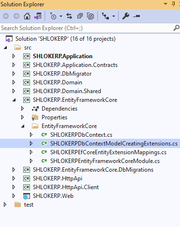

Open the `SHLOKERPDbContextModelCreatingExtensions` class under the `EntityFrameworkCore` folder of the `SHLOKERP.EntityFrameworkCore` project and change the `builder.Entity<Sprint>` part as shown below:

```c#
builder.Entity<Sprint>(b =>
{
    b.ToTable(SHLOKERPConsts.DbTablePrefix + "Sprints", SHLOKERPConsts.DbSchema);
    b.ConfigureByConvention();

    /* Configure more properties here */
    b.HasOne<Revenue>().WithMany().HasForeignKey(x => x.RevenueId).IsRequired();
});
```

## step 4 : Add New EF Core Migration
The startup solution is configured to use **Entity Framework Core Code First Migrations**. Since we've changed the database mapping configuration, we should create a new migration and apply changes to the database.

Open a command-line terminal in the directory of the `SHLOKERP.EntityFrameworkCore.DbMigrations` project and type the following command:

>Refer [CRUD (Single Table)](\CRUDForSingleTable.md) step 4 to open the terminal

```Bash
dotnet ef migrations add Added_RevenueId_To_Sprint
```
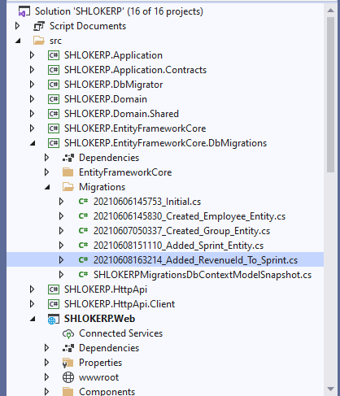

This should create a new migration class with the following code in its Up method:

```c#
 migrationBuilder.AddColumn<Guid>(
                name: "RevenueId",
                table: "AppSprints",
                type: "uniqueidentifier",
                nullable: false,
                defaultValue: new Guid("00000000-0000-0000-0000-000000000000"));

migrationBuilder.CreateIndex(
                name: "IX_AppSprints_RevenueId",
                table: "AppSprints",
                column: "RevenueId");

migrationBuilder.AddForeignKey(
                name: "FK_AppSprints_AppRevenues_RevenueId",
                table: "AppSprints",
                column: "RevenueId",
                principalTable: "AppRevenues",
                principalColumn: "Id",
                onDelete: ReferentialAction.Cascade);
```
* Adds an `RevenueId` field to the `Sprints` table.
* Creates an index on the `RevenueId` field.
* Declares the foreign key to the `Revenues` table.


## step 5 : Update the Database

Run the `SHLOKERP.DbMigrator` application to update the database:

>Refer [CRUD (Single Table)](\CRUDForSingleTable.md) step 5 to Update database.

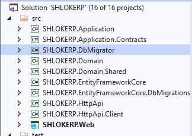

## step 6 : SprintDto
Open the `SprintDto` class in the `Sprints` folder of the `SHLOKERP.Application.Contracts` project. 

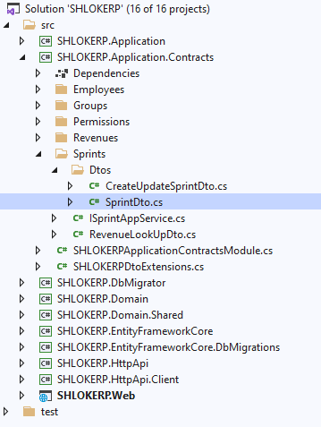

Add the following properties:

```c#
public Guid RevenueId { get; set; }
public int RevenueIncome { get; set; }
```

The final `SprintDto` class should be following:

```c#
using System;
using Volo.Abp.Application.Dtos;

namespace SHLOKERP.Sprints.Dtos
{
    [Serializable]
    public class SprintDto : AuditedEntityDto<Guid>
    {
        public string SprintName { get; set; }

        public int WorkersCount { get; set; }

        public int Duration { get; set; }

        public Guid RevenueId { get; set; }

        public int RevenueIncome { get; set; }

    }
}
```

## step 7 : CreateUpdateSprintDto
Open the `CreateUpdateSprintDto` class in the Sprints folder (namespace) of the `SHLOKERP.Application.Contracts` project:

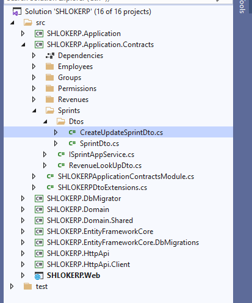

Add the Code as mentioned below:

```c#
public Guid RevenueId { get; set; }
```

## step 8 : RevenueLookupDto

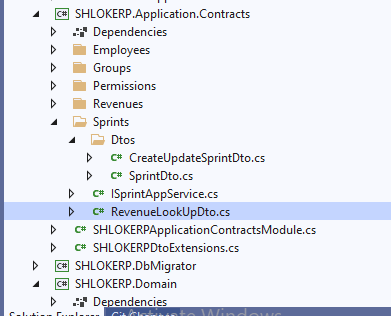

Create a new class, `RevenueLookupDto`, inside the `Sprints` folder of the `SHLOKERP.Application.Contracts` project:

```c#
using System;
using Volo.Abp.Application.Dtos;

namespace SHLOKERP.Sprints
{
    public class RevenueLookUpDto : EntityDto<Guid>
    {
        public int Income { get; set; }
    }
}

```

This will be used in a new method that will be added to the `ISprintAppService`.

## step 9 : ISprintAppService 

Open the `ISprintAppService` interface in the `Sprints` folder (namespace) of the `SHLOKERP.Application.Contracts` project:

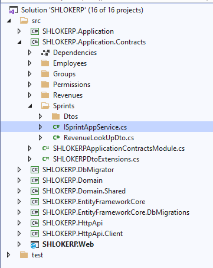

Add a new method, named `GetRevenueLookUpAsync`, as shown below:

```c#
using System;
using System.Threading.Tasks;
using SHLOKERP.Sprints.Dtos;
using Volo.Abp.Application.Dtos;
using Volo.Abp.Application.Services;

namespace SHLOKERP.Sprints
{
    public interface ISprintAppService :
        ICrudAppService< 
            SprintDto, 
            Guid, 
            PagedAndSortedResultRequestDto,
            CreateUpdateSprintDto,
            CreateUpdateSprintDto>
    {

        Task<ListResultDto<RevenueLookUpDto>> GetRevenueLookUpAsync();
    }
}
```

This new method will be used from the UI to get a list of `revenues` and fill a dropdown list to select the `revenue` of a `Sprint`.

## step 10 : SprintAppService

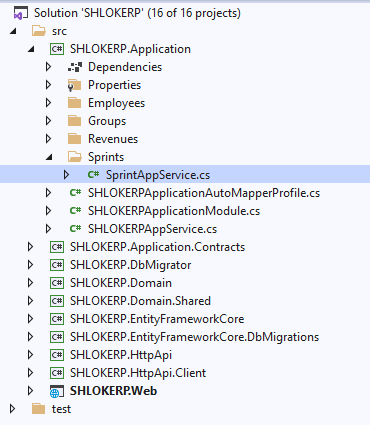

Open the `SprintAppService` in the `Sprints` namespace (folder) of the `SHLOKERP.Application` project and replace the file content with the following code.

* Added `[Authorize(SHLOKERPPermissions.sprints.Default)]` to authorize the methods we've newly added/overrode (remember, authorize attribute is valid for all the methods of the class when it is declared for a class).
* Injected `IRevenueRepository` to query from the `revenues`.

    ```c#
    private readonly IRevenueRepository _revenueRepository;


        public SprintAppService(IRepository<Sprint, Guid> repository,
            IRevenueRepository revenueRepository) : base(repository)
        {
            _revenueRepository = revenueRepository;
        }
    ```
* Overrode the `GetAsync` method of the base `CrudAppService`, which returns a single `SprintDto` object with the given id.
    * Used a simple LINQ expression to join sprints and revenues and query them together for the given sprint id.
    * Used `AsyncExecuter.FirstOrDefaultAsync(...)` to execute the query and get a result. It is a way to use asynchronous LINQ extensions without depending on the database provider API.
    * Throws an `EntityNotFoundException` which results an HTTP 404 (not found) result if requested sprint was not present in the database.
    * Finally, created a `SprintDto` object using the `ObjectMapper`, then assigning the `Income` manually.

    ```c#
    public override async Task<SprintDto> GetAsync(Guid id)
        {
            //Get the IQueryable<Sprint> from the repository
            var queryable = await Repository.GetQueryableAsync();

            //Prepare a query to join sprints and revenues
            var query = from sprint in queryable
                        join revenue in _revenueRepository on sprint.RevenueId equals revenue.Id
                        where sprint.Id == id
                        select new { sprint, revenue };

            //Execute the query and get the sprint with revenue
            var queryResult = await AsyncExecuter.FirstOrDefaultAsync(query);
            if (queryResult == null)
            {
                throw new EntityNotFoundException(typeof(Sprint), id);
            }

            var sprintDto = ObjectMapper.Map<Sprint, SprintDto>(queryResult.sprint);
            sprintDto.RevenueIncome = queryResult.revenue.Income;
            return sprintDto;
        }

    ```

* Overrode the `GetListAsync` method of the base `CrudAppService`, which returns a list of `sprints`. The logic is similar to the previous method, so you can easily understand the code.

    ```c#
    public override async Task<PagedResultDto<SprintDto>> GetListAsync(PagedAndSortedResultRequestDto input)
        {
            //Get the IQueryable<sprint> from the repository
            var queryable = await Repository.GetQueryableAsync();

            //Prepare a query to join sprints and revenues
            var query = from sprint in queryable
                        join revenue in _revenueRepository on sprint.RevenueId equals revenue.Id
                        select new { sprint, revenue };

            // Paging
            query = query
                .OrderBy(NormalizeSorting(input.Sorting))
                .Skip(input.SkipCount)
                .Take(input.MaxResultCount);

            //Execute the query and get a list
            var queryResult = await AsyncExecuter.ToListAsync(query);

            //Convert the query result to a list of sprintDto objects
            var sprintDtos = queryResult.Select(x =>
            {
                var sprintDto = ObjectMapper.Map<Sprint, SprintDto>(x.sprint);
                sprintDto.RevenueIncome = x.revenue.Income;
                return sprintDto;
            }).ToList();

            //Get the total count with another query
            var totalCount = await Repository.GetCountAsync();

            return new PagedResultDto<SprintDto>(
                totalCount,
                sprintDtos
            );
        }
    ```

* Created a new method: `GetRevenueLookupAsync()`. This simple gets all the `revenues`. The UI uses this method to fill a dropdown list and select and revenu while creating/editing sprints.

    ```c#
    public async Task<ListResultDto<RevenueLookUpDto>> GetRevenueLookUpAsync()
        {
            var revenues = await _revenueRepository.GetListAsync();

            return new ListResultDto<RevenueLookUpDto>(
                ObjectMapper.Map<List<Revenue>, List<RevenueLookUpDto>>(revenues)
            );
        }
    ```

* Next Add Normalize Sorting method.
    ```c#
    private static string NormalizeSorting(string sorting)
        {
            if (sorting.IsNullOrEmpty())
            {
                return $"sprint.{nameof(Sprint.RevenueId)}";
            }

            if (sorting.Contains("revenueIncome", StringComparison.OrdinalIgnoreCase))
            {
                return sorting.Replace(
                    "revenueIncome",
                    "revenue.Income",
                    StringComparison.OrdinalIgnoreCase
                );
            }
            return $"sprint.{sorting}";
        }
    ```

* Add required package references

    ```c#
    using System;
    using System.Collections.Generic;
    using System.Threading.Tasks;
    using Microsoft.AspNetCore.Authorization;
    using Volo.Abp.Application.Dtos;
    using Volo.Abp.Application.Services;
    using Volo.Abp.Domain.Entities;
    using Volo.Abp.Domain.Repositories;
    using System.Linq;
    using System.Linq.Dynamic;
    using System.Linq.Dynamic.Core;
    ```

The Whole Code looks like this:
```c#
using System;
using System.Collections.Generic;
using System.Threading.Tasks;
using Microsoft.AspNetCore.Authorization;
using SHLOKERP.Permissions;
using SHLOKERP.Revenues;
using SHLOKERP.Sprints.Dtos;
using Volo.Abp.Application.Dtos;
using Volo.Abp.Application.Services;
using Volo.Abp.Domain.Entities;
using Volo.Abp.Domain.Repositories;
using System.Linq;
using System.Linq.Dynamic;
using System.Linq.Dynamic.Core;

namespace SHLOKERP.Sprints
{
    [Authorize(SHLOKERPPermissions.Sprint.Default)]
    public class SprintAppService : CrudAppService
        <Sprint, SprintDto, Guid, PagedAndSortedResultRequestDto, CreateUpdateSprintDto, CreateUpdateSprintDto>,
        ISprintAppService
    {
        protected override string GetPolicyName { get; set; } = SHLOKERPPermissions.Sprint.Default;
        protected override string GetListPolicyName { get; set; } = SHLOKERPPermissions.Sprint.Default;
        protected override string CreatePolicyName { get; set; } = SHLOKERPPermissions.Sprint.Create;
        protected override string UpdatePolicyName { get; set; } = SHLOKERPPermissions.Sprint.Update;
        protected override string DeletePolicyName { get; set; } = SHLOKERPPermissions.Sprint.Delete;


        private readonly IRevenueRepository _revenueRepository;


        public SprintAppService(IRepository<Sprint, Guid> repository,
            IRevenueRepository revenueRepository) : base(repository)
        {
            _revenueRepository = revenueRepository;
        }

        public override async Task<SprintDto> GetAsync(Guid id)
        {
            //Get the IQueryable<Sprint> from the repository
            var queryable = await Repository.GetQueryableAsync();

            //Prepare a query to join sprints and revenues
            var query = from sprint in queryable
                        join revenue in _revenueRepository on sprint.RevenueId equals revenue.Id
                        where sprint.Id == id
                        select new { sprint, revenue };

            //Execute the query and get the sprint with revenue
            var queryResult = await AsyncExecuter.FirstOrDefaultAsync(query);
            if (queryResult == null)
            {
                throw new EntityNotFoundException(typeof(Sprint), id);
            }

            var sprintDto = ObjectMapper.Map<Sprint, SprintDto>(queryResult.sprint);
            sprintDto.RevenueIncome = queryResult.revenue.Income;
            return sprintDto;
        }

        public override async Task<PagedResultDto<SprintDto>> GetListAsync(PagedAndSortedResultRequestDto input)
        {
            //Get the IQueryable<sprint> from the repository
            var queryable = await Repository.GetQueryableAsync();

            //Prepare a query to join sprints and revenues
            var query = from sprint in queryable
                        join revenue in _revenueRepository on sprint.RevenueId equals revenue.Id
                        select new { sprint, revenue };

            // Paging
            query = query
                .OrderBy(NormalizeSorting(input.Sorting))
                .Skip(input.SkipCount)
                .Take(input.MaxResultCount);

            //Execute the query and get a list
            var queryResult = await AsyncExecuter.ToListAsync(query);

            //Convert the query result to a list of sprintDto objects
            var sprintDtos = queryResult.Select(x =>
            {
                var sprintDto = ObjectMapper.Map<Sprint, SprintDto>(x.sprint);
                sprintDto.RevenueIncome = x.revenue.Income;
                return sprintDto;
            }).ToList();

            //Get the total count with another query
            var totalCount = await Repository.GetCountAsync();

            return new PagedResultDto<SprintDto>(
                totalCount,
                sprintDtos
            );
        }

        public async Task<ListResultDto<RevenueLookUpDto>> GetRevenueLookUpAsync()
        {
            var revenues = await _revenueRepository.GetListAsync();

            return new ListResultDto<RevenueLookUpDto>(
                ObjectMapper.Map<List<Revenue>, List<RevenueLookUpDto>>(revenues)
            );
        }

        private static string NormalizeSorting(string sorting)
        {
            if (sorting.IsNullOrEmpty())
            {
                return $"sprint.{nameof(Sprint.RevenueId)}";
            }

            if (sorting.Contains("revenueIncome", StringComparison.OrdinalIgnoreCase))
            {
                return sorting.Replace(
                    "revenueIncome",
                    "revenue.Income",
                    StringComparison.OrdinalIgnoreCase
                );
            }
            return $"sprint.{sorting}";
        }

    }
}

```


## Step 11 : Object to Object Mapping Configuration

## Object to Object Mapping Configuration <!-- {docsify-ignore} -->
Introduced the `RevenueLookupDto` class and used object mapping inside the `GetRevenueLookupAsync()` method. 

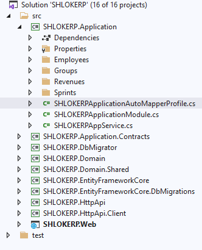

So, we need to add a new mapping definition inside the `SHLOKERPApplicationAutoMapperProfile.cs` file of the `SHLOKERP.Application` project:

```c#
CreateMap<Revenue, RevenueLookUpDto>();
```

## Step 12 : Combining to listing


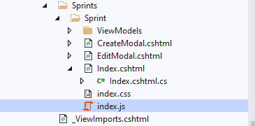

Open the `Pages/Sprints/Index.js` in the `SHLOKERP.Web` project and add the following column definition between the name and type columns:

```c#
{
    title: l('SprintName'),
        data: "sprintName"
},
// ADDED the NEW Revenue Income COLUMN
{
    title: l('Revenue'),
        data: "revenueIncome"
},
////////////////////////////////////////
{
    title: l('SprintWorkersCount'),
        data: "workersCount"
},
{
    title: l('SprintDuration'),
        data: "duration"
}
```

When you run the application, you can see the Revenue column on the table:

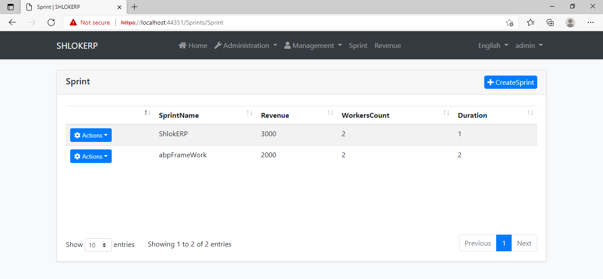

## Step 13 : Let's make it for Create events.

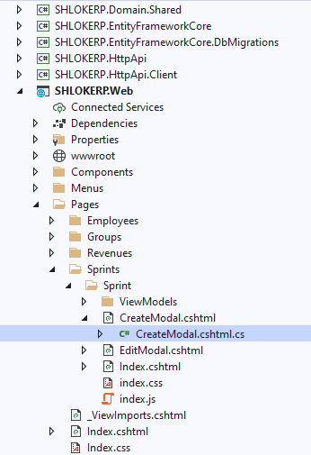

Open the `CreateModal.cshtml.cs` file (CreateModalModel class) and replace with the following code:

```c#
using System;
using System.Collections.Generic;
using System.Linq;
using System.Threading.Tasks;
using Microsoft.AspNetCore.Mvc;
using Microsoft.AspNetCore.Mvc.Rendering;
using SHLOKERP.Sprints;
using SHLOKERP.Sprints.Dtos;
using SHLOKERP.Web.Pages.Sprints.Sprint.ViewModels;

namespace SHLOKERP.Web.Pages.Sprints.Sprint
{
    public class CreateModalModel : SHLOKERPPageModel
    {
        [BindProperty]
        public CreateEditSprintViewModel ViewModel { get; set; }

        public List<SelectListItem> Revenues { get; set; }

        private readonly ISprintAppService _service;

        public CreateModalModel(ISprintAppService service)
        {
            _service = service;
        }

        public async Task OnGetAsync()
        {
            ViewModel = new CreateEditSprintViewModel();

            var revenueLookup = await _service.GetRevenueLookUpAsync();
            Revenues = revenueLookup.Items
                .Select(x => new SelectListItem(x.Income.ToString(), x.Id.ToString()))
                .ToList();
        }
        public async Task<IActionResult> OnPostAsync()
        {
            await _service.CreateAsync(
                ObjectMapper.Map<CreateEditSprintViewModel, CreateUpdateSprintDto>(ViewModel)
                );

            return NoContent();
        }

    }
}
```
* Changed type of the `Sprint` property from `CreateUpdateSprintDto` to the new `CreateEditSprintViewModel` class defined in `SHLOKERP.Web.Pages.Sprints.Sprint.ViewModel` Folder . 

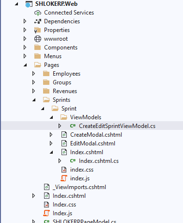

```c#
using Microsoft.AspNetCore.Mvc;
using System;
using System.ComponentModel;
using System.ComponentModel.DataAnnotations;
using Volo.Abp.AspNetCore.Mvc.UI.Bootstrap.TagHelpers.Form;

namespace SHLOKERP.Web.Pages.Sprints.Sprint.ViewModels
{
    public class CreateEditSprintViewModel
    {
        [HiddenInput]
        public Guid Id { get; set; }

        [Display(Name = "SprintName")]
        public string SprintName { get; set; }

        [SelectItems(nameof(Revenues))]
        [DisplayName("Revenue")]
        public Guid RevenueId { get; set; }

        [Display(Name = "WorkersCount")]
        public int WorkersCount { get; set; }

        [Display(Name = "Duration")]
        public int Duration { get; set; }
    }
}
```

* The main motivation of this change to customize the model class based on the User Interface (UI) requirements. We didn't want to use UI-related [SelectItems(nameof(Revenues))] and [DisplayName("Revenue")] attributes inside the `CreateUpdateSprintDto` class.
* Added `Revenues` property that is filled inside the `OnGetAsync` method using the `ISprintAppService.GetRevenueLookupAsync` method defined before.
* Changed the `OnPostAsync` method to map `CreateEditSprintViewModel` object to a `CreateUpdateSprintDto` object since `ISprintAppService.CreateAsync` expects a parameter of this type.

## Step 14 : Let's make it for update events.

Open the `EditModal.cshtml.cs` file (EditModalModel class).

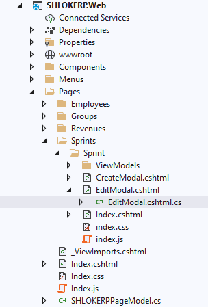

Replace with the following code:

```c#
using System;
using System.Collections.Generic;
using System.Linq;
using System.Threading.Tasks;
using Microsoft.AspNetCore.Mvc;
using Microsoft.AspNetCore.Mvc.Rendering;
using SHLOKERP.Sprints;
using SHLOKERP.Sprints.Dtos;
using SHLOKERP.Web.Pages.Sprints.Sprint.ViewModels;

namespace SHLOKERP.Web.Pages.Sprints.Sprint
{
    public class EditModalModel : SHLOKERPPageModel
    {
        [HiddenInput]
        [BindProperty(SupportsGet = true)]
        public Guid Id { get; set; }

        [BindProperty]
        public CreateEditSprintViewModel ViewModel { get; set; }

        private readonly ISprintAppService _service;

        public List<SelectListItem> Revenues { get; set; }

        public EditModalModel(ISprintAppService service)
        {
            _service = service;
        }

        public virtual async Task OnGetAsync(Guid id)
        {
            var dto = await _service.GetAsync(Id);
            ViewModel = ObjectMapper.Map<SprintDto, CreateEditSprintViewModel>(dto);

            var revenueLookup = await _service.GetRevenueLookUpAsync();
            Revenues = revenueLookup.Items
                .Select(x => new SelectListItem(x.Income.ToString(), x.Id.ToString()))
                .ToList();
        }

        public virtual async Task<IActionResult> OnPostAsync()
        {
            var dto = ObjectMapper.Map<CreateEditSprintViewModel, CreateUpdateSprintDto>(ViewModel);
            await _service.UpdateAsync(Id, dto);
            return NoContent();
        }
    }
}
```

* Changed type of the `Sprint` property from `CreateUpdateSprintDto` to the new `CreateEditSprintViewModel` class defined in this file, just like done before for the create modal above.
* Moved the Id property inside the new `CreateEditSprintViewModel` class.
* Added `Revenues` property that is filled inside the `OnGetAsync` method using the `ISprintAppService.GetRevenueLookupAsync` method.
* Changed the OnPostAsync method to map `CreateEditSprintViewModel` object to a `CreateUpdateSprintDto` object since `ISprintAppService.UpdateAsync` expects a parameter of this type.

The final content of the `EditModal.cshtml` should be following:

```HTML
@page
@using SHLOKERP.Localization
@using Microsoft.AspNetCore.Mvc.Localization
@using Volo.Abp.AspNetCore.Mvc.UI.Bootstrap.TagHelpers.Modal;
@inject IHtmlLocalizer<SHLOKERPResource> L
@model SHLOKERP.Web.Pages.Sprints.Sprint.EditModalModel
@{
    Layout = null;
}
<abp-dynamic-form abp-model="ViewModel" data-ajaxForm="true" asp-page="EditModal">
    <abp-modal>
        <abp-modal-header title="@L["EditSprint"].Value"></abp-modal-header>
        <abp-modal-body>
            <abp-input asp-for="Id" />
            <abp-form-content />
        </abp-modal-body>
        <abp-modal-footer buttons="@(AbpModalButtons.Cancel|AbpModalButtons.Save)"></abp-modal-footer>
    </abp-modal>
</abp-dynamic-form>

```

## Object to Object Mapping Configuration <!-- {docsify-ignore} -->

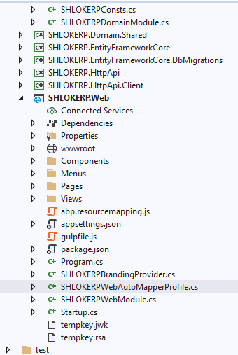

So, we need to add a new mapping definition inside the `SHLOKERPWebAutoMapperProfile.cs` file of the `SHLOKERP.Web` project:

```c#
CreateMap<Pages.Sprints.Sprint.CreateModalModel, CreateUpdateSprintDto>();
CreateMap<SprintDto, Pages.Sprints.Sprint.EditModalModel>();
CreateMap<Pages.Sprints.Sprint.EditModalModel, CreateUpdateSprintDto>();
```


## Step 15 : Results

You can run the application and try to create a new sprint or update an existing sprint. You will see a drop down list on the create/update form to select the revenue of the sprint:

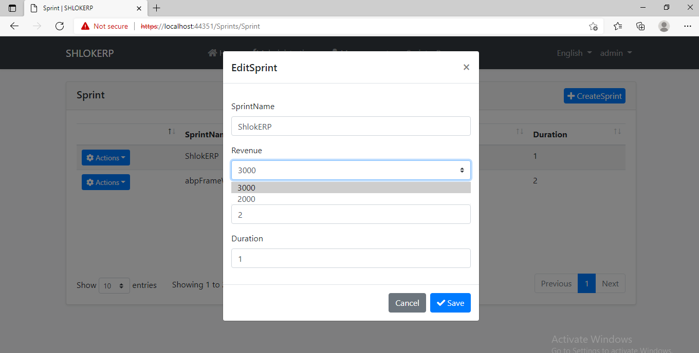

  > Reference Articles

**Unit Testing**

1. [Write unit tests](/Testing)