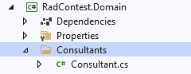

# Simple CRUD with AbpHelper

> Make sure you had installed AbpHelper, if not follow [here](/AbpHelperCodeGen)

## Step 1: Create a Domian Entity

Define your entities in the domain layer (`RadContest.Domain` project) of the solution. 

Create a Consultants folder (namespace) in the `RadContest.Domain` project .



```
using System;
using System.Collections.Generic;
using System.Linq;
using System.Text;
using System.Threading.Tasks;
using Volo.Abp.Domain.Entities.Auditing;

namespace RadContest.Consultants
{
    public class Consultant : FullAuditedEntity<Guid>
    {
        public string ConsultantName { get; set; }

        public bool isActive { get; set; }

        protected Consultant() { }

    }
}

```

## Step 2 : Generate CRUD files

 > Open the terminal on root of the project or developer command prompt.


 Now run the following command.

 ```command-line
 abphelper generate crud Consultant
 ``` 


> This Video will clearly explain the above 

 <video src="../_videos/AbpHelper/abp helper.mp4" width="600" height="400" controls></video>

 ## Step 3 : Create a Db Migration file

> Open the terminal on the project `RadContest.EntityFrameworkCore.DbMigrations`

Now run the following command.

```command-line
dotnet ef migrations add Added_RadContest_Entity
```

## Step 4 : Update database

Run the `RadContest.DbMigrator` application to update the database:


.DbMigrator is a console application that can be run to migrate the database schema and seed the data on development and production environments.


 <video src="../_videos/AbpHelper/abp migrate.mp4" width="600" height="400" controls></video>

 ## Step 4 : Results

  <video src="../_videos/AbpHelper/abp result.mp4" width="600" height="400" controls></video>

  > Reference Articles

**Unit Testing**

1. [Write unit tests](/Testing)

**Menu**

1. [Menu Grouping](/MenuConfig?id=grouping)
2. [Add Icon to menu](/MenuConfig?id=adding-icon-to-menu-items)
3. [Add permission to menu](/MenuConfig?id=adding-permission-is-easy)
4. [Reorder Menus](/MenuConfig?id=reorder-add-remove-default-module-menus-tenant-users-roles)

**Development**

 1. [How to join two table? (`Lookup \ Reference table join`)](/ABPHelper/multiTableCrud)