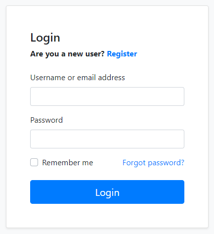
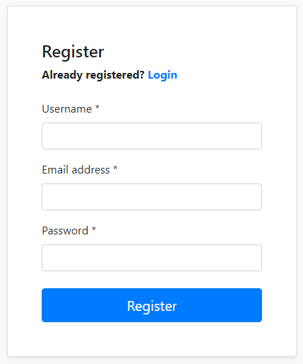
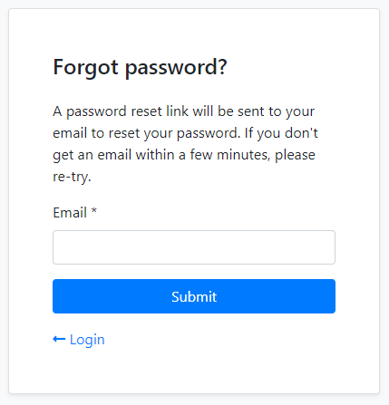
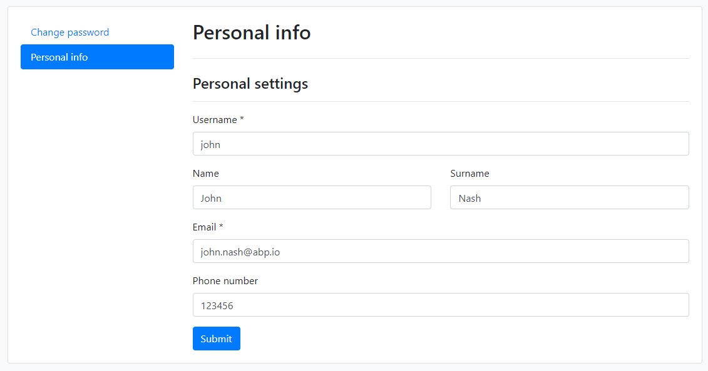

# Account Module
Account module implements the basic authentication features like **login, register, forgot password** and **account management**.

## How to Install
This module comes as pre-installed (as NuGet/NPM packages) when you create a new solution with the ABP Framework. You can continue to use it as package and get updates easily, or you can include its source code into your solution (see `get-source` [CLI](https://docs.abp.io/en/abp/latest/CLI) command) to develop your custom module.

## The Source Code
The source code of this module can be accessed [here](https://github.com/abpframework/abp/tree/dev/modules/account). 

# User Interface
This section introduces the main pages provided by this module.

## Login
`/Account/Login` page provides the login functionality.

## Register
`/Account/Register` page provides the new user registration functionality.

## Forgot Password & Reset Password
`/Account/ForgotPassword` page provides a way of sending password reset link to user's email address. The user then clicks to the link and determines a new password.

## Account Management
`/Account/Manage` page is used to change password and personal information of the user.

# IdentityServer Integration
`Volo.Abp.Account.Web.IdentityServer` package provides integration for the IdentityServer. This package comes as installed with the **application startup template**. See the [IdentityServer Module](IdentityServer.md) documentation.

# Social/External Logins
You can follow the [Social/External Logins](sociallogins.md) documentation to add a social/external login provider to your application. 

>**Related Articles**

- [Social/External Logins](sociallogins.md)
- [IdentityServer Module](IdentityServer.md)
