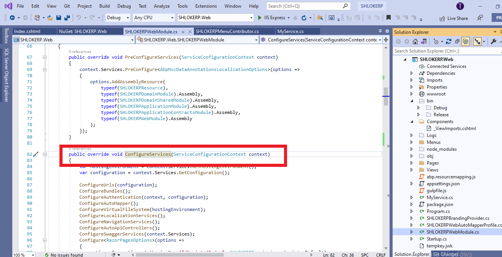

# Audit Logging Module
The Audit Logging Module basically implements the `IAuditingStore` to save the audit log objects to a database.

>This section covers only the `audit logging module` which persists audit logs to a database. See the [audit logging](/ApplicationModules/AuditLogging?id=Audit-Logging) section below for more about the `audit logging system`.

## How to Install
This module comes as pre-installed (as NuGet/NPM packages) when you create a new solution with the ABP Framework. You can continue to use it as package and get updates easily, or you can include its source code into your solution (see `get-source` [CLI](https://docs.abp.io/en/abp/latest/CLI) command) to develop your custom module.

## The Source Code
The source code of this module can be accessed [here](https://github.com/abpframework/abp/tree/dev/modules/audit-logging). 

>Click [here](https://docs.abp.io/en/abp/latest/Modules/Audit-Logging#internals) to know more about **Internals of Audit Logging Module**.

# Audit Logging
Startup templates are configured for the audit logging system which is suitable for most of the applications. Use this document for a detailed control over the audit log system.

## Database Provider Support
- Fully supported by the **Entity Framework Core** provider.
- Entity change logging is not supported by the **MongoDB** provider. Other features work as expected.

## UseAuditing()
`UseAuditing()` middleware should be added to the ASP.NET Core request pipeline in order to create and save the audit logs. 
>If you've created your applications using the startup templates, it is already added.

## AbpAuditingOptions
`AbpAuditingOptions` is the main options object to configure the audit log system. You can configure it in the `ConfigureServices` method of your `module`:



```c#
Configure<AbpAuditingOptions>(options =>
{
    options.IsEnabled = false; //Disables the auditing system
});
```

>Click [here](https://docs.abp.io/en/abp/latest/Audit-Logging#abpauditingoptions) to know about list of the options you can configure

## Entity History Selectors
Saving all changes of all your entities would require a lot of database space. For this reason, **audit log system doesn't save any change for the entities unless you explicitly configure it.**

To save all changes of all entities, simply use the `AddAllEntities()` extension method.

```c#
Configure<AbpAuditingOptions>(options =>
{
    options.EntityHistorySelectors.AddAllEntities();
});
```

The example selector below does the same of the `AddAllEntities()` extension method defined above:

```c#
Configure<AbpAuditingOptions>(options =>
{
    options.EntityHistorySelectors.Add(
        new NamedTypeSelector(
            "MySelectorName",
            type =>
            {
                if (typeof(IEntity).IsAssignableFrom(type))
                {
                    return true;
                }
                else
                {
                    return false;
                }
            }
        )
    );
});
```

`options.EntityHistorySelectors` is a flexible and dynamic way of selecting the entities for audit logging. Another way is to use the `Audited` and `DisableAuditing` attributes per entity.

## Enabling/Disabling Audit Logging for Services
### Enable/Disable for Controllers & Actions
All the controller actions are logged by default.

You can use the `[DisableAuditing]` to disable it for a specific controller type:
 
```c#
[DisableAuditing]
public class HomeController : AbpController
{
    //...
}
```

Use [DisableAuditing] for any action to control it in the action level:

```c#
public class HomeController : AbpController
{
    [DisableAuditing]
    public async Task<ActionResult> Home()
    {
        //...
    }

    public async Task<ActionResult> OtherActionLogged()
    {
        //...
    }
}
```
## Enable/Disable for Application Services & Methods
Application service method calls also included into the audit log by default. You can use the `[DisableAuditing]` in service or method level.

### Enable/Disable for Other Services
Use `[Audited]` and `[DisableAuditing]` for any class or method that need to be audit logged. In addition, your class can (directly or inherently) implement the `IAuditingEnabled` interface to enable the audit logging for that class by default.

### Enable/Disable for Entities & Properties
you can use `Audited` to enable entity change audit logging for an entity:
```c#
[Audited]
public class MyEntity : Entity<Guid>
{
    //...
}
```
Or disable it for an entity:
```c#
[DisableAuditing]
public class MyEntity : Entity<Guid>
{
    //...
}
```

Disabling audit logging can be necessary only if the entity is being selected by the `AbpAuditingOptions.EntityHistorySelectors` that explained before.

You can disable auditing only some properties of your entities for a detailed control over the audit logging:
```c#
[Audited]
public class MyUser : Entity<Guid>
{
    public string Name { get; set; }
        
    public string Email { get; set; }

    [DisableAuditing] //Ignore the Passoword on audit logging
    public string Password { get; set; }
}
```

In some cases, you may want to save a few properties but ignore all others. Writing `[DisableAuditing]` for all the other properties would be tedious. In such cases, use `[Audited]` only for the desired properties and mark the entity with the `[DisableAuditing]` attribute:

```c#
[DisableAuditing]
public class MyUser : Entity<Guid>
{
    [Audited] //Only log the Name change
    public string Name { get; set; }

    public string Email { get; set; }

    public string Password { get; set; }
}
```
> Refer [IAuditingStore](https://docs.abp.io/en/abp/latest/Audit-Logging#iauditingstore) and [Audit Log Object](https://docs.abp.io/en/abp/latest/Audit-Logging#audit-log-object) to know more.

## Audit Log Contributors

- step 1 : You can extend the auditing system by creating a class that is derived from the `AuditLogContributor` class which defines the `PreContribute` and the `PostContribute` methods.

    Example:
    ```c#
    public class MyAuditLogContributor : AuditLogContributor
    {
        public override void PreContribute(AuditLogContributionContext context)
        {
            var currentUser = context.ServiceProvider.GetRequiredService<ICurrentUser>();
            context.AuditInfo.SetProperty(
                "MyCustomClaimValue",
                currentUser.FindClaimValue("MyCustomClaim")
            );
        }

        public override void PostContribute(AuditLogContributionContext context)
        {
            context.AuditInfo.Comments.Add("Some comment...");
        }
    }
    ```
- step 2 : After creating such a contributor, you must add it to the `AbpAuditingOptions.Contributors` list:
    ```c#
    Configure<AbpAuditingOptions>(options =>
    {
        options.Contributors.Add(new MyAuditLogContributor());
    });
    ```

## IAuditLogScope & IAuditingManager
This section explains the `IAuditLogScope` & `IAuditingManager` services for advanced use cases.

An audit log scope is an ambient scope that builds and saves an audit log object (explained before). By default, an audit log scope is created for a web request by the Audit Log Middleware (see `UseAuditing()` section above).

### Access to the Current Audit Log Scope

```c#
public class MyService : ITransientDependency
{
    private readonly IAuditingManager _auditingManager;

    public MyService(IAuditingManager auditingManager)
    {
        _auditingManager = auditingManager;
    }

    public async Task DoItAsync()
    {
        var currentAuditLogScope = _auditingManager.Current;
        if (currentAuditLogScope != null)
        {
            currentAuditLogScope.Log.Comments.Add(
                "Executed the MyService.DoItAsync method :)"
            );
            
            currentAuditLogScope.Log.SetProperty("MyCustomProperty", 42);
        }
    }
}
```
>Always check if `_auditingManager.Current` is null or not, because it is controlled in an outer scope and you can't know if an audit log scope was created before calling your method.

### Manually Create an Audit Log Scope

You rarely need to create a manual audit log scope, but if you need, you can create an audit log scope using the `IAuditingManager` as like in the following example:

```c#
public class MyService : ITransientDependency
{
    private readonly IAuditingManager _auditingManager;

    public MyService(IAuditingManager auditingManager)
    {
        _auditingManager = auditingManager;
    }

    public async Task DoItAsync()
    {
        using (var auditingScope = _auditingManager.BeginScope())
        {
            try
            {
                //Call other services...
            }
            catch (Exception ex)
            {
                //Add exceptions
                _auditingManager.Current.Log.Exceptions.Add(ex);
                throw;
            }
            finally
            {
                //Always save the log
                await auditingScope.SaveAsync();
            }
        }
    }
}
```