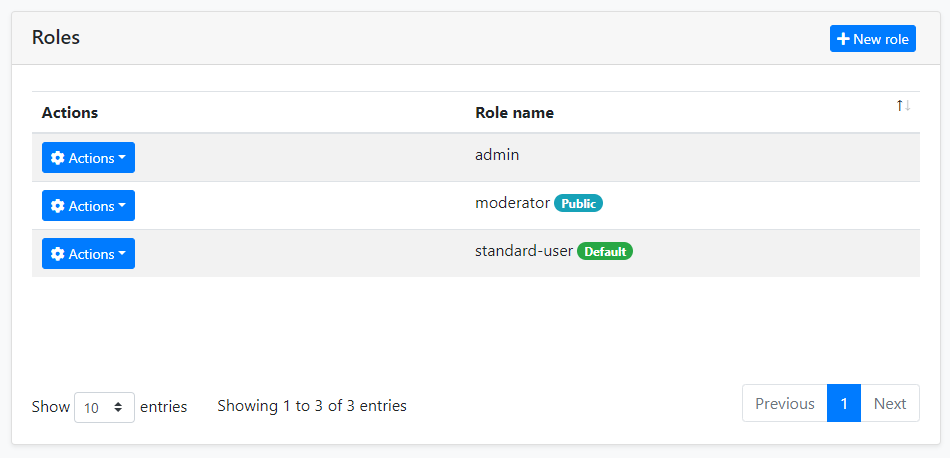

# Identity Management Module
Identity module is used to manage roles, users and their permissions, based on the Microsoft Identity library.

## How to Install
This module comes as pre-installed (as NuGet/NPM packages) when you create a new solution with the ABP Framework. You can continue to use it as package and get updates easily, or you can include its source code into your solution (see `get-source` [CLI](https://docs.abp.io/en/abp/latest/CLI) command) to develop your custom module.

## The Source Code
The source code of this module can be accessed [here](https://github.com/abpframework/abp/tree/dev/modules/identity).

## User Interface
This module provides MVC / Razor Pages UI options.

### Menu Items
This module adds an *Identity management* menu item under the *Administration menu*:


The menu items and the related pages are authorized. That means the current user must have the related permissions to make them visible. The `admin` role (and the users with this role - like the `admin` user) already has these permissions. 

If you want to enable *permissions* for other roles/users, open the Permissions dialog on the *Roles* or *Users* page and check the permissions as shown below:


See the [Authorization](Authorization.md) document to understand the permission system.

## Pages
This section introduces the main pages provided by this module.

### Users
This page is used to see the list of users. You can create/edit and delete users, assign users to roles.


### Roles
Roles are used to group permissions assign them to users.




## Other Features
This section covers some other features provided by this module which don't have the UI pages.

### Organization Units

Click [here](https://docs.abp.io/en/abp/latest/Modules/Identity#organization-units) to know all about Organization Units.

### Identity Security Log

- step 1 : You can inject and use `IdentitySecurityLogManager` or `ISecurityLogManager` to write security logs. It will create a log object by default and fill in some common values, such as `CreationTime`, `ClientIpAddress`, `BrowserInfo`, `current user/tenant`, etc. Of course, you can override them.

    ```c#
    await IdentitySecurityLogManager.SaveAsync(new IdentitySecurityLogContext()
    {
        Identity = "IdentityServer";
        Action = "ChangePassword";
    });
    ```
- step 2 :Configure `AbpSecurityLogOptions` to provide the application name (in case of you have multiple applications and want to distinguish the applications in the logs) for the log or disable this feature.

    ```c#
    Configure<AbpSecurityLogOptions>(options =>
    {
        options.ApplicationName = "AbpSecurityTest";
    });
    ```
## Options
`IdentityOptions` is the standard options class provided by the Microsoft Identity library. So, you can set these options in the `ConfigureServices` method of your module class.

**Example: Set minimum required length of passwords :**
```c#
Configure<IdentityOptions>(options =>
{
    options.Password.RequiredLength = 5;
});
```
ABP takes these options one step further and allows you to change them on runtime by using the setting system. You can inject `ISettingManager` and use one of the `Set...` methods to change the option values for a user, a tenant or globally for all users.

**Example: Change minimum required length of passwords for the current tenant :**
```c#
public class MyService : ITransientDependency
{
    private readonly ISettingManager _settingManager;

    public MyService(ISettingManager settingManager)
    {
        _settingManager = settingManager;
    }

    public async Task ChangeMinPasswordLength(int minLength)
    {
        await _settingManager.SetForCurrentTenantAsync(
            IdentitySettingNames.Password.RequiredLength,
            minLength.ToString()
        );
    }
}
```

`IdentitySettingNames` class (in the `Volo.Abp.Identity.Settings` namespace) defines constants for the setting names.

## Distributed Events
This module defines the following ETOs (Event Transfer Objects) to allow you to subscribe to changes on the entities of the module;

- `UserEto` is published on changes done on an `IdentityUser` entity.
- `IdentityRoleEto` is published on changes done on an `IdentityRole` entity.
- `IdentityClaimTypeEto` is published on changes done on an `IdentityClaimType` entity.
- `OrganizationUnitEto` is published on changes done on an `OrganizationUnit` entity.

**Example: Get notified when a new user has been created**
```c#
public class MyHandler :
    IDistributedEventHandler<EntityCreatedEto<UserEto>>,
    ITransientDependency
{
    public async Task HandleEventAsync(EntityCreatedEto<UserEto> eventData)
    {
        UserEto user = eventData.Entity;
        // TODO: ...
    }
}
```

## Internals

This [section](https://docs.abp.io/en/abp/latest/Modules/Identity#internals) covers some internal details of the module that you don't need much, but may need to use in some cases.


