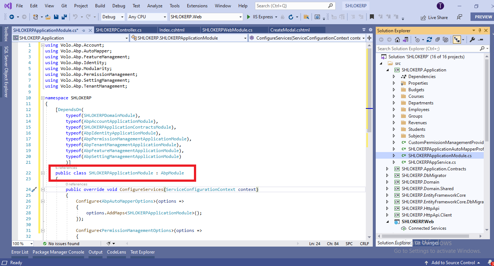
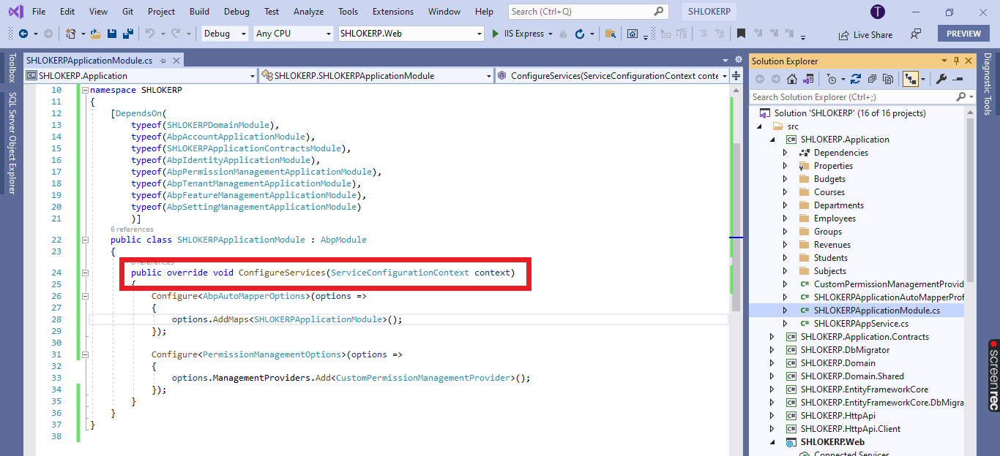
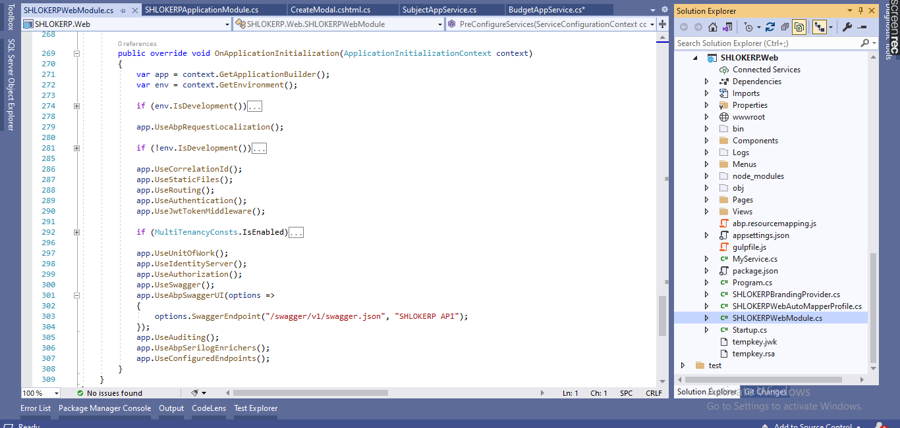
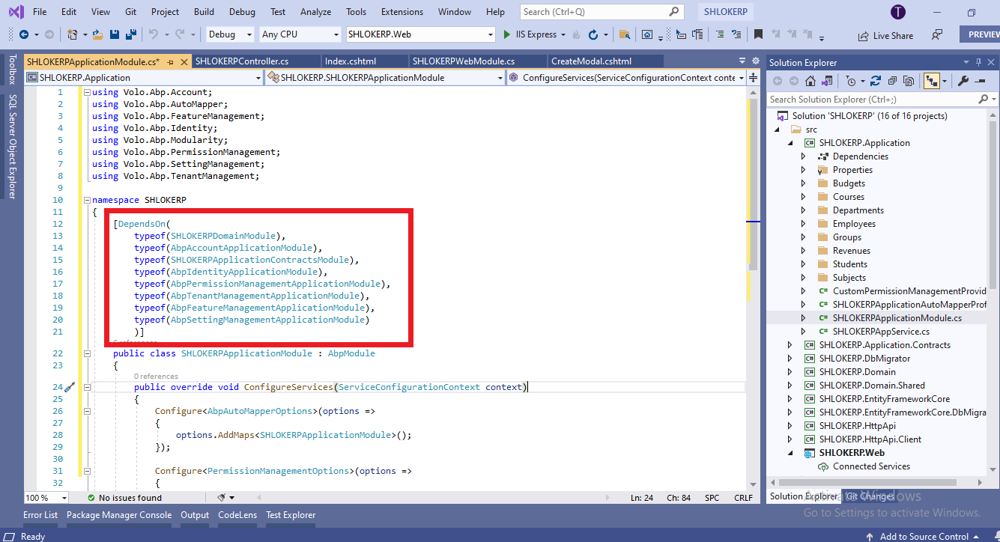

# Introduction
ABP Framework was designed to support to build fully modular applications and systems where every module may have entities, services, database integration, APIs, UI components and so on;

This document introduces the basics of the module system.

## step 1 : Module Class
Every module should define a module class. 
The simplest way of defining a module class is to create a class derived from `AbpModule` as shown below:



## step 2 : ConfigureServices Method
`ConfigureServices` is the main method to add your services to the dependency injection system and configure other modules. 

Example:



## step 3 : Pre & Post Configure Services
`AbpModule` class also defines `PreConfigureServices` and `PostConfigureServices` methods to override and write your code just before and just after `ConfigureServices`. Notice that the code you have written into these methods will be executed before/after the `ConfigureServices `methods of all other modules.

## step 4 : Application Initialization
Once all the services of all modules are configured, the application starts by initializing all modules. In this phase, you can resolve services from `IServiceProvider `since it's ready and available.

### step 4(i) :  `OnApplicationInitialization` Method
You can override `OnApplicationInitialization` method to execute code while application is being started. 

Example:
```c#
public class BlogModule : AbpModule
{
    //...

    public override void OnApplicationInitialization(ApplicationInitializationContext context)
    {
        var myService = context.ServiceProvider.GetService<MyService>();
        myService.DoSomething();
    }
}
```


`OnApplicationInitialization` is generally used by the startup module to construct the middleware pipeline for ASP.NET Core applications. 



Example:
```c#
[DependsOn(typeof(AbpAspNetCoreMvcModule))]
public class AppModule : AbpModule
{
    //...

    public override void OnApplicationInitialization(ApplicationInitializationContext context)
    {
        var app = context.GetApplicationBuilder();
        var env = context.GetEnvironment();

        if (env.IsDevelopment())
        {
            app.UseDeveloperExceptionPage();
        }

        app.UseMvcWithDefaultRoute();
    }
}
```

### Pre & Post Application Initialization
`AbpModule` class also defines `OnPreApplicationInitialization` and `OnPostApplicationInitialization` methods to override and write your code just before and just after `OnApplicationInitialization`. 
Notice that the code you have written into these methods will be executed before/after the `OnApplicationInitialization` methods of all other modules.

### Application Shutdown
Lastly, you can override `OnApplicationShutdown` method if you want to execute some code while application is being shutdown.

## Module Dependencies
In a modular application, it's not unusual for one module to depend upon another module(s). An Abp module must declare `[DependsOn]` attribute if it does have a dependency upon another module, as shown below:



You can use multiple `DependsOn` attribute or pass multiple module types to a single `DependsOn` attribute depending on your preference.
