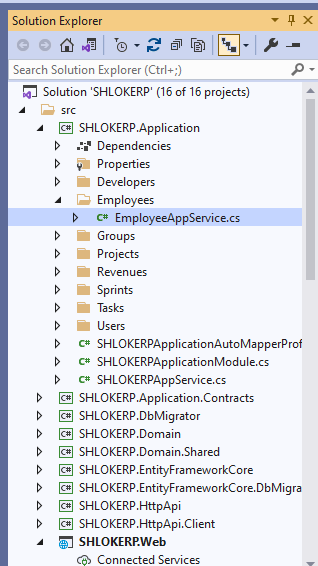

# Settings
Configuration system is a good way to configure the application on startup. In addition to the configurations, ABP provides another way to set and get some application settings.

## Defining Settings
### step 1 : A module must create a class derived from the `SettingDefinitionProvider` in order to define its settings.


Add the Following content:
```c#
public class EmailSettingProvider : SettingDefinitionProvider
{
    public override void Define(ISettingDefinitionContext context)
    {
        context.Add(
            new SettingDefinition("Smtp.Host", "127.0.0.1"),
            new SettingDefinition("Smtp.Port", "25"),
            new SettingDefinition("Smtp.UserName"),
            new SettingDefinition("Smtp.Password", isEncrypted: true),
            new SettingDefinition("Smtp.EnableSsl", "false")
        );
    }
}
```

### step 1(i) : Change Setting Definitions of a Depended Module
In some cases, you may want to change some properties of a settings defined in some other module that your application/module depends on.

The following example gets a setting defined by the Volo.Abp.Emailing package and changes its properties:

Go to `SettingDefinitionProvider` class of your `%Namespace%.Domain` Project:


Add the Following content:
```c#
public class MySettingDefinitionProvider : SettingDefinitionProvider
{
    public override void Define(ISettingDefinitionContext context)
    {
        var smtpHost = context.GetOrNull("Abp.Mailing.Smtp.Host");
        if (smtpHost != null)
        {
            smtpHost.DefaultValue = "mail.mydomain.com";
            smtpHost.DisplayName = 
                new LocalizableString(
                    typeof(MyLocalizationResource),
                    "SmtpServer_DisplayName"
                );
        }
    }
}
```

>Using constants for the setting names is a good practice and ABP packages do it. `Abp.Mailing.Smtp.Host` setting name is a constant defined by the `EmailSettingNames` class (in the `Volo.Abp.Emailing` namespace).

### step 2 : Reading the Setting Values

#### Inject `ISettingProvider` in the constructor of any AppService Present in the `%Namespace%.Application` to read the Setting values


```c#
public class MyService
{
    private readonly ISettingProvider _settingProvider;

    //Inject ISettingProvider in the constructor
    public MyService(ISettingProvider settingProvider)
    {
        _settingProvider = settingProvider;
    }

    public async Task FooAsync()
    {
        //Get a value as string.
        string userName = await _settingProvider.GetOrNullAsync("Smtp.UserName");

        //Get a bool value and fallback to the default value (false) if not set.
        bool enableSsl = await _settingProvider.GetAsync<bool>("Smtp.EnableSsl");

        //Get a bool value and fallback to the provided default value (true) if not set.
        bool enableSsl = await _settingProvider.GetAsync<bool>(
            "Smtp.EnableSsl", defaultValue: true);
        
        //Get a bool value with the IsTrueAsync shortcut extension method
        bool enableSsl = await _settingProvider.IsTrueAsync("Smtp.EnableSsl");
        
        //Get an int value or the default value (0) if not set
        int port = (await _settingProvider.GetAsync<int>("Smtp.Port"));

        //Get an int value or null if not provided
        int? port = (await _settingProvider.GetOrNullAsync("Smtp.Port"))?.To<int>();
    }
}
```
### On Executing the task we get the following result:


## Setting Values in the Application Configuration
`ConfigurationSettingValueProvider` reads the settings from the `IConfiguration` service, which can read values from the `appsettings.json` by default. 


### step 1 : configure setting values to define them in the `appsettings.json` file.

```JSON
{
  "Settings": {
    "Abp.Mailing.DefaultFromAddress": "noreply@mydomain.com",
    "Abp.Mailing.DefaultFromDisplayName": "My Application",
    "Abp.Mailing.Smtp.Host": "mail.mydomain.com",
    "Abp.Mailing.Smtp.Port": "547",
    "Abp.Mailing.Smtp.UserName": "myusername",
    "Abp.Mailing.Smtp.Password": "mySecretPassW00rd",
    "Abp.Mailing.Smtp.EnableSsl": "True"
  }
}
```
### step 2 : Custom Setting Value Providers
If you need to extend the setting system, you can define a class derived from the `SettingValueProvider` class. 

```c#
public class CustomSettingValueProvider : SettingValueProvider
{
    public override string Name => "Custom";

    public CustomSettingValueProvider(ISettingStore settingStore) 
        : base(settingStore)
    {
    }

    public override Task<string> GetOrNullAsync(SettingDefinition setting)
    {
        /* Return the setting value or null
           Use the SettingStore or another data source */
    }
}
```
>Alternatively, you can implement the `ISettingValueProvider `interface. Remember to register it to the dependency injection in this case.

### step 3 : Once you define a custom setting value provider, you need to explicitly register it to the `AbpSettingOptions`:


Go to the module class of your project and add this line of code:

```c#
Configure<AbpSettingOptions>(options =>
{
    options.ValueProviders.Add<CustomSettingValueProvider>();
});
```
## Setting Management Module
Setting Management Module implements the `ISettingStore` to store the setting values in a database and provides the `ISettingManager` to manage (change) the setting values in the database.

>Setting Management module is already installed and configured for the startup templates. So, most of the times you don't need to manually add this module to your application.

### Add the ISettingManager to any AppService
`ISettingManager` is used to get and set the values for the settings. 



```c#
using System;
using System.Threading.Tasks;
using Volo.Abp.DependencyInjection;
using Volo.Abp.SettingManagement;

namespace Demo
{
    public class MyService : ITransientDependency
    {
        private readonly ISettingManager _settingManager;

        //Inject ISettingManager service
        public MyService(ISettingManager settingManager)
        {
            _settingManager = settingManager;
        }

        public async Task FooAsync()
        {
            Guid user1Id = ...;
            Guid tenant1Id = ...;

            //Get/set a setting value for the current user or the specified user
            
            string layoutType1 =
                await _settingManager.GetOrNullForCurrentUserAsync("App.UI.LayoutType");
            string layoutType2 =
                await _settingManager.GetOrNullForUserAsync("App.UI.LayoutType", user1Id);

            await _settingManager.SetForCurrentUserAsync("App.UI.LayoutType", "LeftMenu");
            await _settingManager.SetForUserAsync(user1Id, "App.UI.LayoutType", "LeftMenu");

            //Get/set a setting value for the current tenant or the specified tenant
            
            string layoutType3 =
                await _settingManager.GetOrNullForCurrentTenantAsync("App.UI.LayoutType");
            string layoutType4 =
                await _settingManager.GetOrNullForTenantAsync("App.UI.LayoutType", tenant1Id);
            
            await _settingManager.SetForCurrentTenantAsync("App.UI.LayoutType", "LeftMenu");
            await _settingManager.SetForTenantAsync(tenant1Id, "App.UI.LayoutType", "LeftMenu");

            //Get/set a global and default setting value
            
            string layoutType5 =
                await _settingManager.GetOrNullGlobalAsync("App.UI.LayoutType");
            string layoutType6 =
                await _settingManager.GetOrNullDefaultAsync("App.UI.LayoutType");

            await _settingManager.SetGlobalAsync("App.UI.LayoutType", "TopMenu");
        }
    }
}
```

## Setting Management Providers

If you want to create your own provider, implement the `ISettingManagementProvider` interface or inherit from the `SettingManagementProvider` base class:

```c#
public class CustomSettingProvider : SettingManagementProvider
{
    public override string Name => "Custom";

    public CustomSettingProvider(ISettingManagementStore store) 
        : base(store)
    {
    }
}
```

Once you create your provider class, you should register it using the `SettingManagementOptions` options class:

```c#
Configure<SettingManagementOptions>(options =>
{
    options.Providers.Add<CustomSettingProvider>();
});
```

>Related Articles
- [SettingDefinition](https://docs.abp.io/en/abp/latest/Settings#settingdefinition)
- [Reading Setting Values on the Client Side](https://docs.abp.io/en/abp/latest/UI/AspNetCore/JavaScript-API/Settings)
- [Setting Value Providers](https://docs.abp.io/en/abp/latest/Settings#setting-value-providers)
- [ISettingEncryptionService](https://docs.abp.io/en/abp/latest/Settings#isettingencryptionservice)
- [Setting Management Providers](https://docs.abp.io/en/abp/latest/Modules/Setting-Management#setting-management-providers)