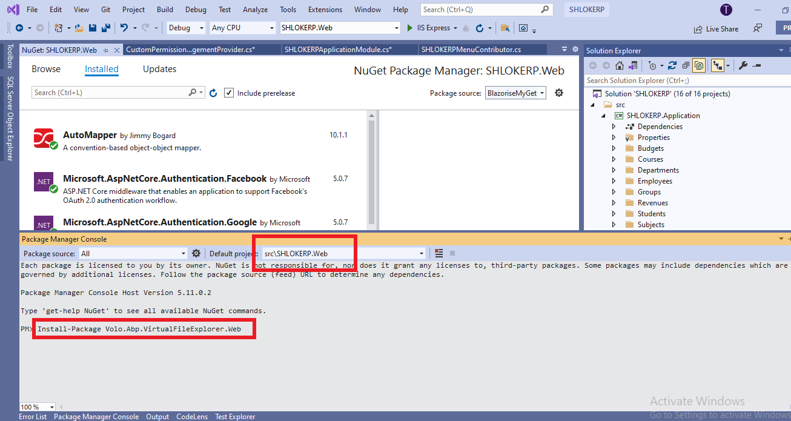
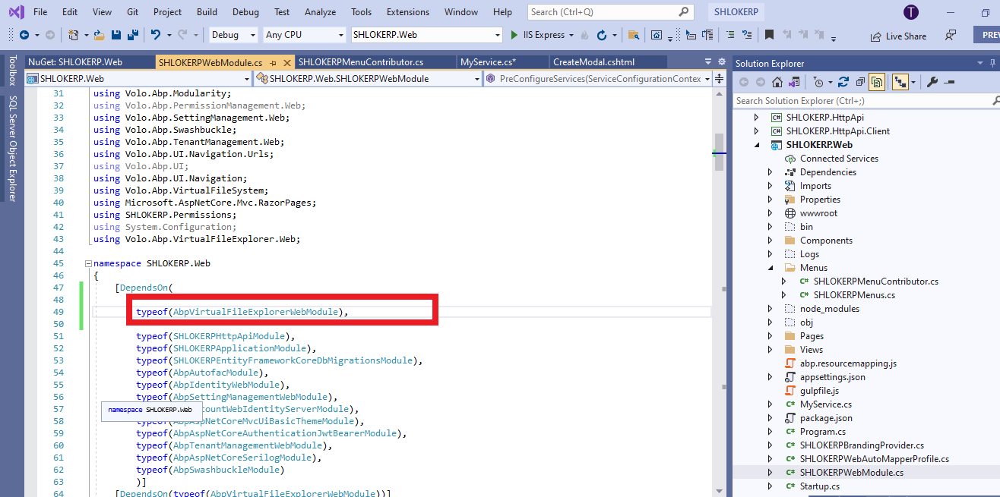
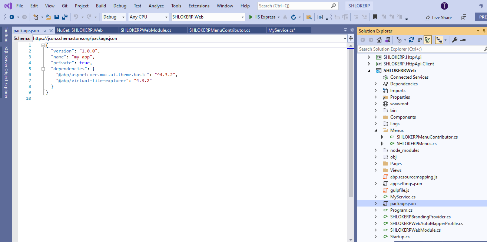
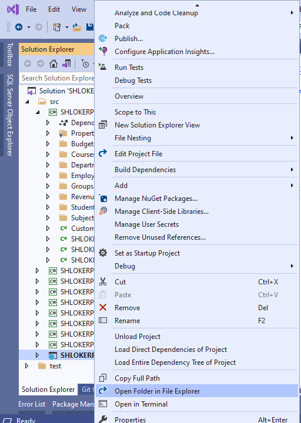
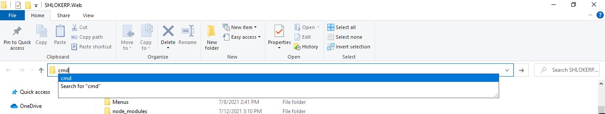
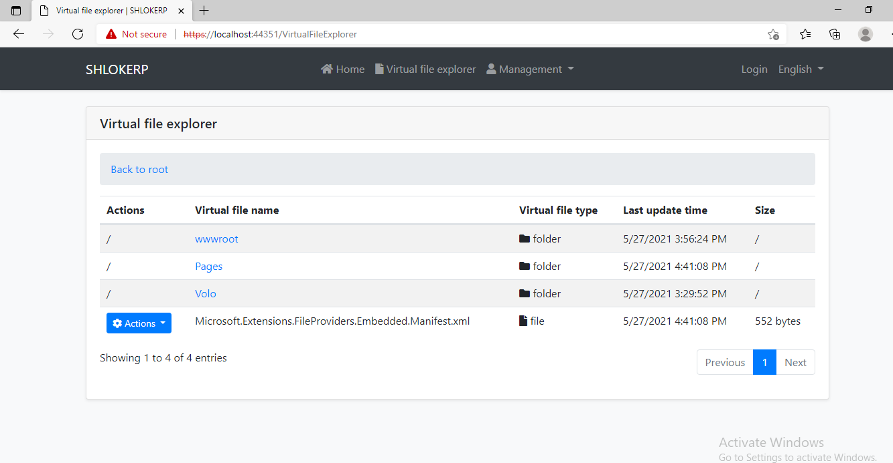

# Virtual File Explorer Module
Virtual File Explorer Module provided a simple UI to view all files in [virtual file system](https://docs.abp.io/en/abp/latest/Virtual-File-System).

>Virtual File Explorer Module is not installed for the startup templates. So, you need to manually add this module to your application.

# Installation
## 1- Use ABP CLI
It is recommended to use the ABP CLI to install the module, 


open the CMD window in the solution file (`.sln`) directory, and run the following command:

```Bash
abp add-module Volo.VirtualFileExplorer
```

## 2- Manually install
Or you can also manually install nuget package to `SHLOKERP.Web` project:

>To open Package Manager Console, Go to `Tools -> NuGet package Manager -> Package Manager Console`

- Install `Volo.Abp.VirtualFileExplorer.Web` nuget package to `SHLOKERP.Web` project.

```Bash
Install-Package Volo.Abp.VirtualFileExplorer.Web
```



### 2.1- Adding Module Dependencies
Open `SHLOKERPWebModule.cs` and add `typeof(AbpVirtualFileExplorerWebModule)` as shown below:



### 2.2- Adding NPM Package
Open `package.json` and add `@abp/virtual-file-explorer": "^2.9.0` as shown below:



Then open the command line terminal in the `SHLOKERP.Web` project folder 

>To open the project folder,

- step 1 : Right Click the respective project in the solution explorer and select `Open Folder in File Explorer` option



- step 2 : inside the location bar type in `cmd` to open the command terminal.



**Run the following command:**

1.  ```bash
    yarn
    ```

2.  ```bash
    gulp
    ```

That's all,Now run the application and Navigate to `/VirtualFileExplorer`. You will see virtual file explorer page:




# Options
You can disabled virtual file explorer module via `AbpVirtualFileExplorerOptions` options:

Go to the `PreConfigureServices` method in the `WebModule.cs` File inside `SHLOKERP.Web` project folder and add this code:

```c#
public override void PreConfigureServices(ServiceConfigurationContext context)
{
    PreConfigure<AbpVirtualFileExplorerOptions>(options =>
    {
        options.IsEnabled = false;
    });
}
```

>**Related Articles**
- [virtual file system](https://docs.abp.io/en/abp/latest/Virtual-File-System)

