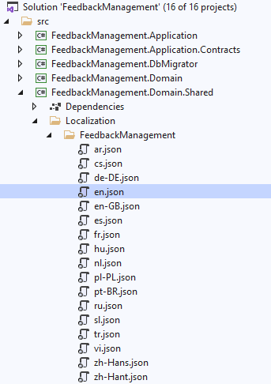
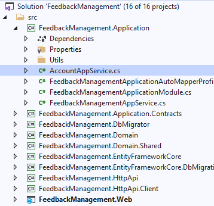
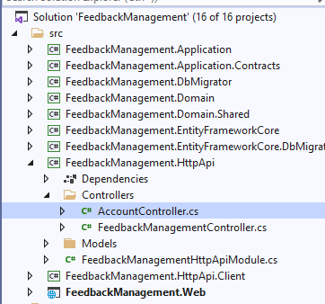

# Forgot Password & Reset Password
This functionality provides a way of sending password reset link to user's email address. The user then clicks to the link and determines a new password.

# Installation

> This package is already installed if you are using the application startup template.

It is suggested to use the ABP CLI to install this package. Open a command line window in the folder of the project (.csproj file) and type the following command:

```Bash
abp add-package Volo.Abp.Emailing
```

## step 1 : Create `ResetPasswordRequestInput` and `ResetPasswordInput` classes:

Create these Classes where ever needed , the following picture shows classes created inside `%Namespace%.Application.Contracts` Project:


**`ResetPasswordRequestInput.cs`** Content:

```c#
public class ResetPasswordRequestInput
{
	public string EmailAddress { get; set; }
	public string ReturnUrl { get; set; }
}
```

**`ResetPasswordInput.cs`** Content:

```c#
public class ResetPasswordInput
{
	public Guid UserId { get; set; }
	public string Token { get; set; }
	public string NewPassword { get; set; }
}
```
## step 2 : Create `IAccountAppService` Interface:

Create this interface inside `%Namespace%.Application.Contracts` Project

```c#
using FeedbackManagement.ResetPassword;
using System.Threading.Tasks;
using Volo.Abp.Application.Services;

namespace FeedbackManagement
{
    public interface IAccountAppService : IApplicationService
    {
        Task ResetPasswordRequest(ResetPasswordRequestInput input);
        Task ResetPassword(ResetPasswordInput input);
    }
}
```

## step 3 : Add Mailing Details in `appsettings.json` file:

>Make sure to update both `appsettings.json` files  present in `%Namespace%.DbMigrator` and `%Namespace%.Web` Project

```JSON
"Settings": {
  "Abp.Mailing.Smtp.Host": "127.0.0.1",
  "Abp.Mailing.Smtp.Port": "25",
  "Abp.Mailing.Smtp.UserName": "",
  "Abp.Mailing.Smtp.Password": "",
  "Abp.Mailing.Smtp.Domain": "",
  "Abp.Mailing.Smtp.EnableSsl": "false",
  "Abp.Mailing.Smtp.UseDefaultCredentials": "true",
  "Abp.Mailing.DefaultFromAddress": "noreply@abp.io",
  "Abp.Mailing.DefaultFromDisplayName": "ABP application"
}
```

## step 4 : Add Localization Texts:

- Go to `%Namespace%.Domain.Shared` Project and navigate to `en.json` file present inside `Localization` Folder:

    

- Add the following :

```JSON
{
  "ResetPasswordRequest:EmailBody": "Hi {0}, to reset your password please <a href=\"{1}?t={2}&tid={3}&uid={4}\" target=\"_blank\">click here</a>.",
  "ResetPasswordRequest:EmailSubject": "Reset your password"
}
```

## step 5 : Create `AccountAppService` Class:

- Go to `%Namespace%.Application` project and create a AppService Class:

    

- Install `Serilog` Package from NuGet Package Manager.

> Add the following if you are an **`Abp Open Source Framework User`**, **`Commercial Users`** can Omit this block of code

```C#
string to = input.EmailAddress; //To address    
string from = _config.GetSection("Settings:Abp.Mailing.DefaultFromAddress").Value; //From address    
MailMessage message = new MailMessage(from, to);

message.Subject = _config.GetSection("Settings:Abp.Mailing.DefaultFromDisplayName").Value;
message.Body = body;
message.BodyEncoding = Encoding.UTF8;
message.IsBodyHtml = true;
var pass = _config.GetSection("Settings:Abp.Mailing.Smtp.Password").Value;
SmtpClient client = new SmtpClient(_config.GetSection("Settings:Abp.Mailing.Smtp.Host").Value, Convert.ToInt32(_config.GetSection("Settings:Abp.Mailing.Smtp.Port").Value)); //Gmail smtp    
System.Net.NetworkCredential basicCredential1 = new System.Net.NetworkCredential(_config.GetSection("Settings:Abp.Mailing.Smtp.UserName").Value, _config.GetSection("Settings:Abp.Mailing.Smtp.Password").Value);
client.EnableSsl = Convert.ToBoolean(_config.GetSection("Settings:Abp.Mailing.Smtp.EnableSsl").Value);
client.UseDefaultCredentials = Convert.ToBoolean(_config.GetSection("Settings:Abp.Mailing.Smtp.UseDefaultCredentials").Value);
client.Credentials = basicCredential1;
try
{
    client.Send(message);
}

catch (Exception ex)
{
    throw ex;
}
```

The final code looks like this:

```c#
using System;
using System.Text;
using System.Threading.Tasks;
using Microsoft.AspNetCore.Identity;
using Volo.Abp;
using Volo.Abp.Application.Services;
using Volo.Abp.Emailing;
using Volo.Abp.Identity;
using Serilog;
using FeedbackManagement.ResetPassword;
using FeedbackManagement.Localization;
using System.Net.Mail;
using Microsoft.Extensions.Configuration;

namespace FeedbackManagement
{
    public class AccountAppService : ApplicationService, IAccountAppService
    {

        public const string PasswordResetToken = "PasswordResetToken";
        private readonly IdentityUserManager _userManager;
        private readonly IEmailSender _emailSender;
        public readonly IConfiguration _config;


        public AccountAppService(
            IdentityUserManager userManager,
            IEmailSender emailSender,IConfiguration configuration)
        {
            
            LocalizationResource = typeof(FeedbackManagementResource);
            _userManager = userManager;
            _emailSender = emailSender;
            _config = configuration;
        }

        // POST /api/account/reset-password-request
        public async Task ResetPasswordRequest(ResetPasswordRequestInput input)
        {
            var user = await _userManager.FindByEmailAsync(input.EmailAddress);

            // For security, don't indicate that the user can't be found
            if (user == null) return;

            var resetToken = await _userManager.GeneratePasswordResetTokenAsync(user);

            var body = L[
                "ResetPasswordRequest:EmailBody",
                // not required, but is used to personalize the email and reduces spam rating
                user.Name,
                input.ReturnUrl.RemovePostFix("/"),
                System.Web.HttpUtility.UrlEncode(resetToken),
                user.TenantId,
                user.Id,
                // not required, but is used by the angular application to allow the user to 
                // be automatically logged in after resetting the password without calling the api again to search for the user by their Id.
                System.Web.HttpUtility.UrlEncode(user.Email)
            ];

            /*OPEN SOURCE ABP FRAMEWORK USERS ADD THE FOLLOWING BLOCK OF CODE*/

            string to = input.EmailAddress; //To address    
            string from = _config.GetSection("Settings:Abp.Mailing.DefaultFromAddress").Value; //From address    
            MailMessage message = new MailMessage(from, to);

            message.Subject = _config.GetSection("Settings:Abp.Mailing.DefaultFromDisplayName").Value;
            message.Body = body;
            message.BodyEncoding = Encoding.UTF8;
            message.IsBodyHtml = true;
            var pass = _config.GetSection("Settings:Abp.Mailing.Smtp.Password").Value;
            SmtpClient client = new SmtpClient(_config.GetSection("Settings:Abp.Mailing.Smtp.Host").Value, Convert.ToInt32(_config.GetSection("Settings:Abp.Mailing.Smtp.Port").Value)); //Gmail smtp    
            System.Net.NetworkCredential basicCredential1 = new
            System.Net.NetworkCredential(_config.GetSection("Settings:Abp.Mailing.Smtp.UserName").Value, _config.GetSection("Settings:Abp.Mailing.Smtp.Password").Value);
            client.EnableSsl = Convert.ToBoolean(_config.GetSection("Settings:Abp.Mailing.Smtp.EnableSsl").Value);
            client.UseDefaultCredentials = Convert.ToBoolean(_config.GetSection("Settings:Abp.Mailing.Smtp.UseDefaultCredentials").Value);
            client.Credentials = basicCredential1;
            try
            {
                client.Send(message);
            }

            catch (Exception ex)
            {
                throw ex;
            }

            /*END OF BLOCK*/

            try
            {
                await _emailSender.SendAsync(user.Email, L["ResetPasswordRequest:EmailSubject"], body);
            }
            catch (Exception e)
            {
                Log.Error(e, "ResetPasswordRequest failed! Please ensure the default SMTP settings are valid.");
                throw new UserFriendlyException("Unable to process your request, please try again later.");
            }

            // Do this last to avoid saving the token if errors occur above i.e. the message fails to send
            // todo: Instead of using user.ExtraProperties, Implement AbpUser.PasswordResetToken property instead!
            if (user.ExtraProperties.ContainsKey(PasswordResetToken))
                user.ExtraProperties[PasswordResetToken] = resetToken;
            else
                user.ExtraProperties.Add(PasswordResetToken, resetToken);
            await _userManager.UpdateAsync(user);
        }

        // POST /api/account/reset-password
        public virtual async Task ResetPassword(ResetPasswordInput input)
        {
            var user = await _userManager.FindByIdAsync(input.UserId.ToString());

            if (user == null || !user.ExtraProperties.TryGetValue(PasswordResetToken, out var resetToken) || ((string)resetToken) != input.Token)
            {
                throw new UserFriendlyException("Invalid token supplied", null, "The token may have expired, please try resetting your password again.");
            }

            // Throws an exception if the token is invalid
            (await _userManager.ResetPasswordAsync(user, (string)resetToken, input.NewPassword)).CheckErrors();

            // todo: I would like to automatically confirm the users email after restting their password but.. 
            // can't use 'user.EmailConfirmed = true;' and need email token to confirm the email when using the _userManager.
            // The only way to do it currently is to use 'GenerateChangeEmailTokenAsync'
            //await _userManager.ConfirmEmailAsync(user, await _userManager.GenerateChangeEmailTokenAsync(user, user.Email));

            user.ExtraProperties.Remove(PasswordResetToken);

            await _userManager.UpdateAsync(user);
        }
    }
}
```

## step 6 : Create `AccountController`:

- Go to `%Namespace%.HttpApi` project and inside `Controllers` Folder create a Controller:

    

Add the following content inside the controller:

```c#
using System;
using System.Collections.Generic;
using System.Threading.Tasks;
using FeedbackManagement.ResetPassword;
using Microsoft.AspNetCore.Mvc;
using Volo.Abp;

namespace FeedbackManagement.Controllers
{
    [RemoteService]
    [Controller]
    [Area("account")]
    [Route("api/account")]
    public class AccountController : FeedbackManagementController, IAccountAppService
    {
        private readonly IAccountAppService _accountAppService;

        public AccountController(IAccountAppService accountAppService)
        {
            _accountAppService = accountAppService;
        }

        [HttpPost]
        [Route("reset-password-request")]
        public virtual Task ResetPasswordRequest(ResetPasswordRequestInput input)
        {
            // Try to guess the return url from the Referer
            // todo: this feature is not required but may be useful?
            if (input.ReturnUrl.IsNullOrEmpty())
            {
                // Create a URL without the Query or Fragment parts
                if (Request.Headers.ContainsKey("Referer") && Uri.TryCreate(Request.Headers["Referer"].ToString(), UriKind.Absolute, out var parsedReturnUrl))
                {
                    input.ReturnUrl = parsedReturnUrl.GetLeftPart(UriPartial.Path);
                }
                else
                {
                    throw new UserFriendlyException("Invalid returnUrl specified");
                }
            }
            else if (!Uri.IsWellFormedUriString(input.ReturnUrl, UriKind.Absolute))
            {
                throw new UserFriendlyException("Invalid returnUrl specified");
            }

            return _accountAppService.ResetPasswordRequest(input);
        }

        [HttpPost]
        [Route("reset-password")]
        public virtual Task ResetPassword([FromBody] ResetPasswordInput input)
        {
            return _accountAppService.ResetPassword(input);
        }
    }
}
```