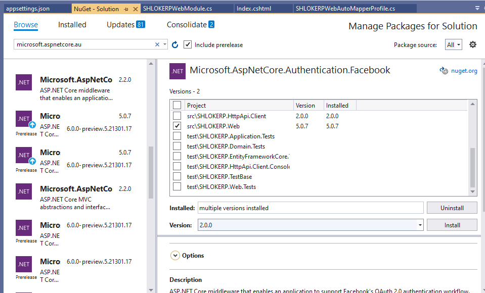
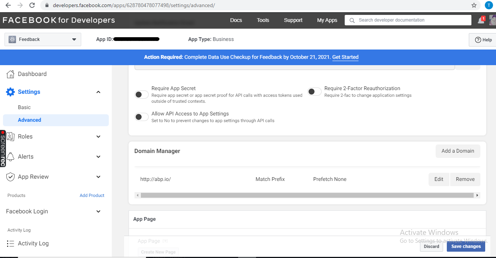

# Social / External Logins
The Account Module has already configured to handle social or external logins out of the box.

Follow the below steps to add these logins.

## Facebook Authentication

## Step 1 : Add the NuGet Package
Add the `Microsoft.AspNetCore.Authentication.Facebook` package to your project. 
Based on your architecture, this can be `.Web`, `.IdentityServer` (for tiered setup) or `.Host` project.

To open NuGet Package Manager:
* Go to `Tools`
* Navigate to `NuGet Package Manager`
* Select `Manage NuGet Packages for solution`
* Browse required Packages



>Make sure to install the right version of the packages compatible to the project

## Step 2 : Create the app in Facebook

- Navigate to the [Facebook Developers app](https://developers.facebook.com/apps/) page and sign in. If you don't already have a Facebook account, use the **Sign up for Facebook** link on the login page to create one. Once you have a Facebook account, follow the instructions to register as a Facebook Developer.

- From the ```My Apps``` menu select ```Create App``` to create a new App ID.

    

- Fill out the form and tap the ```Create App ID``` button.

    

- On the new App card, select ```Add a Product```. On the ```Facebook Login card```, click ```Set Up```

    

- The ```Quickstart``` wizard launches with ```Choose a Platform``` as the first page. Bypass the wizard for now by clicking the ```FaceBook Login Settings``` link in the menu on the lower left:

    

- You are presented with the ```Client OAuth Settings``` page:

    

- Enter your development URI with `/signin-facebook` appended into the **```Valid OAuth Redirect URIs```** field (for example: `https://localhost:44320/signin-facebook`). The Facebook authentication configured later in this tutorial will automatically handle requests at `/signin-facebook` route to implement the OAuth flow.

>The URI */signin-facebook* is set as the default callback of the Facebook authentication provider. You can change the default callback URI while configuring the Facebook authentication middleware via the inherited **`RemoteAuthenticationOptions.CallbackPath`** property of the FacebookOptions class.

- Click **```Save Changes```**.

- If required update the **```Domain Manager```** in **```Settings > Advanced```**

    

- Change the permission of Public Profile to advanced

    

- Add the Privacy policy URL as "`https://account.abp.io/Account/Privacy`" if required.

- Click ```Settings > Basic``` link in the left navigation.

- On this page, make a note of your **```App ID```** and your **```App Secret```**. 

    

You will add both into your ASP.NET Core application in the next section:

- When deploying the site you need to revisit the **Facebook Login** setup page and register a new public URI.

## Step 3 : Store the Facebook app ID and secret

- Go to Web Project of your solution and open the `appsettings.json` 

- Add the Credentials 

    

## Step 4 :  Configure the Provider


Use the `.AddFacebook(...)` extension method in the `ConfigureAuthentication` method of your module, to configure the client:

```c#
context.Services.AddAuthentication()
    .AddFacebook(facebook =>
    {
        facebook.AppId = configuration.GetSection("FacebookAuthentication:AppId").Value;
        facebook.AppSecret = configuration.GetSection("FacebookAuthentication:AppSecret").Value;
        facebook.Scope.Add("email");
        facebook.Scope.Add("public_profile");
    });
```
### Result

In the login page we will have the Facebook Login option.


On Choosing Facebook option in Login Page we go to Facebook login Page that is shown Below:


## Google Authentication

## step 1 : Add the NuGet Package
Add the `Microsoft.AspNetCore.Authentication.Google` package to your project. 
Based on your architecture, this can be `.Web`, `.IdentityServer` (for tiered setup) or `.Host` project.


>Make sure to install the right version of the packages compatible to the project

## step 2 : Get Credentials from Google Cloud Platform:

- The first step is to create a new Project in Google Console, which you can do from this [URL](https://console.cloud.google.com/projectcreate).

    

- your project will be created, and you will be taken to the **`Project Dashboard`** page. In this page, on the top left corner, you will find the **`navigation menu`**. Click this menu and select **`APIs & Services ➤ Credentials`**.

    

- In the Credentials page of the [Google console](https://console.developers.google.com/apis/credentials), select **`CREATE CREDENTIALS > OAuth client ID`**.

- In the Application type dialog, select **`Web`** application. Provide a Name for the app.

- In the Authorized redirect URIs section, select ADD URI to set the redirect URI. Example redirect URI: **`https://localhost:{PORT}/signin-google`**, where the {PORT} placeholder is the app's port.

- Select the **`CREATE`** button.

- Save the Client ID and Client Secret for use in the app's configuration.

    

## Step 3 : Store the Client Id and Client Secret

- Go to Web Project of your solution and open the `appsettings.json` 

- Add the Credentials 

    

## step 4 : Configure the Provider

Use the `.AddGoogle(...)` extension method in the `ConfigureAuthentication` method of your module, to configure the client:

```c#
context.Services.AddAuthentication()
        .AddGoogle(options =>
        {
            IConfigurationSection googleAuthNSection =
                Configuration.GetSection("Authentication:Google");

            options.ClientId = configuration.GetSection("GoogleAuthentication:ClientId").Value;
            options.ClientSecret = configuration.GetSection("GoogleAuthentication:ClientSecret").Value;
        });
```
### Result

In the login page we will have the Google Login option.


