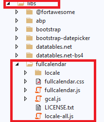
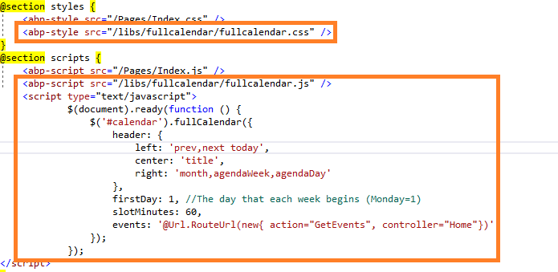
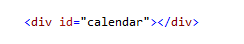
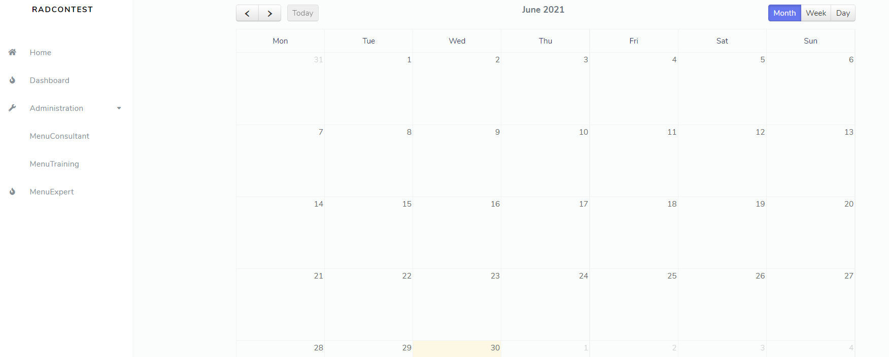

# Adding a Extenal JS plugins

> In this article, we are going to see how to include Extenal JS Plugins, Now we are going to include Full Calendar Plugin

## Step 1 : Adding the plugin files.

First Download the source of the plugin and add it to `Web` Project inside `wwwroot/libs/`.



## Step 2 : Including this scripts inside the cshtml file.

Use @Section blocks to have your Scripts loading like below,



## Step 3 : UI Part

Just add the `div` with id `calendar`.



## Step 4 : Bundling

Open the file `ProjectNameWebModule.cs` in `web` project and add the following code inside `ConfigureBundles` functions like below.

```
Configure<AbpBundlingOptions>(options =>
            {
                options.StyleBundles.Configure(
                    StislaThemeBundles.Styles.Global,
                    bundle =>
                    {
                        bundle.AddFiles("/libs/fullcalendar/fullcalendar.css");
                    }
                );
            });

            Configure<AbpBundlingOptions>(options =>
            {
                options.ScriptBundles.Configure(
                    StislaThemeBundles.Styles.Global,
                    bundle =>
                    {
                        bundle.AddFiles("/libs/fullcalendar/fullcalendar.js");
                    }
                );
            });
```

## Step 5 : Result


