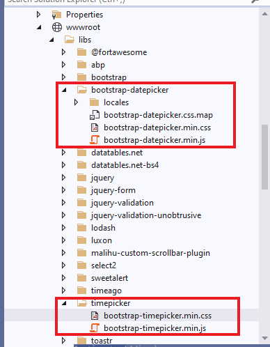
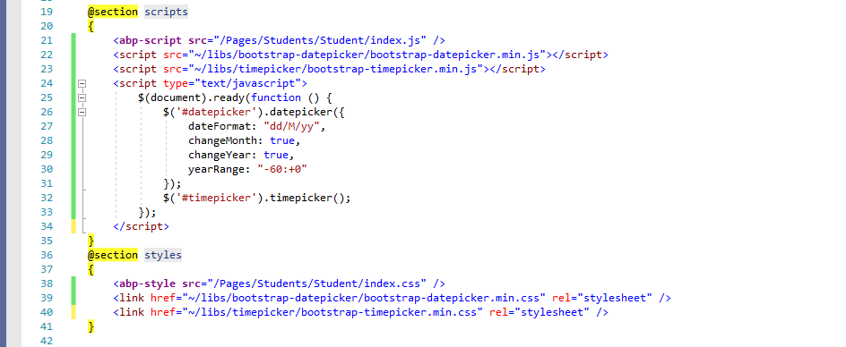
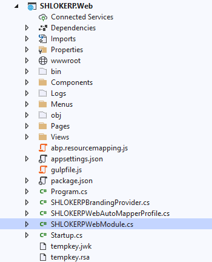
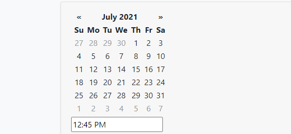

# Adding a Extenal JS plugin Date & Time Picker

> In this article, we are going to see how to add Date & Time Picker.

## Step 1 : Adding the plugin files.

First Download the source of the plugin and add it to `Web` Project inside `wwwroot/libs/`.



## Step 2 : Including this scripts inside the cshtml file of any Page.

Use @Section blocks to have your Scripts loading like below,



## Step 3 : UI Part

Just add the `div` or `input` tag with id `datepicker` , `timepicker`.


## Step 4 : Bundling

Open the file `ProjectNameWebModule.cs` in `web` project 



and add the following code inside `ConfigureBundles` functions like below.

```c#
Configure<AbpBundlingOptions>(options =>
{
    options.StyleBundles.Configure(
        BasicThemeBundles.Styles.Global,
        bundle =>
        {
            bundle.AddFiles("/libs/bootstrap-datepicker/bootstrap-datepicker.min.css");
        }
    );
});
Configure<AbpBundlingOptions>(options =>
{
    options.StyleBundles.Configure(
        BasicThemeBundles.Styles.Global,
        bundle =>
        {
            bundle.AddFiles("/libs/bootstrap-datepicker/bootstrap-datepicker.min.js");
        }
    );
});
Configure<AbpBundlingOptions>(options =>
{
    options.StyleBundles.Configure(
        BasicThemeBundles.Styles.Global,
        bundle =>
        {
            bundle.AddFiles("/libs/timepicker/bootstrap-timepicker.min.css");
        }
    );
});
Configure<AbpBundlingOptions>(options =>
{
    options.StyleBundles.Configure(
        BasicThemeBundles.Styles.Global,
        bundle =>
        {
            bundle.AddFiles("/libs/timepicker/bootstrap-timepicker.min.js");
        }
    );
});
```

## Step 5 : Result

