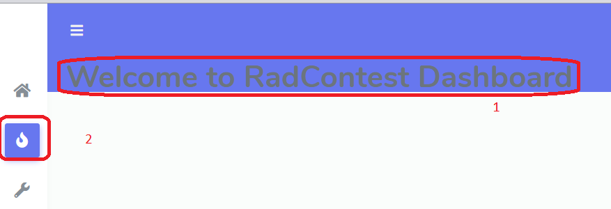
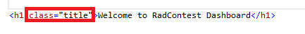
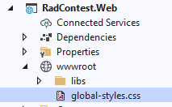
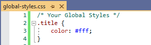
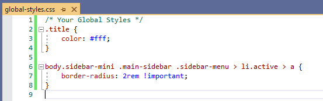

# Writing CSS

> In this section we are going to see where to add styles (css).

In thi, we can take a scenario,

**Things we do**
 1. Changing the text color
 2. Changing the border radius of selected menu item

## Changing the text color

### Step 1 : 

> Add a class attribute to the text.

### Step 2 : 

> Open `global-styles.css` inside `wwwroot` folder 

### Step 3: 

> Now add the style in the css file

## Changing the Menu border radius

### Step 1 : 

> Open `global-styles.css` inside `wwwroot` folder 

### Step 2: 

> Now add the style in the css file

## Result

> Write All your css only in `global-styles.css` inside `wwwroot` folder 

