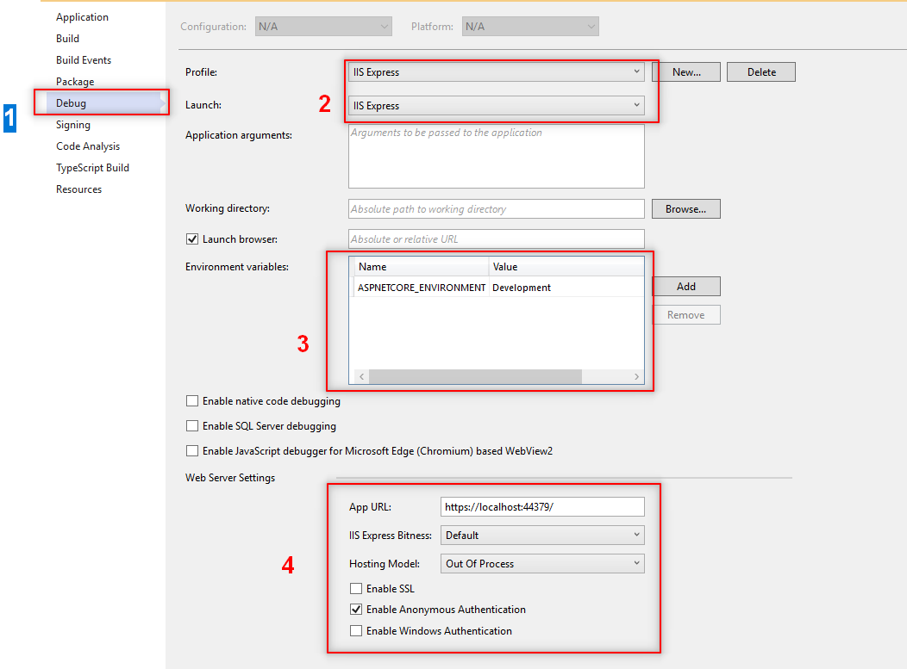
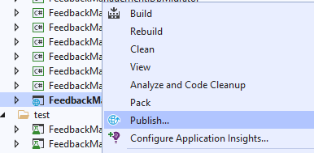
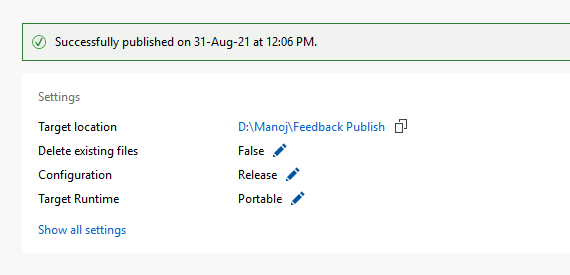
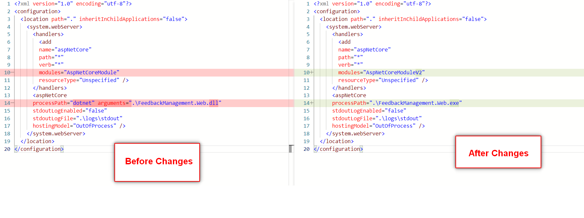
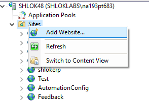
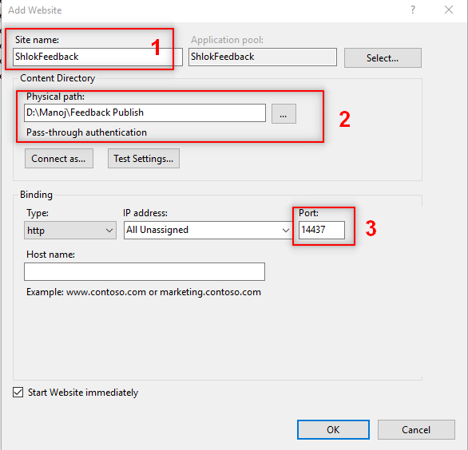
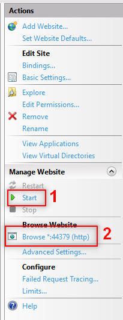
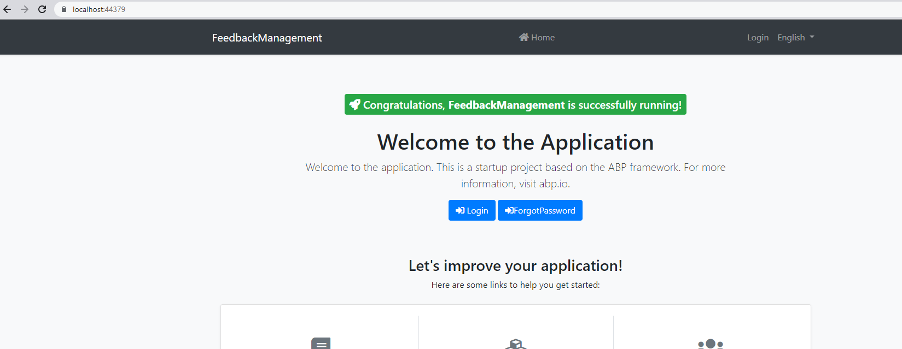

# Hosting with IIS
> This article will walk you through the steps involved to publish a ABP build with IIS.

### Step 1 : Installing .Net Core runtime

> [Click here to  download the .Net Core Runtime](https://dotnet.microsoft.com/download/dotnet/thank-you/runtime-aspnetcore-5.0.9-windows-hosting-bundle-installer)

1. The installation is very simple Just Open the exe downloaded from the above link
2. Click on `proceed`.

### Step 2 : Changing the project properties

1. Open the properties of your `Web` project.
2. Choose `Debug` option in the left panel.
3. Change the properties as below.

### Step 3 : Build & Config the project

1. Right click on your `Web` project, Click on `Publish`.

2. Once your project publish is successfull.

3. Now, browse to the published folder and open the `web.config` file and Change as per below screenshot.

### Step 4 : Hosting in IIS.

1. Open the `IIS` as an `Administrator`.
2. Create a new `website`.

3. Now please add the required hosting details. For reference, see the image below.

4. `Start` the project, you will find `start` on right `actions panel`. After starting, click on `browse`.

### Step 5 : Result.

