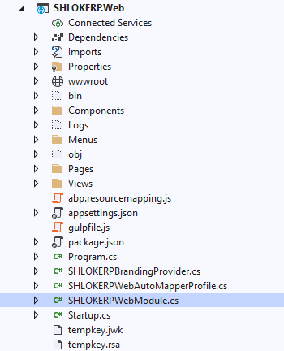

# ASP.NET Core MVC Bundling & Minification
There are many ways of bundling & minification of client side resources (JavaScript and CSS files). Most common ways are:

- Using the **Bundler & Minifier** Visual Studio extension or the **NuGet package**.
- Using **Gulp/Grunt** task managers and their plugins.
ABP offers a simple, dynamic, powerful, modular and built-in way.

## Volo.Abp.AspNetCore.Mvc.UI.Bundling Package

>This package is already installed by default with the startup templates. So, most of the time, you don't need to install it manually.

- **Step 1 :** Install the `Volo.Abp.AspNetCore.Mvc.UI.Bundling` nuget package to your project:

    - Go to NuGet Package Manager Console

    

    - Type the following command

    ```Bash
    install-package Volo.Abp.AspNetCore.Mvc.UI.Bundling
    ```

- **Step 2 :** Then you can add the `AbpAspNetCoreMvcUiBundlingModule` dependency to your module:

    

    ```c#
    using Volo.Abp.Modularity;
    using Volo.Abp.AspNetCore.Mvc.UI.Bundling;

    namespace SHLOKERP.Web
    {
        [DependsOn(typeof(AbpAspNetCoreMvcUiBundlingModule))]
        public class SHLOKERPWebModule : AbpModule
        {
            //...
        }
    }
    ```

## Razor Bundling Tag Helpers
The simplest way of creating a bundle is to use `abp-script-bundle` or `abp-style-bundle` tag helpers. Example:

```HTML
<abp-style-bundle name="MyGlobalBundle">
    <abp-style src="/libs/bootstrap/css/bootstrap.css" />
    <abp-style src="/libs/font-awesome/css/font-awesome.css" />
    <abp-style src="/libs/toastr/toastr.css" />
    <abp-style src="/styles/my-global-style.css" />
</abp-style-bundle>
```

This bundle defines a style bundle with a unique name: `MyGlobalBundle`. 

For more Info Refer `Razor Bundling Tag Helpers` section of [ASP.NET Core MVC Bundling & Minification](https://docs.abp.io/en/abp/latest/UI/AspNetCore/Bundling-Minification)

## Importing The Bundling Tag Helpers
>This is already imported by default with the startup templates. So, most of the time, you don't need to add it manually.

In order to use bundle tag helpers, you need to add it into your `_ViewImports.cshtml` file or into your page:


## Unnamed Bundles
The `name` is **optional** for the razor bundle tag helpers. If you don't define a name, it's automatically **calculated** based on the used bundle file names (they are **concatenated** and **hashed**). 

Example:
```HTML
<abp-style-bundle>
    <abp-style src="/libs/bootstrap/css/bootstrap.css" />
    <abp-style src="/libs/font-awesome/css/font-awesome.css" />
    <abp-style src="/libs/toastr/toastr.css" />
    @if (ViewBag.IncludeCustomStyles != false)
    {
        <abp-style src="/styles/my-global-style.css" />
    }
</abp-style-bundle>
```

This will potentially create **two different bundles** (one incudes the `my-global-style.css` and other does not).

## Single File
If you need to just add a single file to the page, you can use the `abp-script` or `abp-style` tag without a wrapping in the `abp-script-bundle` or `abp-style-bundle` tag. Example:

```XML
<abp-script src="/scripts/my-script.js" />
```

The bundle name will be *scripts.my-scripts* for the example above ("/" is replaced by "."). All bundling features are work as expected for single file bundles too.

## Bundling Options
If you need to use same bundle in **multiple pages** or want to use some more **powerful features**, you can configure bundles by code in your module class.


### Creating A New Bundle
Example usage:

```C#
[DependsOn(typeof(AbpAspNetCoreMvcUiBundlingModule))]
public class MyWebModule : AbpModule
{
    public override void ConfigureServices(ServiceConfigurationContext context)
    {
        Configure<AbpBundlingOptions>(options =>
        {
            options
                .ScriptBundles
                .Add("MyGlobalBundle", bundle => {
                    bundle.AddFiles(
                        "/libs/jquery/jquery.js",
                        "/libs/bootstrap/js/bootstrap.js",
                        "/libs/toastr/toastr.min.js",
                        "/scripts/my-global-scripts.js"
                    );
                });                
        });
    }
}
```

>You can use the same name (MyGlobalBundle here) for a script & style bundle since they are added to different collections (`ScriptBundles` and `StyleBundles`).

After defining such a bundle, it can be included into a page using the same tag helpers defined above. 

Example:
```HTML
<abp-script-bundle name="MyGlobalBundle" />
```

This time, no file defined in the tag helper definition because the bundle files are defined by the code.

### Configuring An Existing Bundle
ABP supports modularity for bundling as well. A module can modify an existing bundle that is created by a depended module. 

Example:

```C#
[DependsOn(typeof(MyWebModule))]
public class MyWebExtensionModule : AbpModule
{
    public override void ConfigureServices(ServiceConfigurationContext context)
    {
        Configure<AbpBundlingOptions>(options =>
        {
            options
                .ScriptBundles
                .Configure("MyGlobalBundle", bundle => {
                    bundle.AddFiles(
                        "/scripts/my-extension-script.js"
                    );
                });
        });
    }
}
```
You can also use the ConfigureAll method to configure all existing bundles:

```C#
[DependsOn(typeof(MyWebModule))]
public class MyWebExtensionModule : AbpModule
{
    public override void ConfigureServices(ServiceConfigurationContext context)
    {
        Configure<AbpBundlingOptions>(options =>
        {
            options
                .ScriptBundles
                .ConfigureAll(bundle => {
                    bundle.AddFiles(
                        "/scripts/my-extension-script.js"
                    );
                });
        });
    }
}
```

## Bundle Contributors
Adding files to an existing bundle seems useful. What if you need to **replace** a file in the bundle or you want to **conditionally** add files? Defining a bundle contributor provides extra power for such cases.

An example bundle contributor that replaces bootstrap.css with a customized version:
```C#
public class MyExtensionGlobalStyleContributor : BundleContributor
{
    public override void ConfigureBundle(BundleConfigurationContext context)
    {
        context.Files.ReplaceOne(
            "/libs/bootstrap/css/bootstrap.css",
            "/styles/extensions/bootstrap-customized.css"
        );
    }
}
```
Then you can use this contributor as like below:
```C#
services.Configure<AbpBundlingOptions>(options =>
{
    options
        .ScriptBundles
        .Configure("MyGlobalBundle", bundle => {
            bundle.AddContributors(typeof(MyExtensionGlobalStyleContributor));
        });
});
```

>You can also add contributors while creating a new bundle.

Contributors can also be used in the bundle tag helpers. Example:

```XML
<abp-style-bundle>
    <abp-style type="@typeof(BootstrapStyleContributor)" />
    <abp-style src="/libs/font-awesome/css/font-awesome.css" />
    <abp-style src="/libs/toastr/toastr.css" />
</abp-style-bundle>
```
`abp-style` and `abp-script` tags can get `type` attributes (instead of `src` attributes) as shown in this sample. When you add a bundle contributor, its dependencies are also automatically added to the bundle.

## Contributor Dependencies
A bundle contributor can have one or more dependencies to other contributors. 

Example:
```C#
[DependsOn(typeof(MyDependedBundleContributor))] //Define the dependency
public class MyExtensionStyleBundleContributor : BundleContributor
{
    //...
}
```

When a bundle contributor is added, its dependencies are **automatically and recursively** added. Dependencies added by the **dependency order** by preventing duplicates. **Duplicates** are prevented even if they are in separated bundles. ABP organizes all bundles in a page and eliminates duplications.

Creating contributors and defining dependencies is a way of organizing bundle creation across different modules.

## Contributor Extensions
In some advanced scenarios, you may want to do some additional configuration whenever a bundle contributor is used. Contributor extensions works seamlessly when the extended contributor is used.

The example below adds some styles for prism.js library:

```C#
public class MyPrismjsStyleExtension : BundleContributor
{
    public override void ConfigureBundle(BundleConfigurationContext context)
    {
        context.Files.AddIfNotContains("/libs/prismjs/plugins/toolbar/prism-toolbar.css");
    }
}
```
Then you can configure `AbpBundleContributorOptions` to extend existing `PrismjsStyleBundleContributor`.

```C#
Configure<AbpBundleContributorOptions>(options =>
{
    options
        .Extensions<PrismjsStyleBundleContributor>()
        .Add<MyPrismjsStyleExtension>();
});
```

Whenever `PrismjsStyleBundleContributor` is added into a bundle, `MyPrismjsStyleExtension` will also be automatically added.

## Accessing to the IServiceProvider
While it is rarely needed, `BundleConfigurationContext` has a `ServiceProvider` property that you can resolve service dependencies inside the `ConfigureBundle` method.

## Standard Package Contributors
Adding a specific NPM package resource (js, css files) into a bundle is pretty straight forward for that package. For example you always add the `bootstrap.css` file for the bootstrap NPM package.

There are built-in contributors for all standard **NPM packages**. For example, if your contributor depends on the bootstrap, you can just declare it, instead of adding the bootstrap.css yourself.

```C#
[DependsOn(typeof(BootstrapStyleContributor))] //Define the bootstrap style dependency
public class MyExtensionStyleBundleContributor : BundleContributor
{
    //...
}
```

## Volo.Abp.AspNetCore.Mvc.UI.Packages Package
>This package is already installed by default in the startup templates. So, most of the time, you don't need to install it manually.

Standard package contributors are defined in the `Volo.Abp.AspNetCore.Mvc.UI.Packages` NuGet package. 

To install it to your project:

- step 1 :  Go to NuGet Package Manager Console

    

- step 2 : Type the following command

    ```Bash
    install-package Volo.Abp.AspNetCore.Mvc.UI.Packages
    ```

- step 3 : Then add the `AbpAspNetCoreMvcUiPackagesModule` module dependency to your own module;

    ```c#
    using Volo.Abp.Modularity;
    using Volo.Abp.AspNetCore.Mvc.UI.Bundling;

    namespace SHLOKERP.Web
    {
        [DependsOn(typeof(AbpAspNetCoreMvcUiPackagesModule))]
        public class SHLOKERPWebModule : AbpModule
        {
            //...
        }
    }
    ```

## Bundle Inheritance
In some specific cases, it may be needed to create a new bundle inherited from other bundle(s). Inheriting from a bundle (recursively) inherits all files/contributors of that bundle. Then the derived bundle can add or modify files/contributors without modifying the original bundle. 

Example:


# Additional Options
This section shows other useful options for the bundling and minification system.

## Bundling Mode
ABP adds bundle files individually to the page for the `development` environment. It automatically bundles & minifies for other environments (`staging`, `production`...). Most of the times this is the behavior you would want. However, you may want to manually configure it in some cases. There are four modes;

- `Auto`: Automatically determines the mode based on the environment.
- `None`: No bundling or minification.
- `Bundle`: Bundled but not minified.
- `BundleAndMinify`: Bundled and minified.

You can configure `AbpBundlingOptions` in the `ConfigureServices` of your module.

Example:

```C#
Configure<AbpBundlingOptions>(options =>
{
    options.Mode = BundlingMode.Bundle;
});
```

## Ignore For Minification
It is possible to ignore a specific file for the minification.

Example:

```C#
Configure<AbpBundlingOptions>(options =>
{
    options.MinificationIgnoredFiles.Add("/scripts/myscript.js");
});
```
Given file is still added to the bundle, but not minified in this case.

>Related Articles
- [Client Side Package Management](MVCClientSidePackageMgmt.md)

- [Theming](Theming.md)