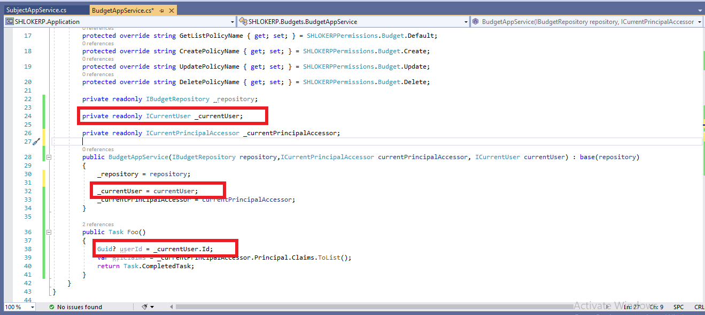

# JavaScript CurrentUser API
`abp.currentUser` is an object that contains information about the current user of the application.

>This Section only explains the **JavaScript API**. See the CurrentUser Section below to get information about the current user in the server side.

## Authenticated User

- step 1 : Run the application.
- step 2 : Open your browser's developer tools (shortcut is generally F12), switch to the Console tab.

    

- step 3 : Login

    

- step 4 : If the user was authenticated, this object will be something like below and `abp.currentUser.userName` returns User's name:

    


## Anonymous User

- step 1 : Run the application.
- step 2 : Open your browser's developer tools (shortcut is generally F12), switch to the Console tab.

    

- step 3 : If the user was authenticated, this object will be something like below and You can check `abp.currentUser.isAuthenticated` to understand if the use was authenticated or not.

    

# Current User
The current user is the active user related to the current request in a web application.

## ICurrentUser
`ICurrentUser` is the main service to get info about the current active user.

**Example: Injecting the `ICurrentUser` into a service:**

- step 1 : Go to the `AppService` of the entity present under `%Namespace%.Application`
    
    

- step 2 : Inject the `ICurrentUser` into the AppService.

    

- step 3 : We can use `CurrentUser` object inside a Method or task to get the users info.
On Executing the task we can see that the **current user's Id** is shown.
    

The whole code Looks like this : 
```c#
using System;
using Volo.Abp.DependencyInjection;
using Volo.Abp.Users;

namespace SHLOKERP
{
    public class MyService : ITransientDependency
    {
        private readonly ICurrentUser _currentUser;

        public MyService(ICurrentUser currentUser)
        {
            _currentUser = currentUser;
        }
        
        public void Foo()
        {
            Guid? userId = _currentUser.Id;
        }
    }
}
```

Common base classes have already injected this service as a base property. 

For example, you can directly use the `CurrentUser` property in an **application service** without perfoming dependency injection like above:
```C#
using System;
using Volo.Abp.Application.Services;

namespace SHLOKERP
{
    public class MyAppService : ApplicationService
    {
        public void Foo()
        {
            Guid? userId = CurrentUser.Id;
        }
    }
}
```

# ICurrentPrincipalAccessor
`ICurrentPrincipalAccessor` is the service that should be used (by the ABP Framework and your application code) whenever the current principal of the current user is needed.

>You generally don't need to this low level `ICurrentPrincipalAccessor` service and directly work with the `ICurrentUser` explained above.

## Basic Usage

- step 1 : Go to the `AppService` of the entity present under `%Namespace%.Application`
    
    

- step 2 : You can inject `ICurrentPrincipalAccessor` and use the `Principal` property to the the current principal:

    

- step 3 : On Executing the Task we can see the 
current principal of the current user shown:

    

The Whole Code Looks Like:
```C#
public class MyService : ITransientDependency
{
    private readonly ICurrentPrincipalAccessor _currentPrincipalAccessor;

    public MyService(ICurrentPrincipalAccessor currentPrincipalAccessor)
    {
        _currentPrincipalAccessor = currentPrincipalAccessor;
    }
    
    public void Foo()
    {
        var allClaims = _currentPrincipalAccessor.Principal.Claims.ToList();
        //...
    }
}
```

## Changing the Current Principal
Current principal is not something you want to set or change, except at some advanced scenarios. If you need it, use the `Change` method of the `ICurrentPrincipalAccessor`. It takes a `ClaimsPrincipal` object and makes it "current" for a scope.

Example:
```C#
public class MyAppService : ApplicationService
{
    private readonly ICurrentPrincipalAccessor _currentPrincipalAccessor;

    public MyAppService(ICurrentPrincipalAccessor currentPrincipalAccessor)
    {
        _currentPrincipalAccessor = currentPrincipalAccessor;
    }

    public void Foo()
    {
        var newPrincipal = new ClaimsPrincipal(
            new ClaimsIdentity(
                new Claim[]
                {
                    new Claim(AbpClaimTypes.UserId, Guid.NewGuid().ToString()),
                    new Claim(AbpClaimTypes.UserName, "john"),
                    new Claim("MyCustomCliam", "42")
                }
            )
        );

        using (_currentPrincipalAccessor.Change(newPrincipal))
        {
            var userName = CurrentUser.UserName; //returns "john"
            //...
        }
    }
}
```

Use the `Change` method always in a `using` statement, so it will be restored to the original value after the `using` scope ends.

This can be a way to simulate a user login for a scope of the application code.

>Related Articles
- [ICurrentUser - Properties,Methods,Authentication & Authorization](https://docs.abp.io/en/abp/latest/CurrentUser)
- [AbpClaimTypes](https://docs.abp.io/en/abp/latest/CurrentUser)