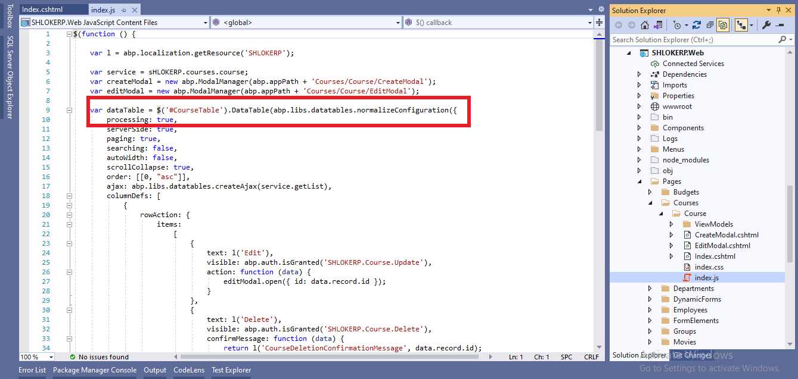

# Data Tables

A Data Table (aka Data Grid) is a UI component to show tabular data to the users.

However, the startup templates come with the **`DataTables.Net`** library as **pre-installed and configured**. 
ABP Framework provides adapters for this library and make it easy to use with the API endpoints.

**Example:**


## DataTables.Net Integration

This section will focus on the ABP addons & integration points.

You can follow the [web application development tutorial](CRUDForSingleTable.md) for a complete example application that uses the DataTables.Net as the Data Table. This section shows a minimalist example.

### step 1 : First, add an `abp-table` as shown below, with an `id` in the `Index.cshtml` page of your Entity:


#### Add this to `Index.cshtml` Content :
```html
<abp-table striped-rows="true" id="CourseTable" class="nowrap"/>
```
>`abp-table` is a Tag Helper defined by the ABP Framework, but a simple `<table...>` tag would also work.

### step 2 : Call the `DataTable` plugin on the table selector inside the `Index.js` file of your Entity:



#### Add this to `Index.js` Content :
```Javascript
$(function () {

    var l = abp.localization.getResource('SHLOKERP');

    var service = sHLOKERP.courses.course;
    var createModal = new abp.ModalManager(abp.appPath + 'Courses/Course/CreateModal');
    var editModal = new abp.ModalManager(abp.appPath + 'Courses/Course/EditModal');

    var dataTable = $('#CourseTable').DataTable(abp.libs.datatables.normalizeConfiguration({
        processing: true,
        serverSide: true,
        paging: true,
        searching: false,
        autoWidth: false,
        scrollCollapse: true,
        order: [[0, "asc"]],
        ajax: abp.libs.datatables.createAjax(service.getList),
        columnDefs: [
            {
                rowAction: {
                    items:
                        [
                            {
                                text: l('Edit'),
                                visible: abp.auth.isGranted('SHLOKERP.Course.Update'),
                                action: function (data) {
                                    editModal.open({ id: data.record.id });
                                }
                            },
                            {
                                text: l('Delete'),
                                visible: abp.auth.isGranted('SHLOKERP.Course.Delete'),
                                confirmMessage: function (data) {
                                    return l('CourseDeletionConfirmationMessage', data.record.id);
                                },
                                action: function (data) {
                                    service.delete(data.record.id)
                                        .then(function () {
                                            abp.notify.info(l('SuccessfullyDeleted'));
                                            dataTable.ajax.reload();
                                        });
                                }
                            }
                        ]
                }
            },
            {
                title: l('CourseCourseCode'),
                data: "courseCode"
            },
            {
                title: l('CourseCourseName'),
                data: "courseName"
            },
            {
                title: l('CreationTime'),
                data: "creationTime",
                dataFormat: 'datetime'
            }
        ]
    }));

    createModal.onResult(function () {
        dataTable.ajax.reload();
    });

    editModal.onResult(function () {
        dataTable.ajax.reload();
    });

    $('#NewCourseButton').click(function (e) {
        e.preventDefault();
        createModal.open();
    });
});
```

## AJAX Adapter
The `abp.libs.datatables.createAjax` method (used in the example above) adapts request and response data format and perfectly works with the Dynamic JavaScript Client Proxy system.

The `createAjax` also supports you to customize request parameters and handle the responses.

**Example:**


If you don't need access or modify the `requestData` or the `dataTableSettings`, you can specify a simple object as the second parameter.

```Javascript
ajax: abp.libs.datatables.createAjax(sHLOKERP.courses.course.getList,{ id: $('#Id').val(), courseName: $('#courseName').val() }
)
```

## Row Actions
`rowAction` is an option defined by the ABP Framework to the column definitions to show a drop down button to take actions for a row in the table.

The example screenshot below shows the actions for each course in courses table:


`rowAction` is defined as a part of a column definition:

```Javascript
{
    title: l('Actions'),
    rowAction: {
        //TODO: CONFIGURATION
    }
},
```
**Example: Show Edit and Delete actions for a Course row**


#### `Index.js` Content of Course Entity - Edit and Delete actions :

```Javascript
{
    rowAction: {
                    items:
                        [
                            {
                                text: l('Edit'),
                                visible: abp.auth.isGranted('SHLOKERP.Course.Update'),
                                action: function (data) {
                                    editModal.open({ id: data.record.id });
                                }
                            },
                            {
                                text: l('Delete'),
                                visible: abp.auth.isGranted('SHLOKERP.Course.Delete'),
                                confirmMessage: function (data) {
                                    return l('CourseDeletionConfirmationMessage', data.record.id);
                                },
                                action: function (data) {
                                    service.delete(data.record.id)
                                        .then(function () {
                                            abp.notify.info(l('SuccessfullyDeleted'));
                                            dataTable.ajax.reload();
                                        });
                                }
                            }
                        ]
                }
}
```
## Action Items

`items` is an array of action definitions. An action definition can have the following options;

* `text`: The text (a `string`) for this action to be shown in the actions drop down.
* `action`: A `function` that is executed when the user clicks to the action. The function takes a `data` argument that has the following fields;
    * `data.record`: This is the data object related to the row. You can access the data fields like `data.record.id`, `data.record.name`... etc.
    * `data.table`: The DataTables instance.
* `confirmMessage`: A `function` (see the example above) that returns a message (`string`) to show a dialog to get a confirmation from the user before executing the `action`. 

Example confirmation dialog:


You can use the [**localization**](Localization.md) system to show a localized message.

 - `visible`: A `bool` or a `function` that returns a bool. If the result is `false`, then the action is not shown in the actions dropdown. This is generally combined by the [authorization](Authorization.md) system to hide the action if the user has no permission to take this action. 
 
    Example:

    

If you define a `function`, then the `function` has two arguments: `record` (the data object of the related row) and the `table` (the DataTable instance). So, you can decide to show/hide the action dynamically, based on the row data and other conditions.
- `iconClass`: Can be used to show a font-icon, like a Font-Awesome icon (ex: `fas fa-trash-alt`), near to the action text. 

    Example screenshot:

    

- `enabled`: A `function` that returns a `bool` to disable the action. The `function` takes a `data` object with two fields: `data.record` is the data object related to the row and `data.table` is the DataTables instance.
- `displayNameHtml`: Set this to `true` is the `text `value contains HTML tags.

There are some rules with the action items;

- If none of the action items is visible then the actions column is not rendered.

## `dataFormat` Option
`dataFormat` column option specifies the data format that is used to render the column data. The same output could be accomplished using the following column definition:


### Add this content to your entities `index.js` file
```JavaScript
{
    title: l('CreationTime'),
    data: "creationTime",
    dataFormat: 'datetime'
}
```
**Result :**


>Related Articles
- [Configuration Normalization & Default Configuration](https://docs.abp.io/en/abp/latest/UI/AspNetCore/Data-Tables#configuration-normalization)

- [Default Renderers](https://docs.abp.io/en/abp/latest/UI/AspNetCore/Data-Tables#default-renderers)

