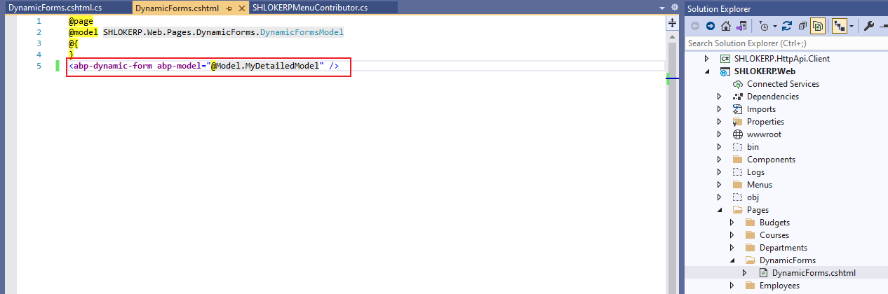
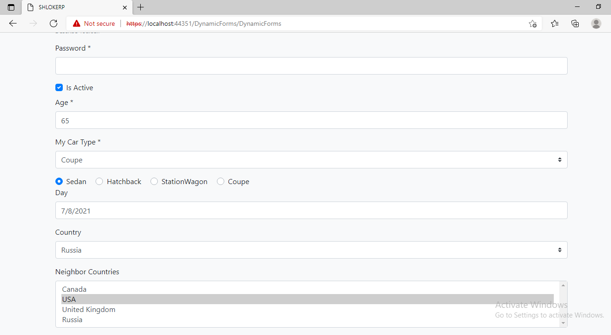
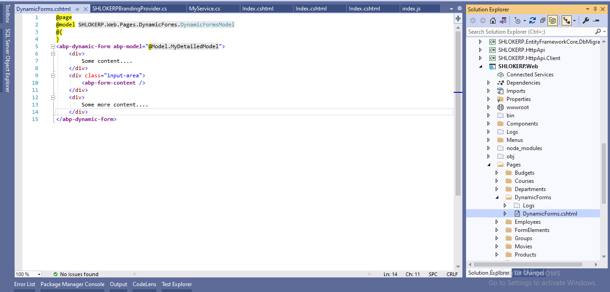
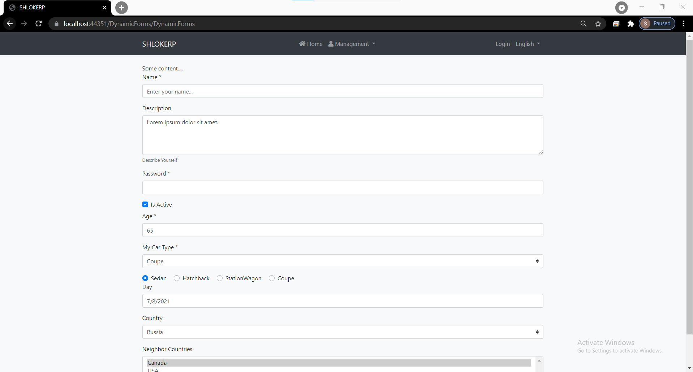
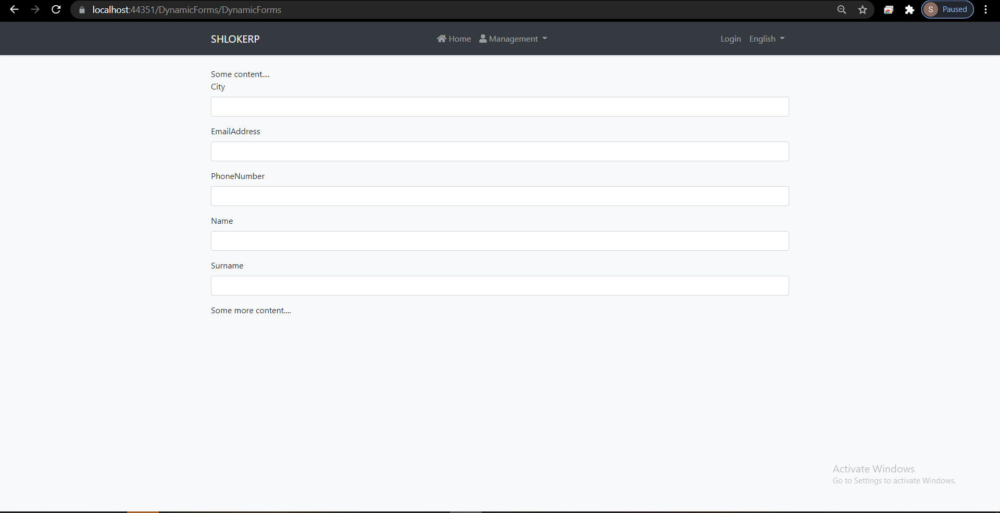
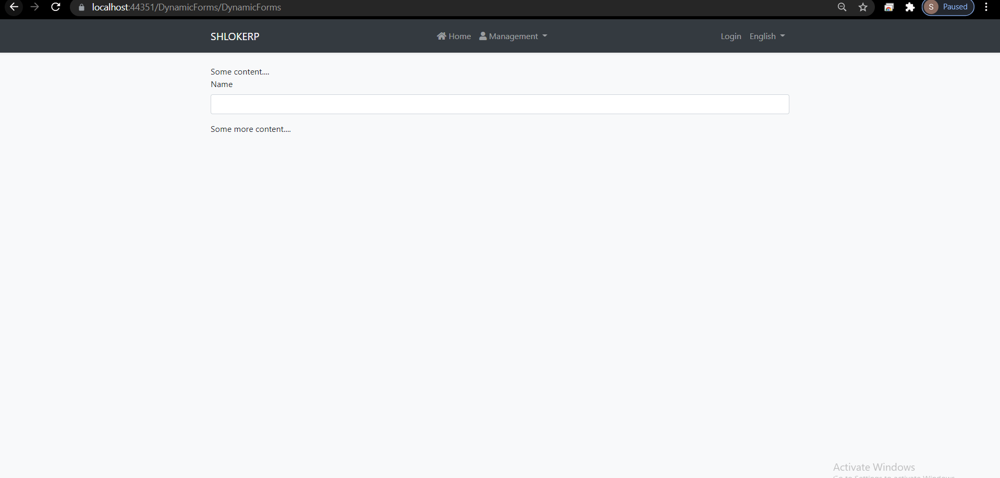
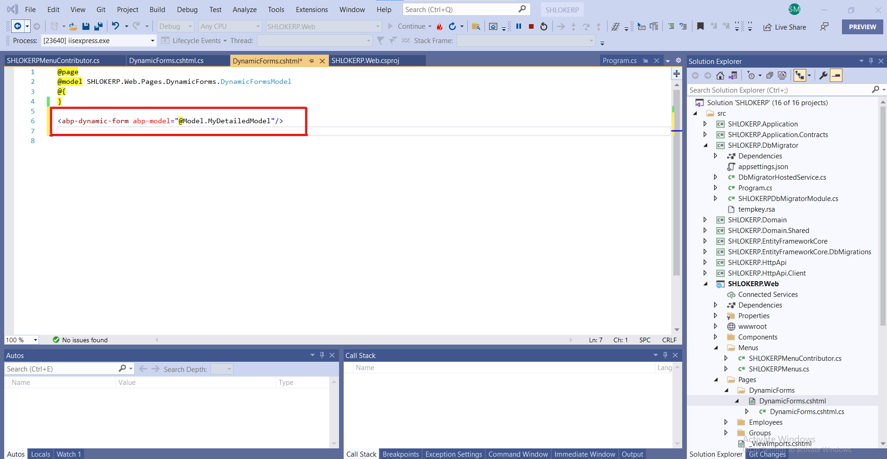
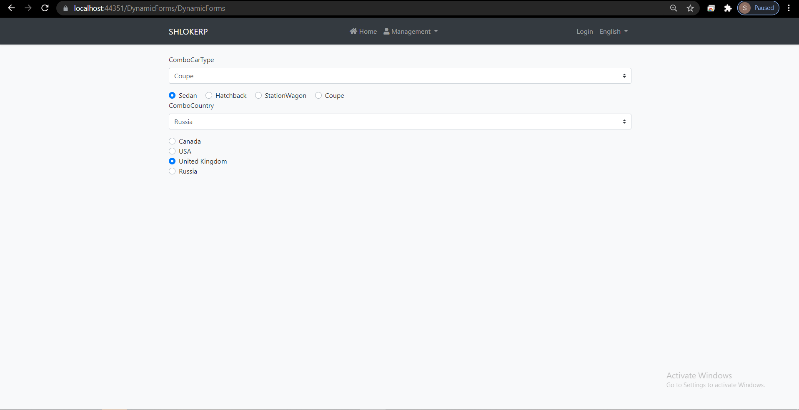

# Dynamic Forms

`abp-dynamic-form` creates a bootstrap form for a given c# model.

### step 1 : Add the set of code in the `.cshtml` file:



### step 2 : Add the Model in the `.cshtml.cs` file:

```c#
using System;
using System.Collections.Generic;
using System.ComponentModel.DataAnnotations;
using System.Linq;
using System.Threading.Tasks;
using Microsoft.AspNetCore.Mvc;
using Microsoft.AspNetCore.Mvc.RazorPages;
using Microsoft.AspNetCore.Mvc.Rendering;
using Volo.Abp.AspNetCore.Mvc.UI.Bootstrap.TagHelpers.Form;

namespace SHLOKERP.Web.Pages.DynamicForms
{
    public class DynamicFormsModel : SHLOKERPPageModel
    {
        [BindProperty]
        public DetailedModel MyDetailedModel { get; set; }

        public List<SelectListItem> CountryList { get; set; } = new List<SelectListItem>
    {
        new SelectListItem { Value = "CA", Text = "Canada"},
        new SelectListItem { Value = "US", Text = "USA"},
        new SelectListItem { Value = "UK", Text = "United Kingdom"},
        new SelectListItem { Value = "RU", Text = "Russia"}
    };

        public void OnGet()
        {
            MyDetailedModel = new DetailedModel
            {
                Name = "",
                Description = "Lorem ipsum dolor sit amet.",
                IsActive = true,
                Age = 65,
                Day = DateTime.Now,
                MyCarType = CarType.Coupe,
                YourCarType = CarType.Sedan,
                Country = "RU",
                NeighborCountries = new List<string>() { "UK", "CA" }
            };
        }

        public class DetailedModel
        {
            [Required]
            [Placeholder("Enter your name...")]
            [Display(Name = "Name")]
            public string Name { get; set; }

            [TextArea(Rows = 4)]
            [Display(Name = "Description")]
            [InputInfoText("Describe Yourself")]
            public string Description { get; set; }

            [Required]
            [DataType(DataType.Password)]
            [Display(Name = "Password")]
            public string Password { get; set; }

            [Display(Name = "Is Active")]
            public bool IsActive { get; set; }

            [Required]
            [Display(Name = "Age")]
            public int Age { get; set; }

            [Required]
            [Display(Name = "My Car Type")]
            public CarType MyCarType { get; set; }

            [Required]
            [AbpRadioButton(Inline = true)]
            [Display(Name = "Your Car Type")]
            public CarType YourCarType { get; set; }

            [DataType(DataType.Date)]
            [Display(Name = "Day")]
            public DateTime Day { get; set; }

            [SelectItems(nameof(CountryList))]
            [Display(Name = "Country")]
            public string Country { get; set; }

            [SelectItems(nameof(CountryList))]
            [Display(Name = "Neighbor Countries")]
            public List<string> NeighborCountries { get; set; }
        }

        public enum CarType
        {
            Sedan,
            Hatchback,
            StationWagon,
            Coupe
        }

    }
}
```

- Result :

    

# Form Content Placement
By default, `abp-dynamic-form` clears the inner html and places the inputs into itself. If you want to add additional content to dynamic form or place the inputs to some specific area, you can use `<abp-form-content />` tag. This tag will be replaced by form content and rest of the inner html of `abp-dynamic-form` tag will be unchanged.


### Step 1 : Add the content inside the `.cshtml` page:



Here is the content :
```xml
<abp-dynamic-form abp-model="@Model.MyDetailedModel">
    <div>
        Some content....
    </div>
    <div class="input-area">
        <abp-form-content />
    </div>
    <div>
        Some more content....
    </div>
</abp-dynamic-form>
```

- Result :

    

# Input Order

`abp-dynamic-form` orders the properties by their `DisplayOrder` attribute and then their property order in model class.

Default `DisplayOrder` attribute number is 10000 for every property.

See example below:


- step 1 :
  Add the Model in the `.cshtml.cs` file:

```c#
public class OrderExampleModel
{
    [DisplayOrder(10004)]
    public string Name{ get; set; }
    
    [DisplayOrder(10005)]
    public string Surname{ get; set; }

    //Default 10000
    public string EmailAddress { get; set; }

    [DisplayOrder(10003)]
    public string PhoneNumber { get; set; }

    [DisplayOrder(9999)]
    public string City { get; set; }
}
```


- Result :

    

In this example, input fields will be displayed with this order: `City > EmailAddress > PhoneNumber > Name > Surname.`

# Ignoring a property

By default, `abp-dynamic-form` generates input for every property in model class. If you want to ignore a property, use `DynamicFormIgnore` attribute.

See example below:

- step 1 :
  Add the Model in the `.cshtml.cs` file:

```c#
        public class MyModel
        {
            public string Name { get; set; }

            [DynamicFormIgnore]
            public string Surname { get; set; }
        }
```

- Result :

    

# Indicating Text box, Radio Group and Combobox

If you have read the Form elements document, you noticed that `abp-radio` and `abp-select` tags are very similar on c# model. So we have to use `[AbpRadioButton()]` attribute to tell abp-dynamic-form which of your properties will be radio group and which will be combobox. See example below:

- Step 1 :
Add the set of code in the `.cshtml` file:

       

- Step2 : 
Add the Model in the `.cshtml.cs` file:

```c#
        public class DynamicFormsModel : PageModel
{
    [BindProperty]
    public DetailedModel MyDetailedModel { get; set; }

    public List<SelectListItem> CountryList { get; set; } = new List<SelectListItem>
    {
        new SelectListItem { Value = "CA", Text = "Canada"},
        new SelectListItem { Value = "US", Text = "USA"},
        new SelectListItem { Value = "UK", Text = "United Kingdom"},
        new SelectListItem { Value = "RU", Text = "Russia"}
    };

    public void OnGet()
    {
            MyDetailedModel = new DetailedModel
            {
                ComboCarType = CarType.Coupe,
                RadioCarType = CarType.Sedan,
                ComboCountry = "RU",
                RadioCountry = "UK"
            };
    }

    public class DetailedModel
    {
        public CarType ComboCarType { get; set; }

        [AbpRadioButton(Inline = true)]
        public CarType RadioCarType { get; set; }
        
        [SelectItems(nameof(CountryList))]
        public string ComboCountry { get; set; }
        
        [AbpRadioButton()]
        [SelectItems(nameof(CountryList))]
        public string RadioCountry { get; set; }
    }

    public enum CarType
    {
        Sedan,
        Hatchback,
        StationWagon,
        Coupe
    }
}
```

- Result :

    

As you see in example above:

- If [AbpRadioButton()] are used on a Enum property, it will be a radio group. Otherwise, combobox.
- If [SelectItems()] and [AbpRadioButton()] are used on a property, it will be a radio group.
- If just [SelectItems()] is used on a property, it will be a combobox.
- If none of these attributes are used on a property, it will be a text box

# Localization
`abp-dynamic-form` handles localization as well.

By default, it will try to find "DisplayName:{PropertyName}" or "{PropertyName}" localization keys and set the localization value as input label.

You can set it yourself by using `[Display()]` attribute of Asp.Net Core. You can use a localization key in this attribute. See example below:

- Step 1

Add the Model in the `.cshtml.cs` file:

```c#
[Display(Name = "Name")]
public string Name { get; set; }
```

- Result
  