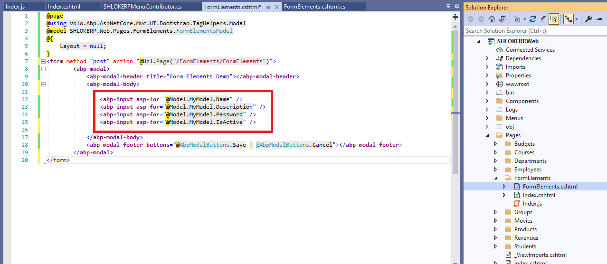
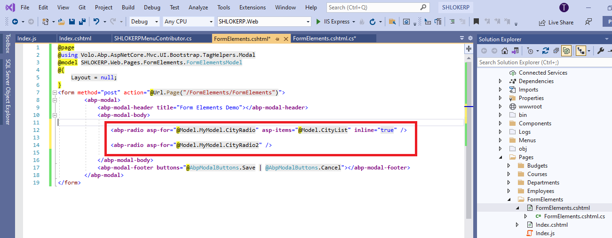

# Form Elements
Abp provides form input tag helpers to make building forms easier.

## abp-input
`abp-input` tag creates a Bootstrap form input for a given c# property. It uses **Asp.Net Core Input Tag Helper** in background, so every data annotation attribute of `input` tag helper of Asp.Net Core is also valid for `abp-input`.

- step 1 :
Add the set of code in the `.cshtml` file:

    

- step 2 :
Add the Model in the `.cshtml.cs` file:

    ```c#
    using System.ComponentModel.DataAnnotations;
    using Volo.Abp.AspNetCore.Mvc.UI.Bootstrap.TagHelpers.Form;

    namespace SHLOKERP.Web.Pages.FormElements
    {
        public class FormElementsModel : SHLOKERPPageModel
        {
            public SampleModel MyModel { get; set; }

            public void OnGet()
            {
                MyModel = new SampleModel();
            }

            public class SampleModel
            {
                [Required]
                [Placeholder("Enter your name...")]
                [InputInfoText("What is your name?")]
                public string Name { get; set; }

                [Required]
                [FormControlSize(AbpFormControlSize.Large)]
                public string SurName { get; set; }

                [TextArea(Rows = 4)]
                public string Description { get; set; }

                [Required]
                [DataType(DataType.Password)]
                public string Password { get; set; }

                public bool IsActive { get; set; }
            }
        }
    }
    ```

- Result :

    

For more info on `Attributes`, `Label & Localization` click [here](https://docs.abp.io/en/abp/latest/UI/AspNetCore/Tag-Helpers/Form-elements) and refer the `abp-input` section.

## abp-select
`abp-select` tag creates a Bootstrap form select for a given c# property. It uses `Asp.Net Core Select Tag Helper` in background, so every data annotation attribute of `select` tag helper of Asp.Net Core is also valid for `abp-select`.

`abp-select` tag needs a list of `Microsoft.AspNetCore.Mvc.Rendering.SelectListItem` to work. It can be provided by `asp-items` attriube on the tag or `[SelectItems()]` attribute on c# property. (if you are using **abp-dynamic-form**, c# attribute is the only way.)

`abp-select` supports multiple selection.

`abp-select` auto-creates a select list for **Enum** properties. No extra data is needed. If property is nullable, an empty key and value is added to top of the auto-generated list.

- step 1 :
Add the set of code in the `.cshtml` file:

    

- step 2 :
Add the Model in the `.cshtml.cs` file:

    ```c#
    using Microsoft.AspNetCore.Mvc.Rendering;
    using System.Collections.Generic;
    using System.ComponentModel.DataAnnotations;
    using Volo.Abp.AspNetCore.Mvc.UI.Bootstrap.TagHelpers.Form;

    namespace SHLOKERP.Web.Pages.FormElements
    {
        public class FormElementsModel : SHLOKERPPageModel
        {
            public SampleModel MyModel { get; set; }

            public List<SelectListItem> CityList { get; set; }

            public void OnGet()
            {
                MyModel = new SampleModel();

                CityList = new List<SelectListItem>
                {
                    new SelectListItem { Value = "NY", Text = "New York"},
                    new SelectListItem { Value = "LDN", Text = "London"},
                    new SelectListItem { Value = "IST", Text = "Istanbul"},
                    new SelectListItem { Value = "MOS", Text = "Moscow"}
                };
            }

            public class SampleModel
            {
                public string City { get; set; }

                [SelectItems(nameof(CityList))]
                public string AnotherCity { get; set; }

                public List<string> MultipleCities { get; set; }

                public CarType MyCarType { get; set; }

                public CarType? MyNullableCarType { get; set; }
            }

            public enum CarType
            {
                Sedan,
                Hatchback,
                StationWagon,
                Coupe
            }
        }
    }
    ```
- Result :

    

For more info on `Attributes`, `Label & Localization` click [here](https://docs.abp.io/en/abp/latest/UI/AspNetCore/Tag-Helpers/Form-elements) and refer the `abp-select` section.

## abp-radio
`abp-radio` tag creates a Bootstrap form radio group for a given c# property. Usage is very similar to `abp-select` tag.

- step 1 :
Add the set of code in the `.cshtml` file:

    

- step 2 :
Add the Model in the `.cshtml.cs` file:

    ```c#
    using Microsoft.AspNetCore.Mvc.Rendering;
    using System.Collections.Generic;
    using System.ComponentModel.DataAnnotations;
    using Volo.Abp.AspNetCore.Mvc.UI.Bootstrap.TagHelpers.Form;

    namespace SHLOKERP.Web.Pages.FormElements
    {
        public class FormElementsModel : SHLOKERPPageModel
        {
                public SampleModel MyModel { get; set; }

            public List<SelectListItem> CityList { get; set; } = new List<SelectListItem>
            {
                new SelectListItem { Value = "NY", Text = "New York"},
                new SelectListItem { Value = "LDN", Text = "London"},
                new SelectListItem { Value = "IST", Text = "Istanbul"},
                new SelectListItem { Value = "MOS", Text = "Moscow"}
            };

            public void OnGet()
            {
                MyModel = new SampleModel();
                MyModel.CityRadio = "IST";
                MyModel.CityRadio2 = "MOS";
            }

            public class SampleModel
            {
                public string CityRadio { get; set; }

                [SelectItems(nameof(CityList))]
                public string CityRadio2 { get; set; }
            }
        }
    }
    ```
- Result :

    

For more info on `Attributes` click [here](https://docs.abp.io/en/abp/latest/UI/AspNetCore/Tag-Helpers/Form-elements) and refer the `abp-radio` section.

# Demo
See the [form elements demo page](https://bootstrap-taghelpers.abp.io/Components/FormElements) to see it in action.