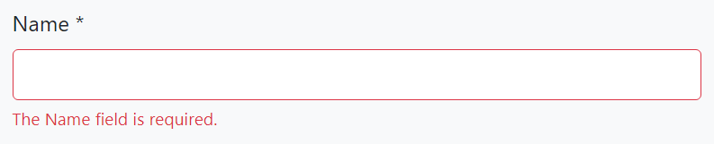
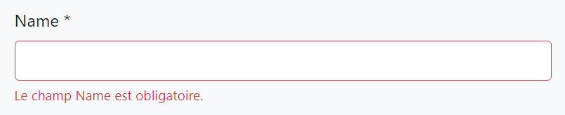

# ABP Dynamic Forms
`abp-dynamic-form` tag helper completely automates the form creation. Take this model class as an example:

```c#
using System;
using System.ComponentModel.DataAnnotations;
using Volo.Abp.AspNetCore.Mvc.UI.Bootstrap.TagHelpers.Form;

namespace SHLOKERP.Web.Pages.Movies
{
    public class MovieViewModel
    {
        [Required]
        [StringLength(256)]
        public string Name { get; set; }

        [Required]
        [DataType(DataType.Date)]
        public DateTime ReleaseDate { get; set; }

        [Required]
        [TextArea]
        [StringLength(1000)]
        public string Description { get; set; }

        public Genre Genre { get; set; }

        public float? Price { get; set; }

        public bool PreOrder { get; set; }
    }

    public enum Genre
    {
        Classic,
        Action,
        Fiction,
        Fantasy,
        Animation
    }
}
```

It uses the data annotation attributes to define validation rules and UI styles for the properties. 

In order to create the form in a razor page, create a property in your `PageModel` class:
```c#
using System.Threading.Tasks;
using Microsoft.AspNetCore.Mvc;

namespace SHLOKERP.Web.Pages.Movies
{
    public class CreateMovieModel : SHLOKERPPageModel
    {
        [BindProperty]
        public MovieViewModel Movie { get; set; }

        public void OnGet()
        {
            Movie = new MovieViewModel();
        }

        public virtual Task OnPostAsync()
        {
            if (ModelState.IsValid)
            {
                //TODO: Save the Movie
            }

            return Task.CompletedTask;
        }
    }
}
```
Then you can render the form in the `.cshtml` file:

```html
@page
@model SHLOKERP.Web.Pages.Movies.CreateMovieModel

<h2>Create a new Movie</h2>

<abp-dynamic-form abp-model="Movie" submit-button="true" />
```

The result is shown below:


# ABP Form Tag Helpers
`abp-dynamic-form` covers most of the scenarios and allows you to control and customize the form using the attributes.

However, if you want to **render the form body yourself** (for example, you may want to fully control the **form layout**), you can directly use the `ABP Form Tag Helpers`. The same auto-generated form above can be created using the ABP Form Tag Helpers as shown below:

```html
@page
@model SHLOKERP.Web.Pages.Movies.CreateMovieModel

<h2>Create a new Movie</h2>

<form method="post">
    <abp-input asp-for="Movie.Name"/>
    <abp-input asp-for="Movie.ReleaseDate"/>
    <abp-input asp-for="Movie.Description"/>
    <abp-select asp-for="Movie.Genre"/>
    <abp-input asp-for="Movie.Price"/>
    <abp-input asp-for="Movie.PreOrder"/>
    <abp-button button-type="Primary" type="submit">Save</abp-button>
</form>
```

# Validation & Localization
Both of the Dynamic Form and the Form Tag Helpers **automatically validate** the input based on the data annotation attributes and shows validation error messages on the user interface. Error messages are **automatically localized** based on the current culture.

**Example: User leaves empty a required string property**



The error message below is shown if the language is French:



Validation errors are already translated a lot of languages. You can contribute to the translation for your own language or override the texts for your own application by following the localization documentation.

# Display Name Localization
ABP Framework uses the property name as the field name on the user interface. You typically want to localize this name based on the current culture.

ABP Framework can conventionally localize the fields on the UI when you add the localization keys to the localization JSON files.

Example: French localization for the Name property (add into the `fr.json` in the application):

```javascript
"Name": "Nom"
```

Then the UI will use the given name for French language.

# Using the `DisplayName:` Prefix
Directly using the property name as the localization key may be a problem if you need to use the property name for other purpose, which a different translation value. In this case, use the `DisplayName:` prefix for the localization key:

```javascript
"DisplayName:Name": "Nom"
```

ABP prefers to use the `DisplayName:Name` key over the `Name` key if it does exists.

# Using a Custom Localization Key
If you need, you can use the `[DisplayName]` attribute to specify the localization key for a specific property:

```c#
[DisplayName("MyNameKey")]
public string Name { get; set; }
```

In this case, you can add an entry to the localization file using the key MyNameKey.

>If you use the `[DisplayName]` but not add a corresponding entity to the localization file, then ABP Framework shows the given key as the field name, `MyNameKey` for this case. So, it provides a way to specify a hard coded display name even if you don't need to use the localization system.