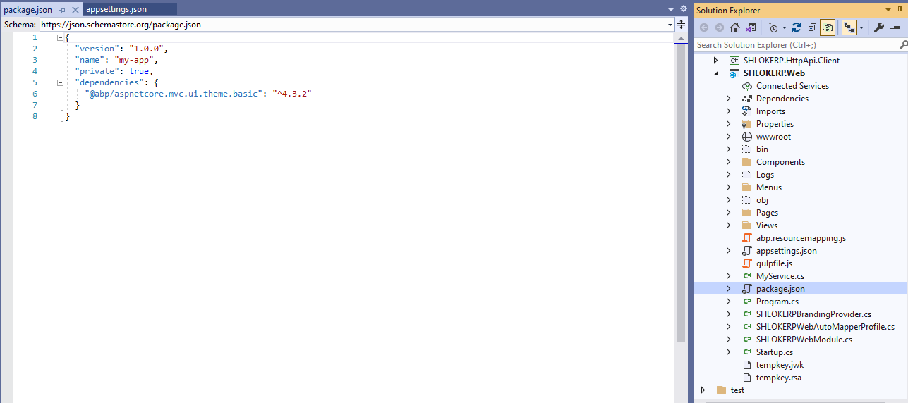
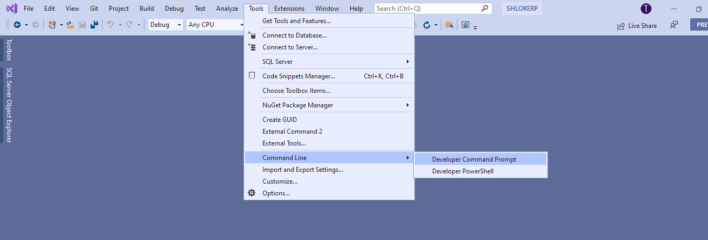
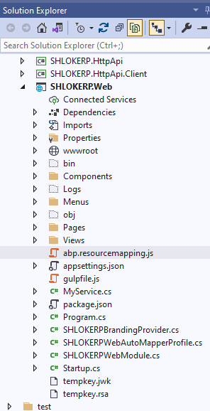

# ASP.NET Core MVC Client Side Package Management
ABP framework can work with any type of client side package management systems. You can even decide to use no package management system and manage your dependencies manually.

However, ABP framework works best with **NPM/Yarn**. By default, built-in modules are configured to work with NPM/Yarn.

we suggest the **Yarn** over the NPM since it's faster, stable and also compatible with the NPM.

## @ABP NPM Packages <!-- {docsify-ignore} -->
ABP is a modular platform. Every developer can create modules and the modules should work together in a **compatible** and **stable** state.

One challenge is the **versions of the dependant NPM packages**. What if two different modules use the same JavaScript library but its different (and potentially incompatible) versions.

To solve the versioning problem, we created a **standard set of packages** those depends on some common third-party libraries. 
Some example packages are `@abp/jquery`, `@abp/bootstrap` and `@abp/font-awesome`. You can see **the list of packages** from the **Github repository**.

The benefit of a **standard package** is:

- It depends on a **standard version** of a package. Depending on this package is **safe** because all modules depend on the same version.
- It contains the gulp task to copy library resources (js, css, img... files) from the `node_modules` folder to `wwwroot/libs` folder.

## Step 1 : Depending on a standard package is easy. Just add it to your **package.json** file like you normally do. 

Example:



It's suggested to depend on a standard package instead of directly depending on a third-party package.

## Step 2 : Package Installation
After depending on a NPM package, all you should do is to run the yarn command from the command line to install all the packages and their dependencies:



```Bash
yarn
```
Alternatively, you can use `npm install` but `Yarn` is suggested as mentioned before.

## Step 3 : Package Contribution
If you need a third-party NPM package that is not in the standard set of packages, you can create a Pull Request on the Github **repository**. A pull request that follows these rules is accepted:

  - Package name should be named as `@abp/package-name` for a `package-name` on NPM (example: `@abp/bootstrap` for the `bootstrap `package).
  - It should be the **latest stable** version of the package.
  - It should only depend a **single** third-party package. It can depend on multiple `@abp/*` packages.
  - The package should include a `abp.resourcemapping.js` file formatted. This file should only map resources for the depended package.
  - You also need to create `bundle contributor(s)` for the package you have created.

See current standard packages for examples.

## Step 4 : Mapping The Library Resources
Using NPM packages and NPM/Yarn tool is the de facto standard for client side libraries. NPM/Yarn tool creates a **node_modules** folder in the root folder of your web project.

Next challenge is copying needed resources (js, css, img... files) from the `node_modules` into a folder inside the **wwwroot** folder to make it accessible to the clients/browsers.

ABP defines a Gulp based task to **copy resources** from **node_modules** to `wwwroot/libs` folder. Each **standard package** (see the @ABP NPM Packages section) defines the mapping for its own files. So, most of the time, you only configure dependencies.

The `startup templates` are already configured to work all these out of the box. This section will explain the configuration options.

## Step 5 : Resource Mapping Definition File



A module should define a JavaScript file named `abp.resourcemapping.js` which is formatted as in the example below:

```JavaScript
module.exports = {
    aliases: {
        "@node_modules": "./node_modules",
        "@libs": "./wwwroot/libs"
    },
    clean: [
        "@libs",
        "!@libs/**/foo.txt"
    ],
    mappings: {
        
    }
}
```

- **aliases** section defines standard aliases (placeholders) that can be used in the mapping paths. **@node_modules** and **@libs** are required (by the standard packages), you can define your own aliases to reduce duplication.
- **clean** section is a list of folders to clean before copying the files. Glob matching and negation is enabled, so you can fine-tune what to delete and keep. The example above will clean everything inside `./wwwroot/libs`, but keep any `foo.txt` files.
- **mappings** section is a list of mappings of files/folders to copy. This example does not copy any resource itself, but depends on a standard package.

An example mapping configuration is shown below:

```JavaScript
mappings: {
    "@node_modules/bootstrap/dist/css/bootstrap.css": "@libs/bootstrap/css/",
    "@node_modules/bootstrap/dist/js/bootstrap.bundle.js": "@libs/bootstrap/js/",
    "@node_modules/bootstrap-datepicker/dist/locales/*.*": "@libs/bootstrap-datepicker/locales/",
    "@node_modules/bootstrap-v4-rtl/dist/**/*": "@libs/bootstrap-v4-rtl/dist/"
}
```

## Step 6 : Using The Gulp
Once you properly configure the `abp.resourcemapping.js` file, you can run the gulp command from the command line:

```Bash
gulp
```

When you run the `gulp`, all packages will copy their own resources into the **wwwroot/libs** folder. Running `yarn & gulp` is only necessary if you make a change in your dependencies in the **package.json** file.

>When you run the Gulp command, dependencies of the application are resolved using the package.json file. The Gulp task automatically discovers and maps all resources from all dependencies (recursively).

>Related Articles

- [Bundling & Minification](Bundling&Minification.md)

- [Theming](Theming.md)
