# ASP.NET Core MVC / Razor Pages UI: Modals

## Basic Usage - Creating a Modal as a Razor Page

### step 1 : To demonstrate the usage, we are creating a simple Razor Page, named `ProductInfoModal.cshtml`, under the `/Pages/Products` folder:

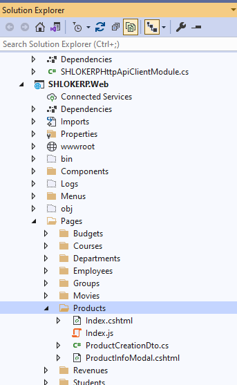

### step 2 : Add the `ProductInfoModal.cshtml` Content like shown below:

```html
@page
@model SHLOKERP.Web.Pages.Products.ProductInfoModalModel
@{
    Layout = null;
}
<abp-modal>
    <abp-modal-header title="Product Information"></abp-modal-header>
    <abp-modal-body>
        <h3>@Model.ProductName</h3>
        <p>
            @Model.ProductDescription
        </p>
        <p>
            <small><i>Reference: https://acme.com/catalog/</i></small>
        </p>
    </abp-modal-body>
    <abp-modal-footer buttons="Close"></abp-modal-footer>
</abp-modal>
```
* This page sets the `Layout` to `null` since we will show this as a modal. So, no need to wrap with a layout.
* It uses `abp-modal tag helper` to simplify creating the modal HTML code. You can use the standard Bootstrap modal code if you prefer it.

### step 3 : Add the `ProductInfoModalModel.cshtml.cs` Content like shown below:

```c#
using Volo.Abp.AspNetCore.Mvc.UI.RazorPages;
namespace SHLOKERP.Web.Pages.Products
{
    public class ProductInfoModalModel : SHLOKERPPageModel
    {
        public string ProductName { get; set; }

        public string ProductDescription { get; set; }

        public string ProductImageUrl { get; set; }

        public void OnGet()
        {
            ProductName = "Acme Indestructo Steel Ball";
            ProductDescription = "The ACME Indestructo Steel Ball is completely indestructible, there is nothing that can destroy it!";
            ProductImageUrl = "https://acme.com/catalog/acmeindestructo.jpg";
        }

    }
}
```
You can surely get the product info from a database or API. We are setting the properties hard-coded for the sake of simplicity,

### step 4 : Defining the Modal Manager & Opening the Modal

First, create an `abp.ModalManager` object by setting the `viewUrl`, in the JavaScript file of the page that will use the modal.
You typically want to open the modal when something happens; For example, when the user clicks a button:

#### `Index.js` Content :
```Javascript
var productInfoModal = new abp.ModalManager({
    viewUrl: '/Products/ProductInfoModal'
});
$('#OpenProductInfoModal').click(function () {
    productInfoModal.open();
});
```

>If you only need to specify the `viewUrl`, you can directly pass it to the `ModalManager` constructor, as a shortcut. Example: `new abp.ModalManager('/Products/ProductInfoModal');`

#### `Index.cshtml` Content :

```html
@page
@model SHLOKERP.Web.Pages.Products.IndexModel
@section scripts
{
    <abp-script src="/Pages/Products/index.js" />
}
<abp-card>
    <abp-card-header>
        <abp-row>
            <abp-column size-md="_6">
                <abp-card-title>Products</abp-card-title>
            </abp-column>
            <abp-column size-md="_6" class="text-right">
                
                    <abp-button id="OpenProductInfoModal"
                                text="NewProduct"
                                icon="plus"
                                button-type="Primary" />
                
            </abp-column>
        </abp-row>
    </abp-card-header>
    <abp-card-body>
    </abp-card-body>
</abp-card>
```

### step 5 : Add Menus in Menu Contributor class :

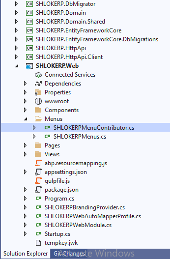

```c#
.AddItem(
                    new ApplicationMenuItem("Products", "Products", url: "/Products"))
```

### The resulting modal will be like that:

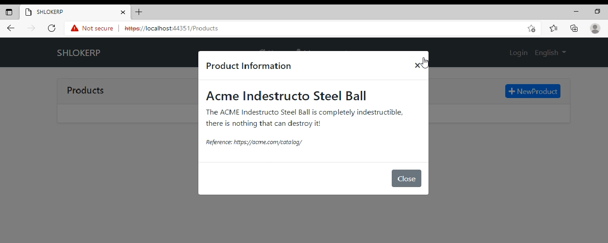

## Opening the Modal with Arguments
When you call the `open()` method, `ModalManager` loads the modal HTML by requesting it from the `viewUrl`. You can pass some `query string parameters` to this URL when you open the modal.

`Example: Pass the product id while opening the modal`

```JavaScript
productInfoModal.open({
    productId: 42
});
```

You can add a `productId` parameter to the get method:

```c#
using Volo.Abp.AspNetCore.Mvc.UI.RazorPages;

namespace SHLOKERP.Web.Pages.Products
{
    public class ProductInfoModalModel : AbpPageModel
    {
        //...

        public async Task OnGetAsync(int productId) //Add productId parameter
        {
            //TODO: Get the product with database with the given productId
            //...
        }
    }
}
```
In this way, you can use the `productId` to query the product from a data source.

## Modals with Forms
`abp.ModalManager` handles various common tasks (described in the introduction) when you want to use a form inside the modal.

### Example Modal with a Form
This section shows an example form to create a new product.

### step 1 : Creating the Razor Page:
using a Razor Page, named `ProductInfoModal.cshtml`, under the `/Pages/Products` folder:


### step 2 :Add `ProductInfoModal.cshtml` Content:
```html
@page
@using Volo.Abp.AspNetCore.Mvc.UI.Bootstrap.TagHelpers.Modal
@model SHLOKERP.Web.Pages.Products.ProductInfoModalModel
@{
    Layout = null;
}
<form method="post" action="@Url.Page("/Products/ProductInfoModal")">
    <abp-modal>
        <abp-modal-header title="Create New Product"></abp-modal-header>
        <abp-modal-body>
            <abp-input asp-for="Product.Name" />
            <abp-input asp-for="Product.Description" />
            <abp-input asp-for="Product.ReleaseDate" />
        </abp-modal-body>
        <abp-modal-footer buttons="@AbpModalButtons.Save | @AbpModalButtons.Cancel"></abp-modal-footer>
    </abp-modal>
</form>
```

* The `abp-modal` has been wrapped by the `form`. This is needed to place the `Save` and the `Cancel` buttons into the form. In this way, the `Save` button acts as the `submit` button for the `form`.
* Used the **abp-input tag helpers** to simplify to create the form elements. Otherwise, you need to write more HTML.

### step 3 :Add `ProductInfoModal.cshtml.cs` Content:
```c#
using System.Threading.Tasks;
using Microsoft.AspNetCore.Mvc;
using Volo.Abp.AspNetCore.Mvc.UI.RazorPages;
namespace SHLOKERP.Web.Pages.Products
{
    public class ProductInfoModalModel : SHLOKERPPageModel
    {
        [BindProperty]
        public PoductCreationDto Product { get; set; }

        public async Task OnGetAsync()
        {
            //TODO: Get logic, if available
        }

        public async Task<IActionResult> OnPostAsync()
        {
            //TODO: Save the Product...

            return NoContent();
        }
    }
}
```
* This is a simple `PageModal` class. The `[BindProperty]` make the form binding to the model when you post (submit) the form; The standard ASP.NET Core system.
* `OnPostAsync` returns `NoContent` (this method is defined by the base `AbpPageModel` class). Because we don't need to a return value in the client side, after the form post operation.

### step 4 : ProductCreationDto :

Create a class inside the `Products` Folder:

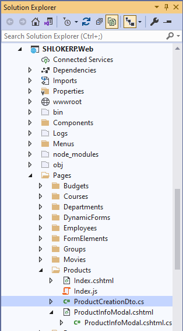

`ProductInfoModalModel` uses a `ProductCreationDto` class defined as shown below:

```c#
using System;
using System.ComponentModel.DataAnnotations;
using Volo.Abp.AspNetCore.Mvc.UI.Bootstrap.TagHelpers.Form;

namespace SHLOKERP.Web.Pages.Products
{
    public class PoductCreationDto
    {
        [Required]
        [StringLength(128)]
        public string Name { get; set; }

        [TextArea(Rows = 4)]
        [StringLength(2000)]
        public string Description { get; set; }

        [DataType(DataType.Date)]
        public DateTime ReleaseDate { get; set; }
    }
}
```

* `abp-input` Tag Helper can understand the data annotation attributes and uses them to shape and validate the form elements.

### step 5 : Defining the Modal Manager & Opening the Modal

#### `Index.js` :

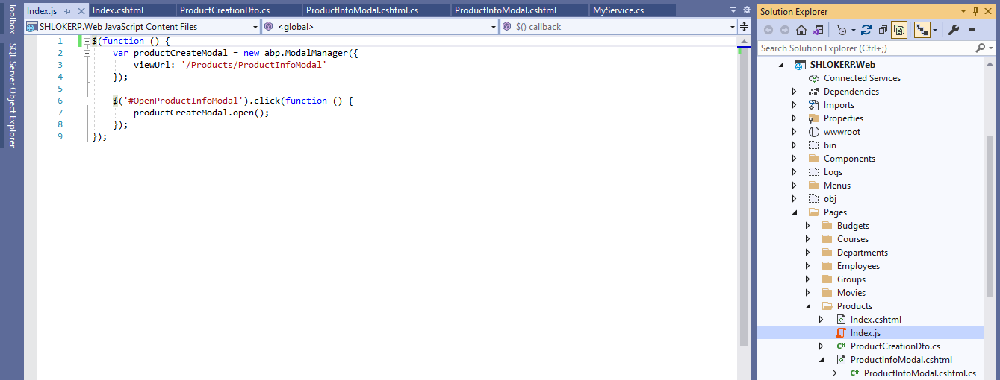

The complete code will be something like that (assuming you have a button with id is `OpenProductInfoModal` on the view side):

#### `Index.js` Content shown below :

```Javascript
$(function () {

    var productCreateModal = new abp.ModalManager({
        viewUrl: '/Products/ProductInfoModal'
    });

    $('#OpenProductCreateModal').click(function () {
        productCreateModal.open();
    });

});
```

#### `Index.cshtml` :

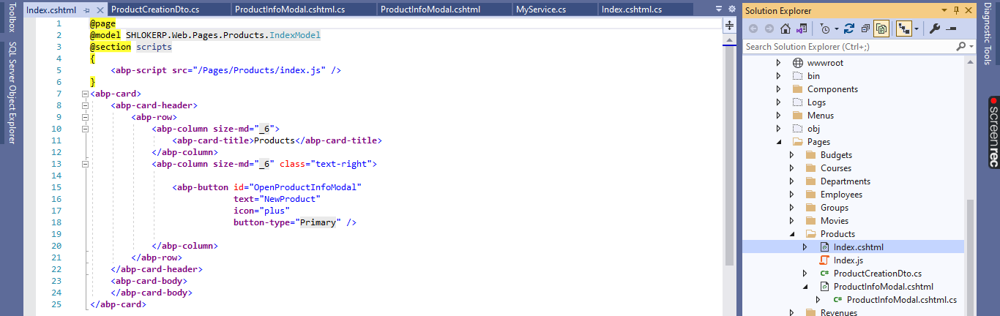

#### `Index.cshtml` Content shown below:

```html
@page
@model SHLOKERP.Web.Pages.Products.IndexModel
@section scripts
{
    <abp-script src="/Pages/Products/index.js" />
}
<abp-card>
    <abp-card-header>
        <abp-row>
            <abp-column size-md="_6">
                <abp-card-title>Products</abp-card-title>
            </abp-column>
            <abp-column size-md="_6" class="text-right">
                
                    <abp-button id="OpenProductInfoModal"
                                text="NewProduct"
                                icon="plus"
                                button-type="Primary" />
                
            </abp-column>
        </abp-row>
    </abp-card-header>
    <abp-card-body>
    </abp-card-body>
</abp-card>
```

The resulting modal will be like that:

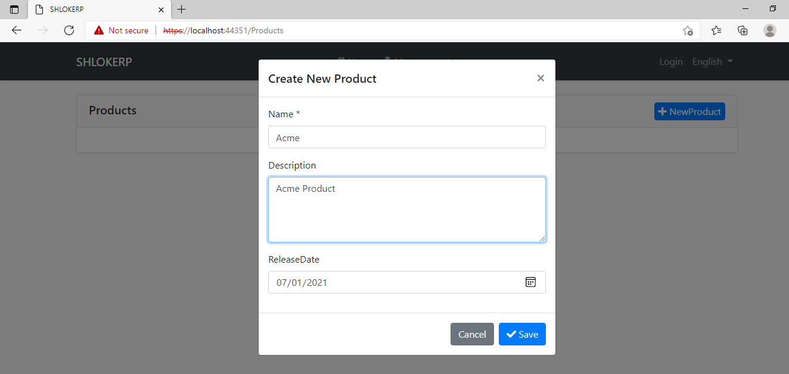

### step 6 : Saving the Modal

When you click to the `Save` button, the form is posted to the server. If the server returns a success response, then the `onResult` event is triggered with some arguments including the server response and the modal is automatically closed.

An example callback that logs the arguments passed to the `onResult` method:

#### Add this to `Index.js` Content :

```Javascript
productCreateModal.onResult(function(){
   console.log(arguments);
});
```

If the server returns a failed response, it shows the error message returned from the server and keeps the modal open.

### step 7 : Canceling the Modal
If you click to the Cancel button with some changes made but not saved, you get such a warning message:

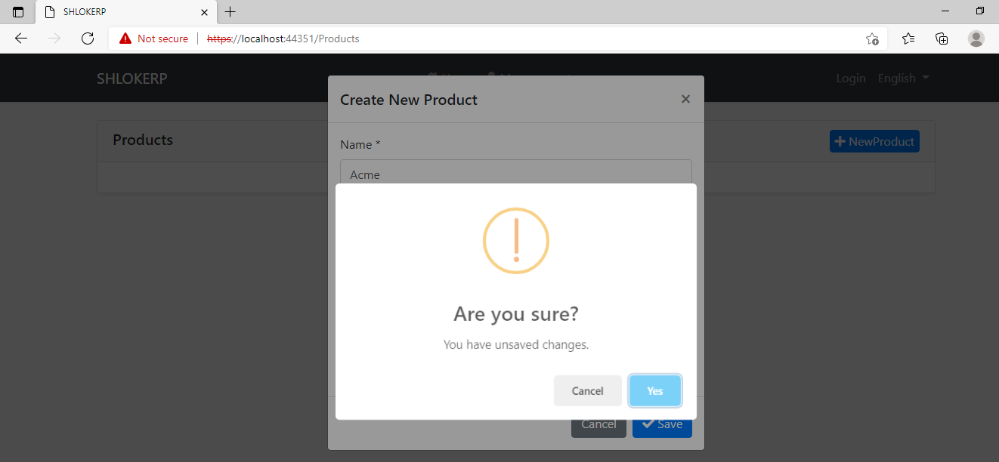

If you don't want such a check & message, you can add `data-check-form-on-close="false"` attribute to your `form` element. Example:

#### Add this to `Index.cshtml` Content :

```html
<form method="post"
      action="@Url.Page("/Products/ProductCreateModal")"
      data-check-form-on-close="false">
```

### Form Validation
`ModalManager` automatically triggers the form validation when you click to the `Save` button or hit the `Enter` key on the form:

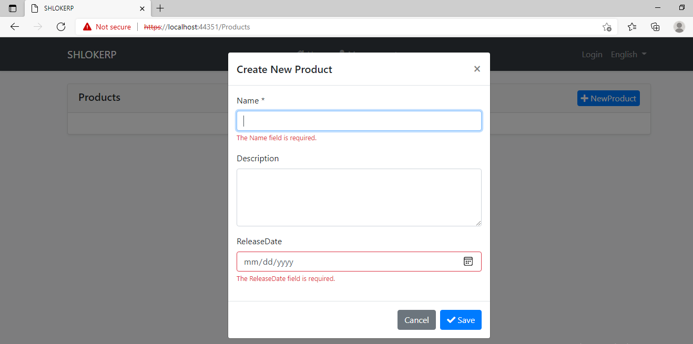

## Modals with Script Files
You may need to perform some logic for your modal.  
### step 1 : create a JavaScript file like below:

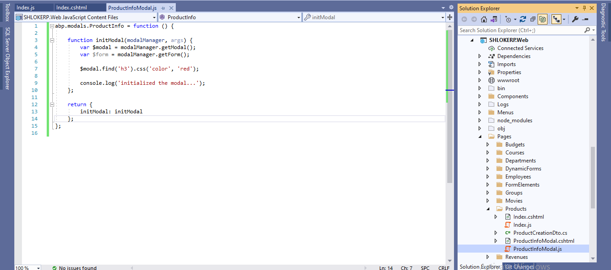

### step 2 : Add the following to `ProductInfoModal.js` Content:

```JavaScript
abp.modals.ProductInfo = function () {

    function initModal(modalManager, args) {
        var $modal = modalManager.getModal();
        var $form = modalManager.getForm();

        $modal.find('h3').css('color', 'red');
        
        console.log('initialized the modal...');
    };

    return {
        initModal: initModal
    };
};
```

* This code simply adds a `ProductInfo` class into the `abp.modals` namespace. The `ProductInfo` class exposes a single public function: `initModal`.
* `initModal` method is called by the `ModalManager` once the modal HTML is inserted to DOM and ready for the initialization logic.
* `modalManager` parameter is the `ModalManager` object related to this modal instance. So, you can use any function on it in your code.

### step 3 : Include this file to the page that you use the modal:

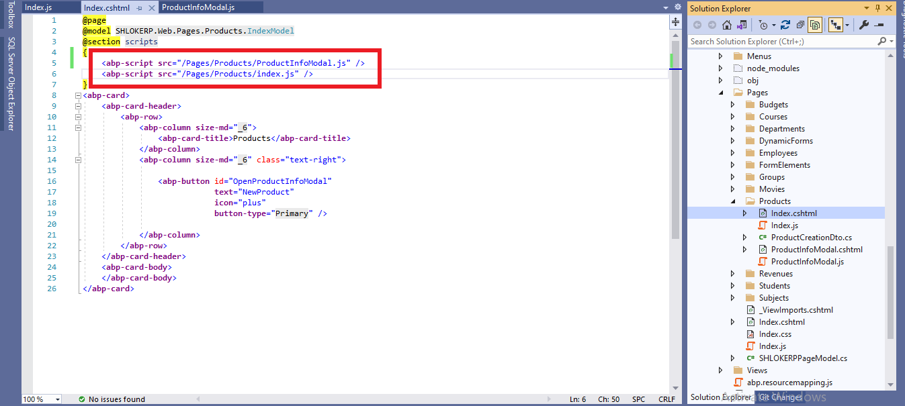

### step 4 : Set the modalClass option while creating the ModalManager instance:

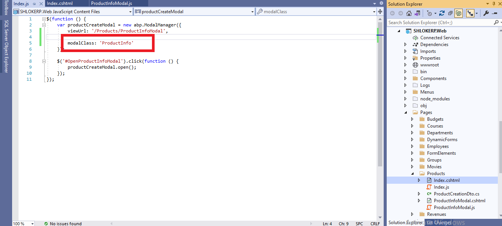

**Result:**

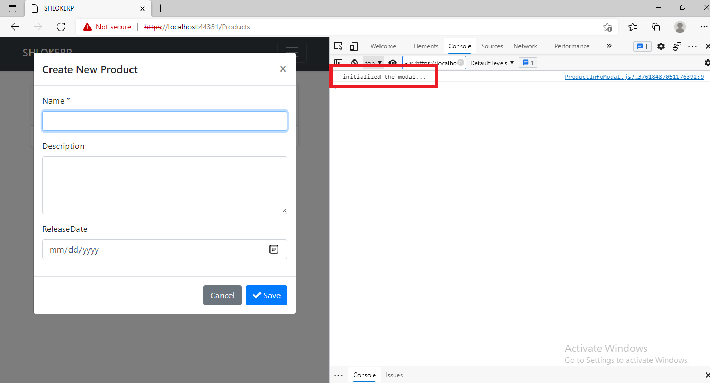

## Lazy Loading the Script File

Instead of adding the `ProductInfoModal.js` to the page you use the modal, you can configure it to lazy load the script file when the first time the modal is opened.

```JavaScript
var productInfoModal = new abp.ModalManager({
    viewUrl: '/Products/ProductInfoModal',
    scriptUrl: '/Pages/Products/ProductInfoModal.js', //Lazy Load URL
    modalClass: 'ProductInfo'
});
```

- `scriptUrl` is used to set the URL to load the script file of the modal.
- In this case, you no longer need to include the `ProductInfoModal.js` to the page. It will be loaded on demand.


>Related Articles
- [ModalManager Reference](https://docs.abp.io/en/abp/latest/UI/AspNetCore/Modals#modalmanager-reference)
- [Bundling & Minification](Bundling&Minification.md)