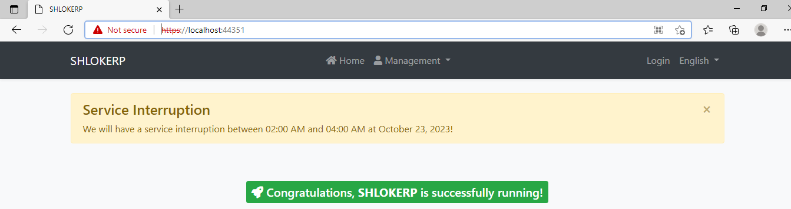
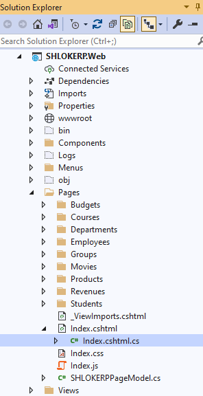
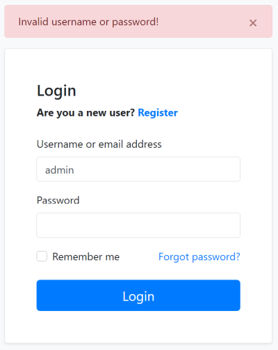
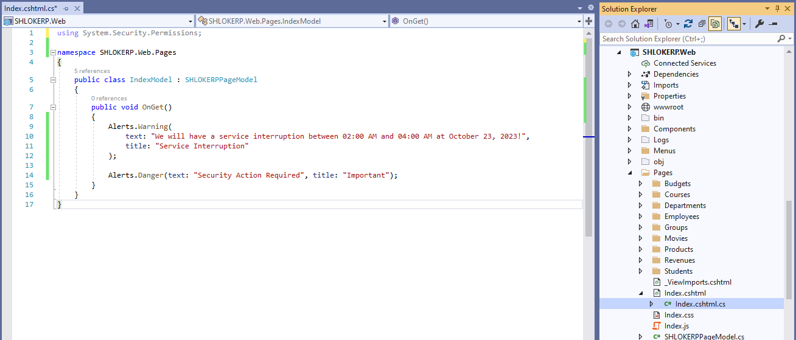
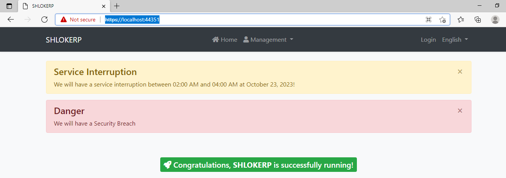

# ASP.NET Core MVC / Razor Pages: Page Alerts

It is common to show error, warning or information alerts to inform the user. 

An example Service Interruption alert is shown below:



## Basic Usage
If you directly or indirectly inherit from `AbpPageModel`, you can use the Alerts property to add alerts to be rendered after the request completes.

- **step 1:** Go to the razor page where the alerts should be shown

    

- **step 2:** Add a Warning alert inside the `.cshtml.cs` file of the razor page

    ```c#
    namespace SHLOKERP.Web.Pages
    {
        public class IndexModel : SHLOKERPPageModel
        {
            public void OnGet()
            {
                Alerts.Warning(
                    text: "We will have a service interruption between 02:00 AM and 04:00 AM at October 23, 2023!",
                    title: "Service Interruption"
                );
            }
        }
    }
    ```
    This usage renders an `alert` that was shown above. 
If you need to `localize` the messages, you can always use the `standard localization system`.

- **step 3:** Run the application , we will see a similar result like the picture shown above.

## Exceptions / Invalid Model States
It is typical to show alerts when you manually handle exceptions (with try/catch statements) or want to handle `!ModelState.IsValid` case and warn the user. 
For example, the Account Module shows a warning if user enters an incorrect username or password:



>Note that you generally don't need to manually handle exceptions since ABP Framework provides an automatic exception handling system.

## Alert Types
`Warning` is used to show a warning alert. Other common methods are `Info`, `Danger` and `Success`.

Beside the standard methods, you can use the `Alerts.Add` method by passing an `AlertType enum` with one of these values: `Default`, `Primary`, `Secondary`, `Success`, `Danger`, `Warning`, `Info`, `Light`, `Dark`.

## Dismissible
All alert methods gets an optional `dismissible` parameter. Default value is `true` which makes the alert box dismissible. Set it to `false`to create a sticky alert box.

## IAlertManager
If you need to add alert messages from another part of your code, you can inject the `IAlertManager` service and use its `Alerts` list.

- **step 1:** Inject the `IAlertManager` by creating a class

    ```c#
    using Volo.Abp.AspNetCore.Mvc.UI.Alerts;
    using Volo.Abp.DependencyInjection;

    namespace SHLOKERP.Web
    {
        public class MyService : ITransientDependency
        {
            private readonly IAlertManager _alertManager;

            public MyService(IAlertManager alertManager)
            {
                _alertManager = alertManager;
            }

            public void Test()
            {
                _alertManager.Alerts.Add(AlertType.Danger, "Test message!");
            }
        }
    }
    ```

- **step 2:** Now use it in a page:

    

- **step 3:** Run the application , we will see a similar result like the picture shown Below.

Result is shown below:


