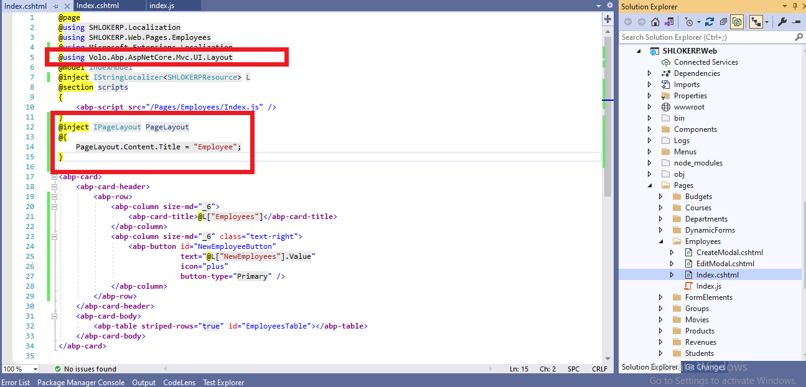
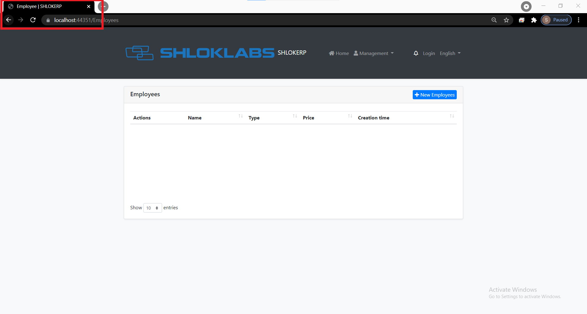
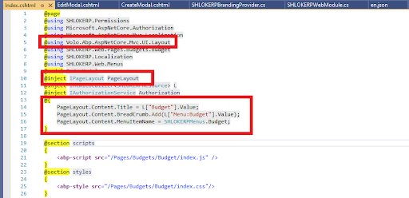
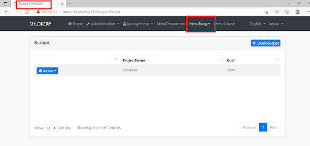

# **ASP.NET Core MVC / Razor Pages: Page Header**

`IPageLayout` service can be used to set the page title, selected menu item and the breadcrumb items for a page. It's the theme's responsibility to render these on the page.

## IPageLayout

`IPageLayout` can be injected in any page/view to set the page header properties.

## Page Title

Page Title can be set as shown in the example below:

### step 1 : Go to `Index.cshtml` Razor Page of your Entity Folder



### step 2 : Add the Content shown Below:
```c#
@using Volo.Abp.AspNetCore.Mvc.UI.Layout
@inject IPageLayout PageLayout
@{
    PageLayout.Content.Title = "Employee";
}

```

- The Page Title is set to the HTML title tag (in addition to the brand/application name).
- The theme may render the Page Title before the Page Content (not implemented by the Basic Theme).

**Result**




## Breadcrumb

### step 1 : Go to `Index.cshtml` Razor Page of your Entity Folder

### step 2 : Add the Following Contents inside the `Index.cshtml` 

```c#
@using Volo.Abp.AspNetCore.Mvc.UI.Layout
@inject IPageLayout PageLayout
@{
    PageLayout.Content.Title = L["Budget"].Value;
    PageLayout.Content.BreadCrumb.Add(L["Menu:Budget"].Value);
    PageLayout.Content.MenuItemName = SHLOKERPMenus.Budget;
}
```



> The `Basic Theme` currently doesn't implement the breadcrumbs.

**Result:**

The theme then renders the breadcrumb. An example render result can be:



- The Home icon is rendered by default. Set `PageLayout.Content.BreadCrumb.ShowHome` to `false` to hide it.

- Current Page name (got from the `PageLayout.Content.Title`) is added as the last by default. Set `PageLayout.Content.BreadCrumb.ShowCurrent` to `false` to hide it.

Any item that you add is inserted between Home and Current Page items. You can add as many item as you need. `BreadCrumb.Add(...)` method gets three parameters:

- `text`: The text to show for the breadcrumb item.
- `url` (optional): A URL to navigate to, if the user clicks to the breadcrumb item.
- `icon` (optional): An icon class (like `fas fa-user-tie` for Font-Awesome) to show with the `text`.

## The Selected Menu Item

> **The Basic Theme currently doesn't implement the selected menu item since it is not applicable to the top menu which is the only option for the Basic Theme for now.**

You can set the Menu Item name related to this page:

```c#
PageLayout.Content.MenuItemName = "BookStore.Books";
```

Menu item name should match a unique menu item name defined using the Navigation / Menu system. In this case, it is expected from the theme to make the menu item "active" in the main menu.


