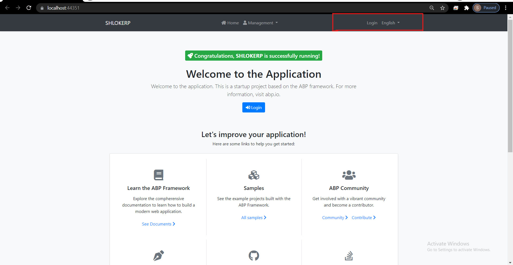
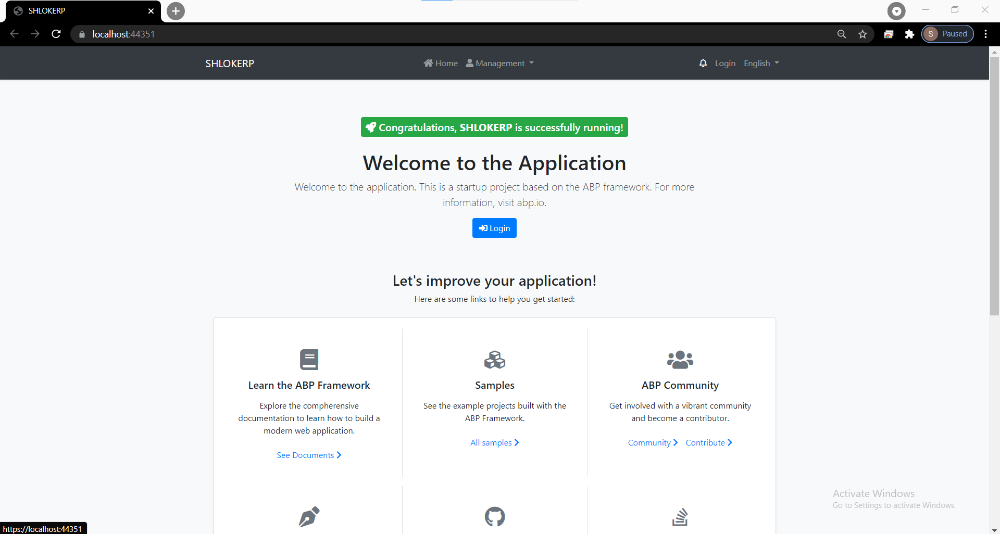

# **ASP.NET Core MVC / Razor Pages UI: Toolbars**
The Toolbar system is used to define **toolbars** on the user interface. Modules (or your application) can add **items** to a toolbar, then the theme renders the toolbar on the layout.

There is only one **standard toolbar** named "Main" (defined as a constant: `StandardToolbars.Main`). The Basic Theme renders the main toolbar as shown below:



In the screenshot above, there are two items added to the main toolbar: Language switch component & user menu. You can add your own items here.

In this example, we will add a **notification (bell) icon** to the left of the language switch item. A item in the toolbar should be a **view component**.

# **Example: Add a Notification Icon**

- Step 1 : Create a new view component in your project:

    

- Step 2 : **NotificationViewComponent.cs**

    ```c#
    public class NotificationViewComponent : AbpViewComponent
    {
        public async Task<IViewComponentResult> InvokeAsync()
        {
            return View("/Pages/Shared/Components/Notification/Default.cshtml");
        }
    }

    ```
- Step 3 : **Default.cshtml**

    ```html
    <div id="MainNotificationIcon" style="color: white; margin: 8px;">
        <i class="far fa-bell"></i>
    </div>

    ```
- Step 4 : Now, we can create a class implementing the `IToolbarContributor` interface:

    ```c#
    public class MyToolbarContributor : IToolbarContributor
    {
        public Task ConfigureToolbarAsync(IToolbarConfigurationContext context)
        {
            if (context.Toolbar.Name == StandardToolbars.Main)
            {
                context.Toolbar.Items
                    .Insert(0, new ToolbarItem(typeof(NotificationViewComponent)));
            }

            return Task.CompletedTask;
        }
    }
    ```

- Step 5: **Authorization**

    You can use the authorization to decide whether to add a `ToolbarItem`.

    ```c#
    if (await context.IsGrantedAsync("MyPermissionName"))
    {
        //...add Toolbar items
    }
    ```

    You can use `RequiredPermissionName` as a shortcut. It is also more performant, ABP optimizes the permission check for all the items.

    ```c#
    context.Toolbar.Items.Insert(0, new ToolbarItem(typeof(NotificationViewComponent), requiredPermissionName: "MyPermissionName"));

    ```

- Step 6 : This class adds the `NotificationViewComponent` as the first item in the `Main` toolbar.

Finally, you need to add this contributor to the `AbpToolbarOption`s, in the `ConfigureServices` of your module:

That's all, you will see the notification icon on the toolbar when you run the application:



`NotificationViewComponent` in this sample simply returns a view without any data. In real life, you probably want to **query database** (or call an HTTP API) to get notifications and pass to the view. If you need, you can add a `JavaScript` or `CSS` file to the global bundle for your toolbar item.

# IToolbarManager
`IToolbarManager` is used to render the toolbar. It returns the toolbar items by a toolbar name. This is generally used by the themes to render the toolbar on the layout.

>Related Articles

- [Theming](Theming.md)

- [Authorization](Authorization.md)


