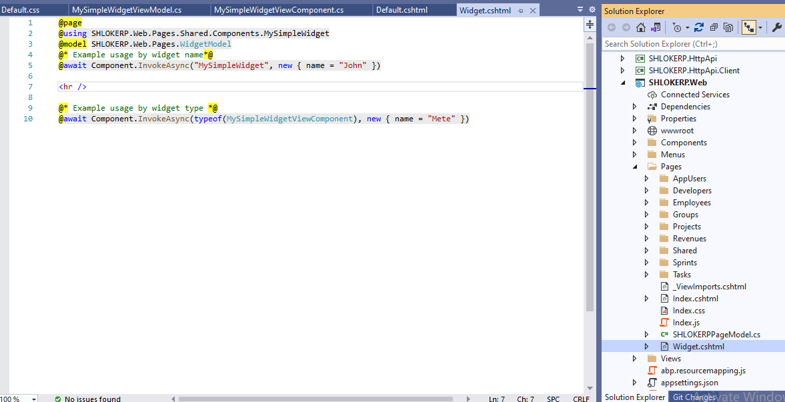

# Widgets

## step 1 : Create a View Component
As the first step, create a new regular ASP.NET Core View Component:


## step 2 : Defining View Component Class:

### Create a `MySimpleWidgetViewComponent.cs` class:


`MySimpleWidgetViewComponent.cs` Content

```c#
using Microsoft.AspNetCore.Mvc;
using System.Collections.Generic;
using Volo.Abp.AspNetCore.Mvc;
using Volo.Abp.AspNetCore.Mvc.UI.Bundling;
using Volo.Abp.AspNetCore.Mvc.UI.Widgets;

namespace SHLOKERP.Web.Pages.Shared.Components.MySimpleWidget
{
    public class MySimpleWidgetViewComponent : AbpViewComponent
    {
        public IViewComponentResult Invoke(string name)
        {
            return View(new MySimpleWidgetViewModel { Name = name });
        }
    }
}
```
## step 3 : Adding Style & Script Dependencies:

We can do this in 2 ways,

- Defining as Simple File Paths
- Defining Bundle Contributors

### First Add a css file:


`Default.css` Content:

```css
.my-simple-widget {
    width: 400px;
    border: 1px solid red;
    padding: 5px;
}
```
### Add a JavaScript file:


`Default.js` Content:

```JavaScript
abp.log.debug('MySimpleWidget loaded :)');
```

### Defining as Simple File Paths

The example below adds a style and a script file to `MySimpleWidgetViewComponent.cs` class:

```c#
[Widget(
        StyleFiles = new[] { "/Pages/Shared/Components/MySimpleWidget/Default.css" },
        ScriptFiles = new[] { "/Pages/Shared/Components/MySimpleWidget/Default.js" }
    )]
```
### Defining Bundle Contributors

The sample code below does the same with the code above, but defines and uses bundle contributors:
```c#
using System.Collections.Generic;
using Microsoft.AspNetCore.Mvc;
using Volo.Abp.AspNetCore.Mvc;
using Volo.Abp.AspNetCore.Mvc.UI.Bundling;
using Volo.Abp.AspNetCore.Mvc.UI.Widgets;

namespace DashboardDemo.Web.Pages.Components.MySimpleWidget
{
    [Widget(
        StyleTypes = new []{ typeof(MySimpleWidgetStyleBundleContributor) },
        ScriptTypes = new[]{ typeof(MySimpleWidgetScriptBundleContributor) }
        )]
    public class MySimpleWidgetViewComponent : AbpViewComponent
    {
        public IViewComponentResult Invoke()
        {
            return View();
        }
    }

    public class MySimpleWidgetStyleBundleContributor : BundleContributor
    {
        public override void ConfigureBundle(BundleConfigurationContext context)
        {
            context.Files
              .AddIfNotContains("/Pages/Components/MySimpleWidget/Default.css");
        }
    }

    public class MySimpleWidgetScriptBundleContributor : BundleContributor
    {
        public override void ConfigureBundle(BundleConfigurationContext context)
        {
            context.Files
              .AddIfNotContains("/Pages/Components/MySimpleWidget/Default.js");
        }
    }
}
```
Here we are Defining as Simple File Paths in this example :


## step 4 : Add a `Default.cshtml` Razor Page:


### `Default.cshtml` Content :

```html
@model SHLOKERP.Web.Pages.Shared.Components.MySimpleWidget.MySimpleWidgetViewModel

<div class="my-simple-widget">
    <h2>My Simple Widget</h2>
    <p>Hello <strong>@Model.Name</strong>! This is a simple widget!</p>
</div>
```
### Add a ViewModel for `Default.cshtml` Razor Page:


### `MySimpleWidgetViewModel.cs` Content :

```c#
namespace SHLOKERP.Web.Pages.Shared.Components.MySimpleWidget
{
    public class MySimpleWidgetViewModel
    {
        public string Name { get; set; }
    }
}
```

## step 5 : Rendering a Widget:

Use the `Component.InvokeAsync` method in a razor view/page as you do for any view component:



### `Widget.cshtml` Content:

```html
@page
@using SHLOKERP.Web.Pages.Shared.Components.MySimpleWidget
@model SHLOKERP.Web.Pages.WidgetModel
@* Example usage by widget name*@
@await Component.InvokeAsync("MySimpleWidget", new { name = "John" })

<hr />

@* Example usage by widget type *@
@await Component.InvokeAsync(typeof(MySimpleWidgetViewComponent), new { name = "Mete" })
```

## step 6 : WidgetOptions
As alternative to the `Widget` attribute, you can use the `AbpWidgetOptions` to configure widgets:


### ConfigureServices `AbpWidgetOptions` Content :

```c#
Configure<AbpWidgetOptions>(options =>
{
    options.Widgets
        .Add<MySimpleWidgetViewComponent>()
        .WithStyles("/Pages/Shared/Components/MySimpleWidget/Default.css");
});
```

## Widgets with Arguments
ASP.NET Core's view component system allows you to accept arguments for view components. 

The sample view component below accepts `startDate` and `endDate` and uses these arguments to retrieve data from a service.

```c#
using System;
using System.Threading.Tasks;
using Microsoft.AspNetCore.Mvc;
using Volo.Abp.AspNetCore.Mvc;
using Volo.Abp.AspNetCore.Mvc.UI.Widgets;

namespace DashboardDemo.Web.Pages.Shared.Components.CountersWidget
{
    [Widget]
    public class CountersWidgetViewComponent : AbpViewComponent
    {
        private readonly IDashboardAppService _dashboardAppService;

        public CountersWidgetViewComponent(IDashboardAppService dashboardAppService)
        {
            _dashboardAppService = dashboardAppService;
        }

        public async Task<IViewComponentResult> InvokeAsync(
            DateTime startDate, DateTime endDate)
        {
            var result = await _dashboardAppService.GetCountersWidgetAsync(
                new CountersWidgetInputDto
                {
                    StartDate = startDate,
                    EndDate = endDate
                }
            );

            return View(result);
        }
    }
}
```

Now, you need to pass an anonymous object to pass arguments as shown below:

```xml
@await Component.InvokeAsync("CountersWidget", new
{
    startDate = DateTime.Now.Subtract(TimeSpan.FromDays(7)),
    endDate = DateTime.Now
})
```
## Widget Name
If your view component type is `MySimpleWidgetViewComponent` then the widget name will be `MySimpleWidget` (removes `ViewComponent` postfix). This is how ASP.NET Core calculates a view component's name.

To customize widget's name, just use the standard `ViewComponent` attribute of ASP.NET Core:

```c#
using Microsoft.AspNetCore.Mvc;
using Volo.Abp.AspNetCore.Mvc;
using Volo.Abp.AspNetCore.Mvc.UI.Widgets;

namespace DashboardDemo.Web.Pages.Components.MySimpleWidget
{
    [Widget]
    [ViewComponent(Name = "MyCustomNamedWidget")]
    public class MySimpleWidgetViewComponent : AbpViewComponent
    {
        public IViewComponentResult Invoke()
        {
            return View("~/Pages/Components/MySimpleWidget/Default.cshtml");
        }
    }
}
```

>If the view component name and the folder name of the view component don't match, you may need to manually write the view path as done in this example.

## Display Name

Display name is optional and can be defined using properties of the `Widget` attribute:

```c#
using DashboardDemo.Localization;
using Microsoft.AspNetCore.Mvc;
using Volo.Abp.AspNetCore.Mvc;
using Volo.Abp.AspNetCore.Mvc.UI.Widgets;

namespace DashboardDemo.Web.Pages.Components.MySimpleWidget
{
    [Widget(
        DisplayName = "MySimpleWidgetDisplayName", //Localization key
        DisplayNameResource = typeof(DashboardDemoResource) //localization resource
        )]
    public class MySimpleWidgetViewComponent : AbpViewComponent
    {
        public IViewComponentResult Invoke()
        {
            return View();
        }
    }
}
```

>Related Articles

- [RefreshUrl](https://docs.abp.io/en/abp/latest/UI/AspNetCore/Widgets#refreshurl)
- [AutoInitialize](https://docs.abp.io/en/abp/latest/UI/AspNetCore/Widgets#autoinitialize)
- [JavaScript API](https://docs.abp.io/en/abp/latest/UI/AspNetCore/Widgets#javascript-api)
- [Authorization](https://docs.abp.io/en/abp/latest/UI/AspNetCore/Widgets#authorization)
- [Example project (source code).](https://github.com/abpframework/abp-samples/tree/master/DashboardDemo)