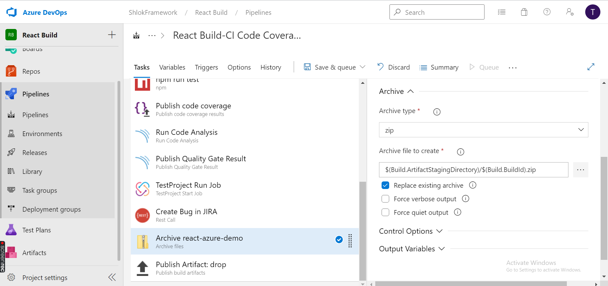
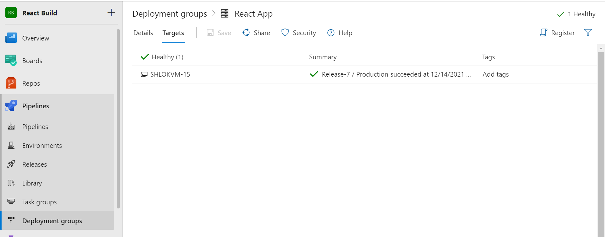
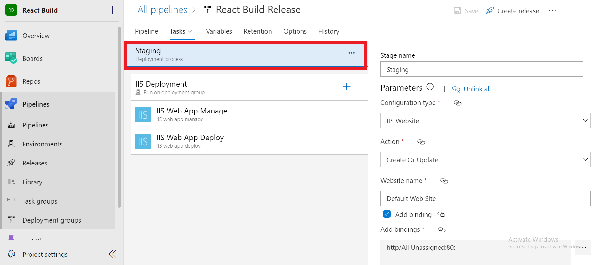
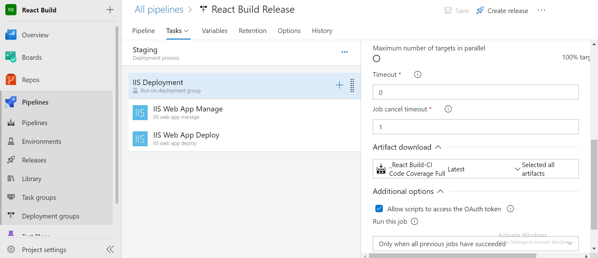

# Azure Pipeline Setup
## Before pushing your project to Azure Repos

- step 1 : Go to Command Line Prompt Globally and enter the following command:

    ```bash
    npm install jest --global
    ```

- step 2 : Go to `Root Directory` of your project and execute the following command in your command prompt.

    ```bash
    npm install jest-junit
    ```
- step 3 : Add `jest.config` file to your project's Root directory:

```json
{
 "setupFiles": ["<rootDir>/src/setupTests.js"],
 "testRegex": "/*.test.js$",
 "collectCoverage": true,
 "coverageReporters": ["lcov", "cobertura"],
 "coverageDirectory": "test-coverage",
 "coverageThreshold": {
  "global": {
  "branches": 0,
  "functions": 0,
  "lines": 0,
  "statements": 0
  }
 },
 "moduleDirectories": ["node_modules", "src"]
}
```

- step 4 : The `package.json` file will have `scripts` and `dependencies` classes similar to the code shown below

```json
{
  "name": "react-azure-demo",
  "version": "0.1.0",
  "private": true,
  "dependencies": {
    "@testing-library/jest-dom": "^5.11.4",
    "@testing-library/react": "^11.1.0",
    "@testing-library/user-event": "^12.1.10",
    "jest-junit": "^13.0.0",
    "react": "^17.0.2",
    "react-dom": "^17.0.2",
    "react-scripts": "4.0.3",
    "web-vitals": "^1.0.1"
  },
  "scripts": {
    "start": "react-scripts start",
    "build": "react-scripts build",
    "test": "react-scripts test --watchAll=false --coverage --testResultsProcessor jest-sonar-reporter ",
    "eject": "react-scripts eject",
    "sonar": "node sonarqube-scanner.js"
  },
  "eslintConfig": {
    "extends": [
      "react-app",
      "react-app/jest"
    ]
  },
  "browserslist": {
    "production": [
      ">0.2%",
      "not dead",
      "not op_mini all"
    ],
    "development": [
      "last 1 chrome version",
      "last 1 firefox version",
      "last 1 safari version"
    ]
  },
  "devDependencies": {
    "jest-sonar-reporter": "^2.0.0",
    "sonarqube-scanner": "^2.8.1"
  }
}

```

> Make sure to check the above steps before uploading the Source code to Azure Repos

## Create Pipeline
- `step 1 : New Pipeline `

Let’s click on “`create a pipeline`” and choose “`use the classic editor`” and choose start with an “`empty job`”.


- `step 2 : Select source from Azure Repos Git`

    

    In the Tasks Tab, Select `Get Sources` and Set `Clean` option to **`True`**.

    

- `step 3 : Press on the Agent job 1 and start adding tasks:`

Here a `JIRA Work Item` is Set


select `Type` as shown above and also add the `Script` which is given below:

```bash
$branch= Out-String -InputObjec $(Build.SourceBranch)
$branchArray= ($branch).Split("/")
echo "$branchArray"
$branch = ($branchArray[$branchArray.Count - 1])
$workitem = ($branch).Split('_')[0]
echo "$workitem"
Write-Host "##vso[task.setvariable variable=CurrrentWorkItem;]$workitem"

echo "$(CurrrentWorkItem)"
```
Also Set Variables as shown below :


- `step 4 : Prepare analysis on SonarQube:`

Follow [here](../SonarQube/AnalysisSetup.md) to setup project in SonarQube.


- Select the `SonarQube server endpoint` you created in the Adding a new `SonarQube Service Endpoint section`.
- Under `Choose a way to run the analysis`, select `Use standalone scanner`.
- Select the `Manually provide configuration mode`.
- In the `project key` field, enter your project key.


- `step 5 : Add npm install task:` 

Configure the task as shown below:


- `step 6 : Add Build task:` 

Configure the task as shown below:


- `step 7 : Add Test task:` 

Configure the task as shown below:


- `step 8 : Add Test task:` 

Configure the task as shown below:


- `step 9 : Add Publish Code Coverage:` 

Configure the task as shown below:


- `step 10 : Run code Analysis:` 

Configure the task as shown below:


- `step 11 : Publish Quality Gate Result:`

Configure the task as shown below:


- `step 12 : Test Project Setup:`

Configure the task as shown below:


To Know about Test Project Setup,Click [here](../Devops/TestProject/TestProjectSetup.md)

- To get `Project ID`, Go to Test Project :


- To get `Job ID`, Go to Job Section


- To get `API Key`, Go to `Integrations` & select `API` - either generate a token or Copy the token.


- `step 13 : Add Rest Call to notify bugs`:

- To Add `WebService Endpoint`

    - Go to `Project Settings` -> `Pipeline` -> `Service Connections`

    - Create New Service Connections and Select `Generic`.

        

    - Enter the Details.

        

        To know how to get Server URL ,Refer [Server URL](../JIRA/JIRASetup.md) Section of JIRA Documentation.

Fill the Details as shown below:


> `Body Script`
```Script
{
  "issues": ["$(CurrrentWorkItem)"]
}
```
- `step 14 : Add Archive Files`:

Configure the tasks as shown below:




- `step 15 : Publish Artifact`:

Configure the tasks as shown below:


After the Successfull Build of Pipeline, Artifact will be published


Click the Artifact, we should have a Job folder contating a Zip file named after your Build ID.


# Release Pipeline

## Create Release Pipeline:

## `step 1 : Create a deployment group`

- Open the Azure Pipelines web portal and choose `Deployment groups`.

    

- Click `Add Deployment` group (or `New` if there are already deployment groups in place).

- Enter a name for the group, and then click Create.

    

- In the `Register machine section`, make sure that Windows is selected, and that `Use a personal access token in the script for authentication` is also selected. Click `Copy script to clipboard`.

    

- On your VM, in an `Administrator PowerShell console`, paste and run the script.

    

- On your VM, in an `Administrator PowerShell console`, paste and run the script.

    

    - When you're prompted to configure tags for the agent, press Enter (you don't need any tags).

    - When you're prompted for the user account, press Enter to accept the defaults. 

- When the script is done, it displays the message *`Service vstsagent.account.computername started successfully`*.

- On the `Deployment groups` page in Azure Pipelines, open your deployment group. On the `Targets` tab, verify that your VM is listed.

    


## `step 2 : Define your CD release pipeline`

Your CD release pipeline picks up the artifacts published by your CI build and then deploys them to your IIS servers.

1. If you haven't already done so, install the `IIS Web App Deployment` Using [`WinRM extension from Marketplace`](https://marketplace.visualstudio.com/items?itemName=ms-vscs-rm.iiswebapp). This extension contains the tasks required for this example.

2. Do one of the following:

    1. If you've just completed a CI build then, in the build's `Summary` tab choose `Release`. This creates a new release pipeline that's automatically linked to the build pipeline.

        

    2. Open the `Releases` tab of `Azure Pipelines`, open the + drop-down in the list of release pipelines, and choose `Create release pipeline`.
    
        

3. Select the `IIS Website Deployment` template and choose Apply.

    

4. If you created your new release pipeline from a build summary, check that the build pipeline and artifact is shown in the `Artifacts` section on the `Pipeline` tab. If you created a new release pipeline from the `Releases` tab, choose the `+ Add` link and select your build artifact.

    

5. Choose the `Continuous deployment` icon in the `Artifacts` section, check that the continuous deployment trigger is enabled, and add a filter to include the `main` branch.

    

6. Open the `Task`s tab and select the `IIS Deployment job`.

    

    - For the `Deployment Group`, select the deployment group you created earlier.

        


7. Click `1 job,2 tracks` link , which will open the Task's Settings

    - Select the `Deployment Process` Tab and enter the details as Shown below :

        

        You can Add Website Name and Bindings as per your preference.

    - Select the `Deployment group job` Tab and enter the details as shown below:

        

        For the `Deployment Group`, select the deployment group you created earlier. 

        

    - Select the `IIS web app manage` Tab and enter the details as shown below:

        

        

        Here in `Physical path` add the variable name or location of your Project. 
        
        To Create a variable -> Go to Variable Tab and Create a Variable, Add the Location of your Project

        

    - Select the `IIS web app deploy` Tab and enter the details as shown below:

        

        

- Create or Clone into 3 of them and naming each one as **`Staging,Quality,Production`**.

    

8. Change the Pre Deployment Conditions for **`Quality,Production`** tasks:

    

# Additional Steps to IIS Deployment of React Application

If Deployment of your React App fails

- Try Copying your `Build` Folder of React App Project into the `C:\inetpub\wwwroot` directory.


Then Change the IISDirectory Variable value into this Folders Location.

Also grant Permission for `IUSR`


> If we adding certain routing features (multiple components) in the react application, we have to install the [IIS URL Rewrite extension](https://www.iis.net/downloads/microsoft/url-rewrite).

After a successful installation, we need to create a `web.config` file containing the below content under the root directory of the IIS website.

```xml
<?xml version="1.0"?>
<configuration>
 <system.webServer>
 <rewrite>
 <rules>
 <rule name="React Routes" stopProcessing="true">
 <match url=".*" />
 <conditions logicalGrouping="MatchAll">
 <add input="{REQUEST_FILENAME}" matchType="IsFile" negate="true" />
 <add input="{REQUEST_FILENAME}" matchType="IsDirectory" negate="true" />
 <add input="{REQUEST_URI}" pattern="^/(api)" negate="true" />
 </conditions>
 <action type="Rewrite" url="/" />
 </rule>
 </rules>
 </rewrite>
 </system.webServer>
</configuration>
```
