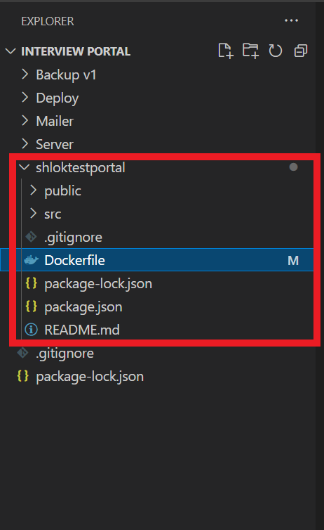

# CI/CD for React app using Azure DevOps

### `Step 1 : Dockerize the app`





```
FROM node:13.12.0-alpine

# set working directory
WORKDIR /app

# add `/app/node_modules/.bin` to $PATH
ENV PATH /app/node_modules/.bin:$PATH

# install app dependencies
COPY package.json ./
COPY package-lock.json ./
RUN npm install --silent
RUN npm install react-scripts@3.4.1 -g --silent

# add app
COPY . ./

# start app
CMD ["npm", "start"]
```
