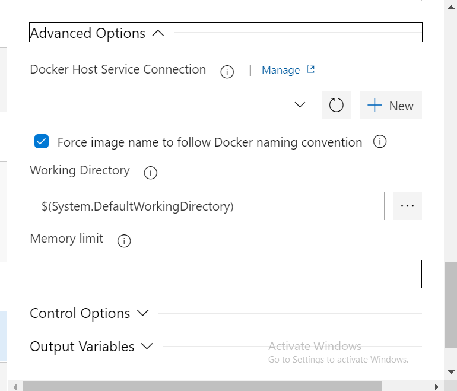
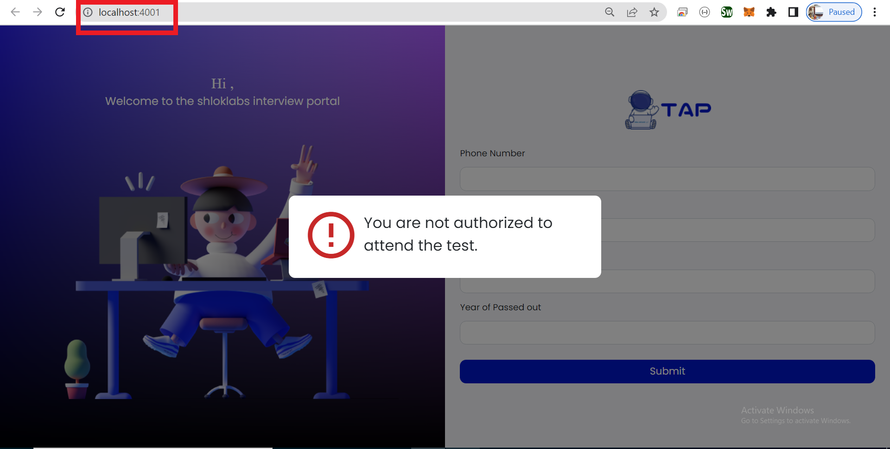

# Docker Setup for React app in Azure DevOps

> Prerequisite - [Docker Desktop](https://docs.docker.com/desktop/windows/install/) setup should be completed in your machine

## `Step 1 : Add Dockerfile`:


Create a Dockerfile and paste the code shown below:

```
FROM node:16.14.2
WORKDIR /app
COPY package.json ./
COPY package-lock.json ./
COPY ./ ./
RUN npm i
CMD ["npm", "run", "start"]
```

> The node version should not be `alpine`.

## `Step 2 : Add `Docker Registry` Connection in your Azure DevOps Project`:

Go to `Service Connection` in your project settings and add a new Service Connection `Docker Registry` and configure as shown below:


## `Step 3 : Setup DevOps Agent`:

DevOps Agent of your project should be set in the machine that has `Docker Desktop`.

> To know about Agent Setup , [Click here](/en/Devops/AzureDevOps/CISetupDotNet.md#2-set-up-an-azure-pipelines-agent)

## `Step 4 : Add Docker Tasks in your pipeline`:

### (i) Add `Build an image` Docker Task:

Configure this task as shown below:

- Link the `Docker Registry Service Connection` we have created before here:

    

- Select `Build an image` Action:

    

- Configure Advanced options as shown below:

    

- Configure Control options as shown below:

    

### (ii) Add `Run an image` Docker Task:

Configure this task as shown below:

- Link the `Docker Registry Service Connection` we have created before here:

    

- Select `Run an image` Action:

    

- Configure `Run an image` Action as shown below:

    

- Configure Advanced options as shown below:

    

- Configure Control options as shown below:

    

## `Step 5 : Run Pipeline and view the Container in your Docker Desktop`:

- Open Docker Desktop after successfull run of the pipeline.

- The Container Created from our pipline run is seen:

    

- Open the Container in Browser:

    

- The hosted project is running successfully:

    
 


