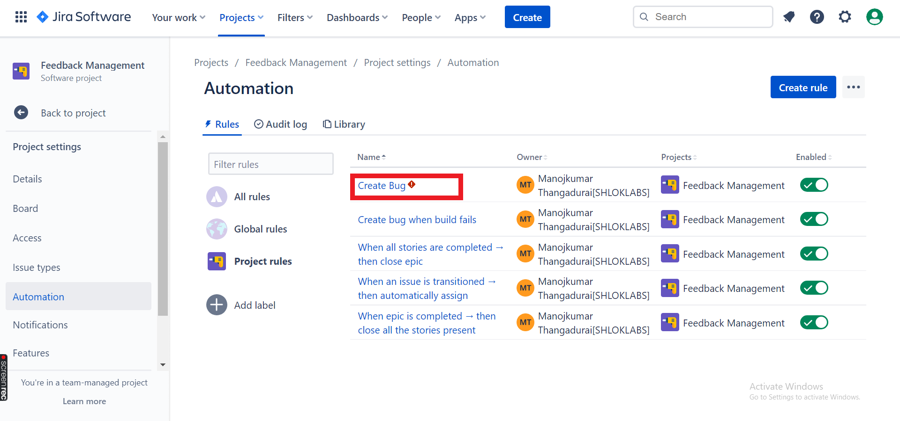
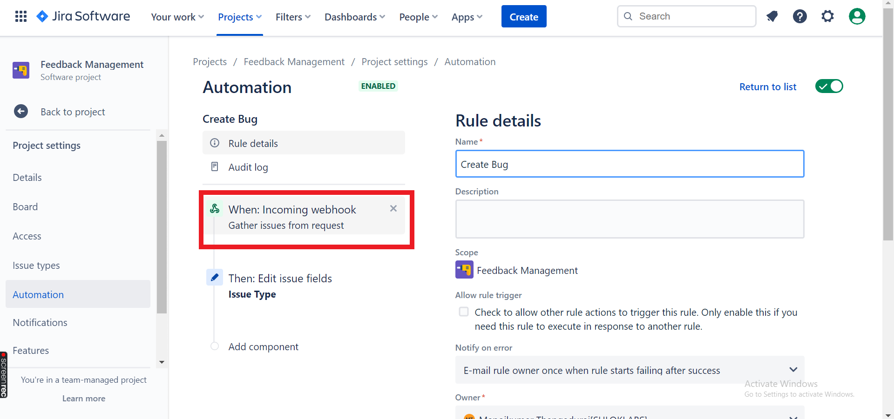
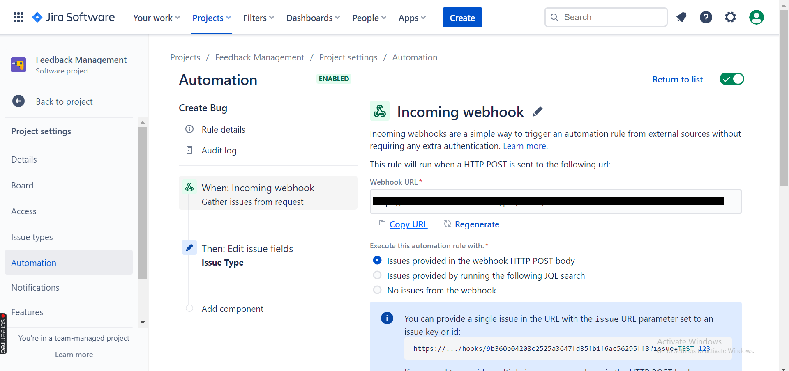

# JIRA 

## How to get Server URL from JIRA

- Go to your JIRA `Project Settings` -> `Automation` -> `Select Rule`.

 

- Here Select `When Incoming Webhook`

 

- Copy the Server URL and Paste it in your Azure Service Connection

