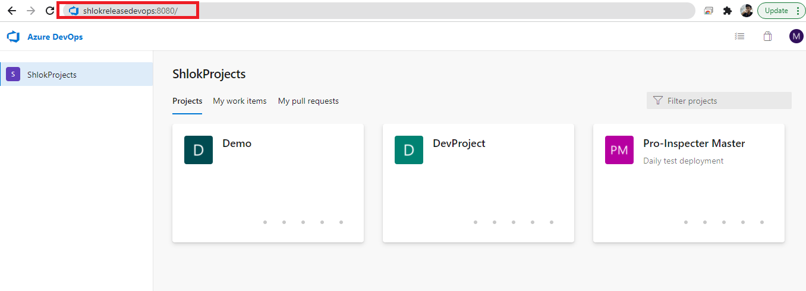
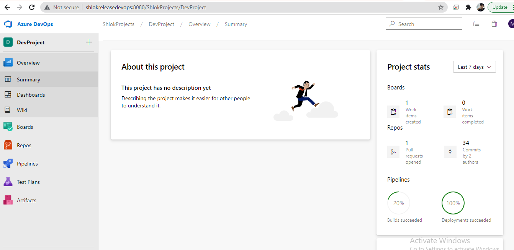
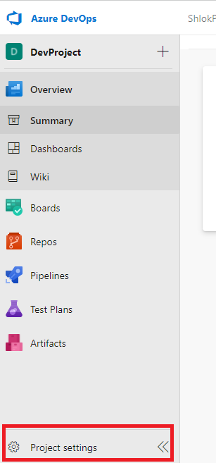
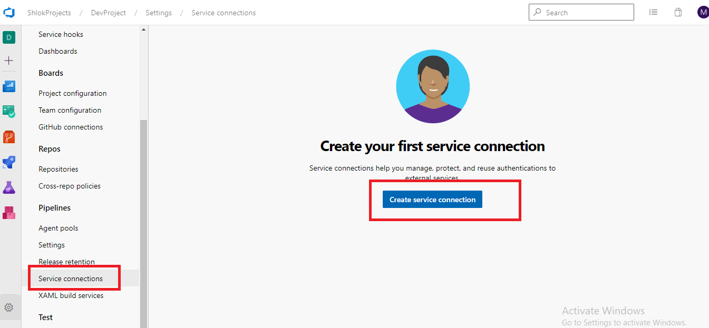
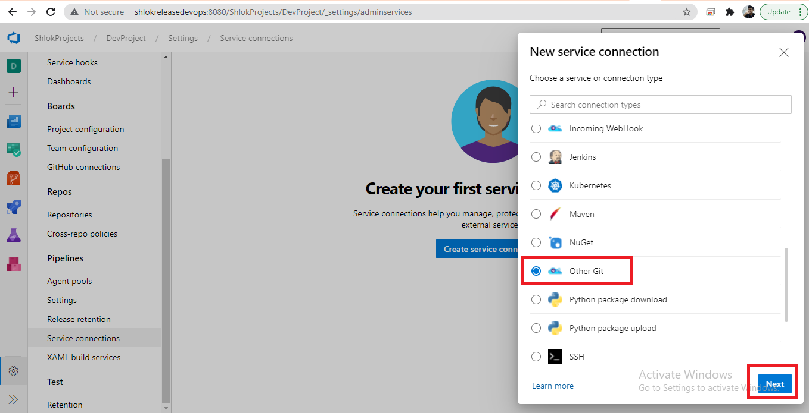
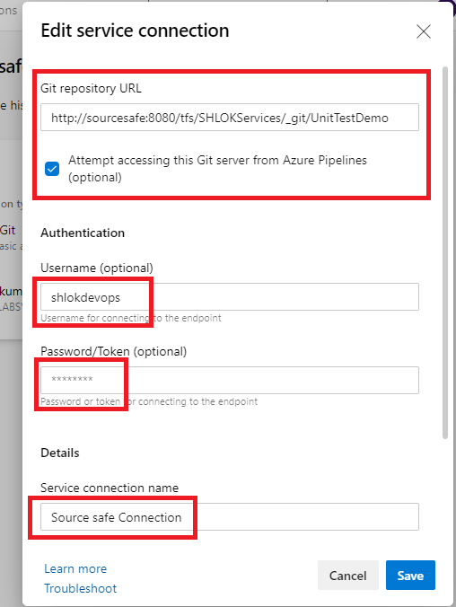
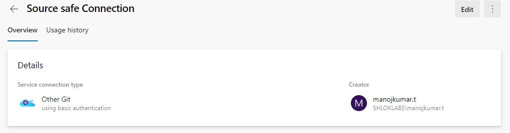
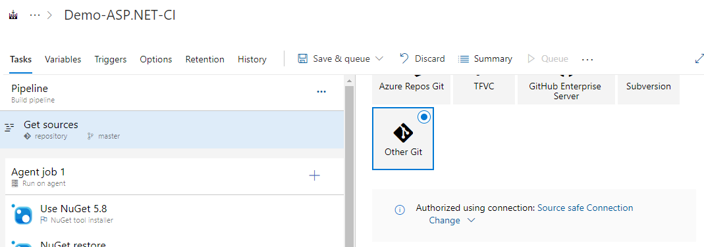

# Service Connection

> You can create a connection from Azure Pipelines to external and remote services for executing tasks in a job. Once you establish a connection, you can view, edit, and add security to the service connection

### Service Connection for TFS Source Safe - Azure Devops:

 1. Open Azure Devops site.
    `http://shlokreleasedevops:8080/`
    

 2. Select your project.
     
    
 3. Select `Project settings` > `Service connections`. 
   
    
 4. Click on `create New Connection`.
    

 5. Select `other git` and Click `Next`.
    

 6. Please fill out the necessary details listed below,
    1. Git url - `http://sourcesafe:8080/tfs/SHLOKServices/_git/UnitTestDemo`
    2. Username - `shlokdevops`
    3. Password - `Please contact us for the password`.
    4. Service connection name - `Source Safe Connection`.
   
    

 7. Click on Save.   
    

> You can use it to pull source from TFS to pipeline build machine.

    