# Code Analysis through SonarQube

SonarQube's integration with Azure DevOps allows you to maintain code quality and security in your Azure DevOps repositories.

## Prerequisites

- Make sure to check the Test Project of your Master Source contains **`Coverlet`** package.
If not refer [Coverlet Package Installation](../SonarQube/SonarQubeSetup.md) Section.
- CI/CD Setup should be done in [Azure DevOps](../AzureDevOps/CISetupDotNet.md). 
- From Visual Studio Marketplace, install the [SonarQube extension](https://marketplace.visualstudio.com/items?itemName=SonarSource.sonarqube) by clicking the **Get it free** button.
>The extension will work with all of the hosted agents (Windows, Linux, and macOS).
If you are self-hosting the build agents, make sure you have at least the minimum SonarQube-supported version of Java installed.
- [SonarQube Setup](../SonarQube/SonarQubeSetup.md).

# Integration Steps

### step 1 : Create a project in *`SonarQube`*

- After Setting up SonarQube , You need to pass server URL (http://`public ip of virtual machine`:9000/).
- Here Login by giving Admin Credentials and Create a Project.

    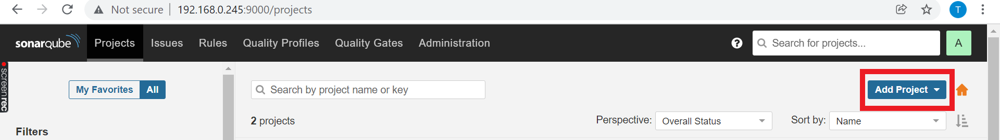

- In Create Project Page, enter Project Key of choice , Display name and Hit Setup.

    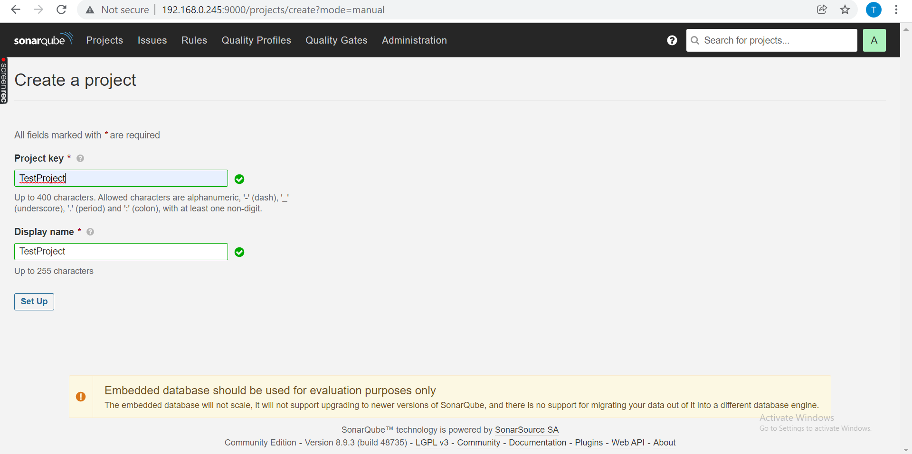

- Now Generate a Token by giving a Name to identify it. If you have already created a token then select *`Use Existing Token`*.
    
    

- If *`Generate a token`* option selected then a token will be generated. Hit *`Continue`*.

    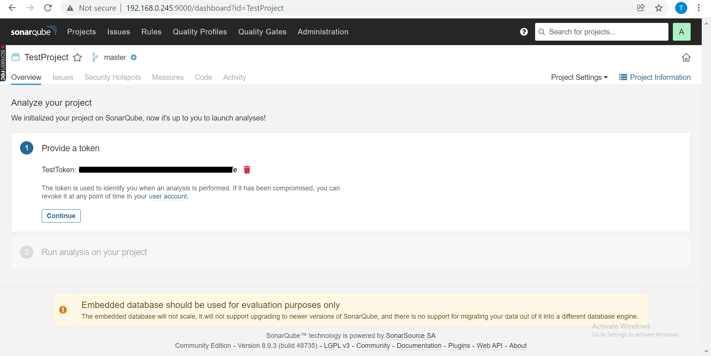

- Select *`.Net`*.

    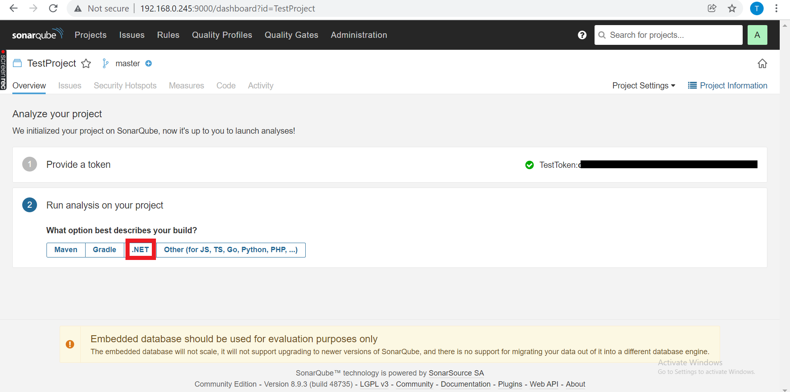

- Based on type of your .Net Project, Command to run Code Analysis will be generated like shown below.

    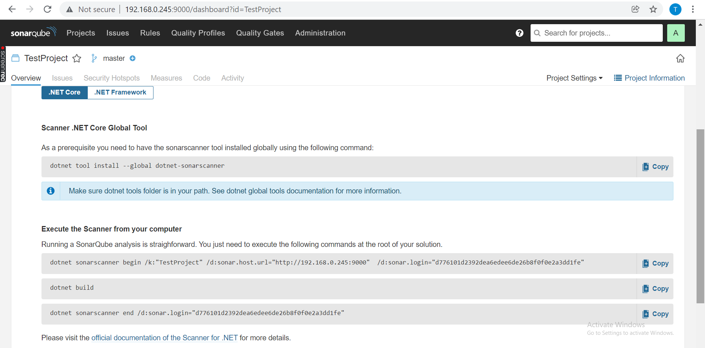

### step 2 : Create a new SonarQube Service Endpoint in Azure DevOps project

- Go to *`Project Settings`* of your Azure DevOps Project.
- Create a new Service Connection 
- Select `+ New service connection`, select the type of service connection that you need ("`SonarQube`" in our case), and then select `Next`.
- Enter the `Server URL of SonarQube` , Security token and Details for Connection.

    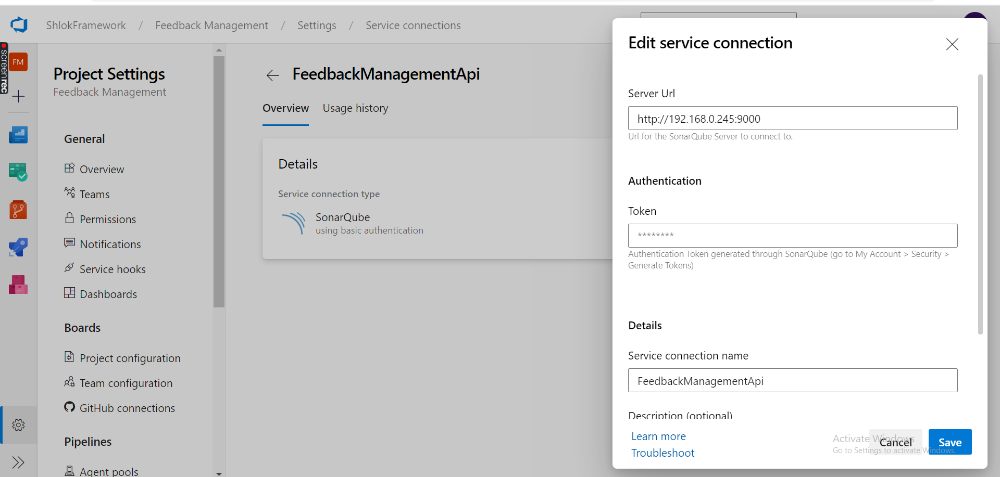

    > to Generate Security Token from SonarQube
        
    - Go to `My Account` in SonarQube
    - Select `Security` Tab 
    - Generate a token by naming it
        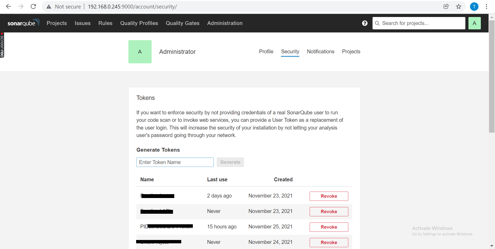

- Save Connection

### step 3 : Configuring branch analysis

After adding your SonarQube service endpoint, you'll need to configure branch analysis. You'll use the following tasks in your build definitions to analyze your projects:

- **Prepare Analysis Configuration** - This task configures the required settings before executing the build.
- **Run Code Analysis** - (Not used in Maven or Gradle projects) This task executes the analysis of source code.
- **Publish Quality Gate Result** - this task displays the Quality Gate status in the build summary letting you know if your code meets quality standards for production. This task may increase your build time as your pipeline has to wait for SonarQube to process the analysis report.

1. In `Azure DevOps`, `create or edit a Build Pipeline`, and add a new **Prepare Analysis Configuration** task before your build task:

    - Select the **SonarQube server endpoint** you created in the Adding a new SonarQube Service Endpoint section.
    - Under Choose a way to run the analysis, select **Integrate with MSBuild**.
    - In the project key field, enter your **project key**.

        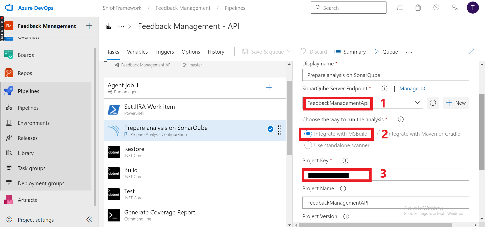

> To get project key of your SonarQube project
- go to `Projects` Page in your `SonarQube Portal`.
- Click on your project, which will open your project `Overview` page,click `Project Information` on the page's top right corner. We can see our `Project Key`, copy it

    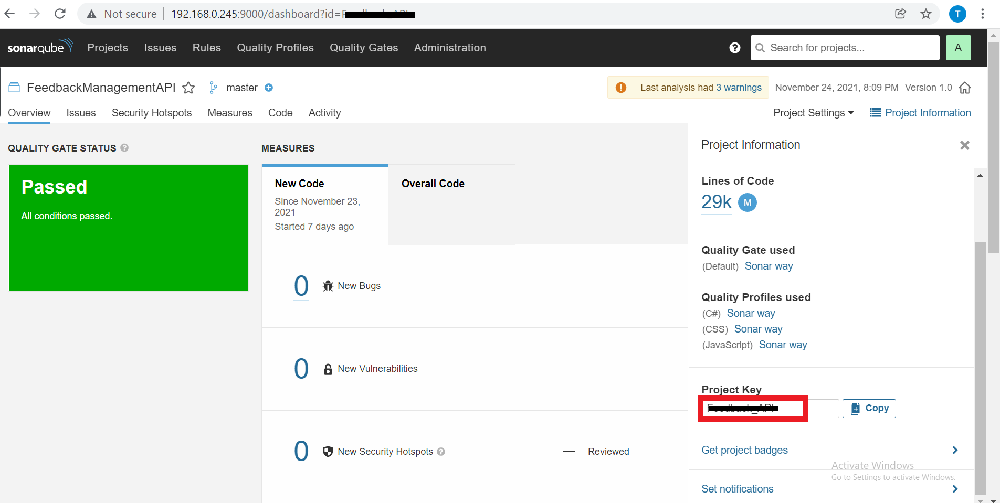

2. Add restore,build and run tasks with commands & arguments shown below:
    - Restore:
        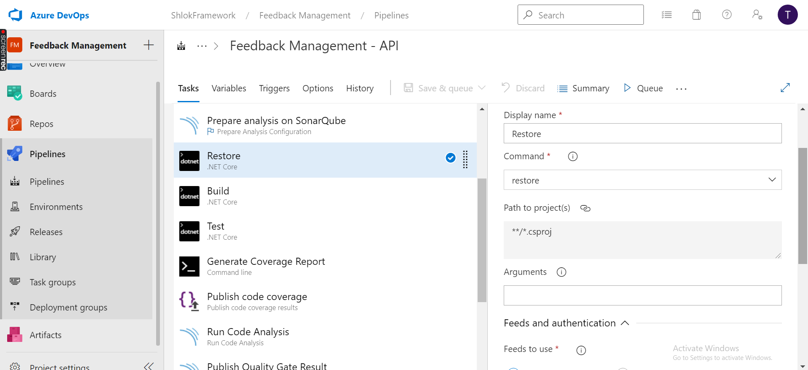
    - Build:
        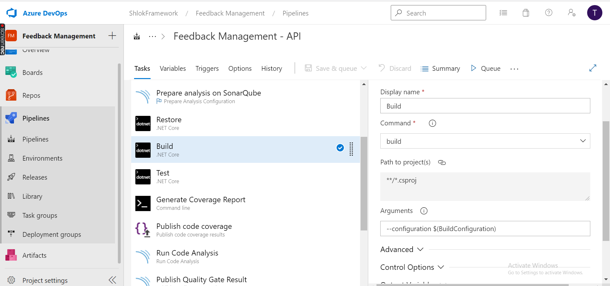

        ```arguments
        --configuration $(BuildConfiguration)
        ```
    - Test:
        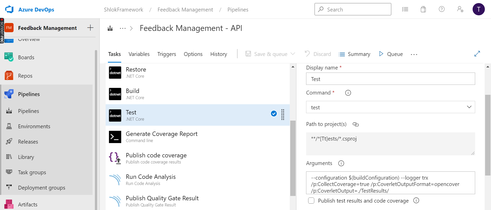

        ```arguments
        --configuration $(buildConfiguration) --logger trx /p:CollectCoverage=true /p:CoverletOutputFormat=opencover /p:CoverletOutput=./TestResults/
        ```
    - Generate Coverage Report:

        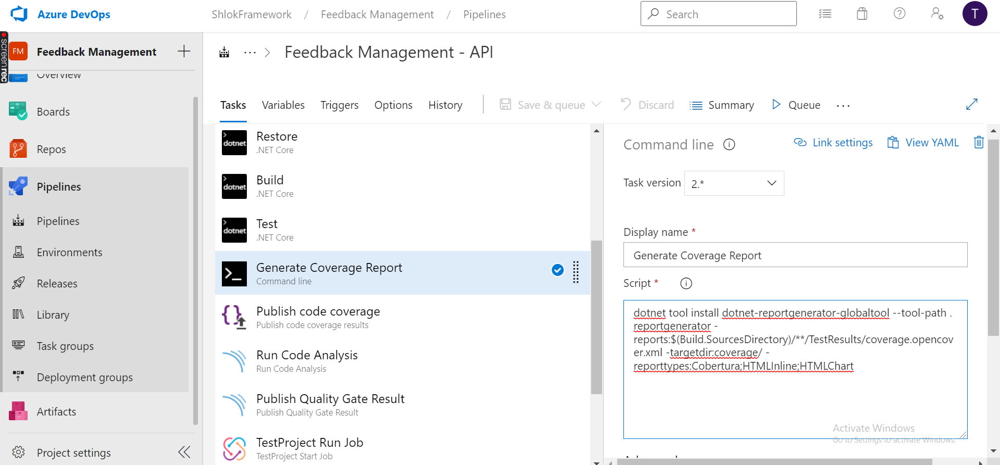

        ```arguments
        dotnet tool install dotnet-reportgenerator-globaltool --tool-path. 
        reportgenerator -reports:$(Build.SourcesDirectory)/**/TestResults/coverage.opencover.xml -targetdir:coverage/ -reporttypes:Cobertura;HTMLInline;HTMLChart
        ```
    - Publish code coverage:
        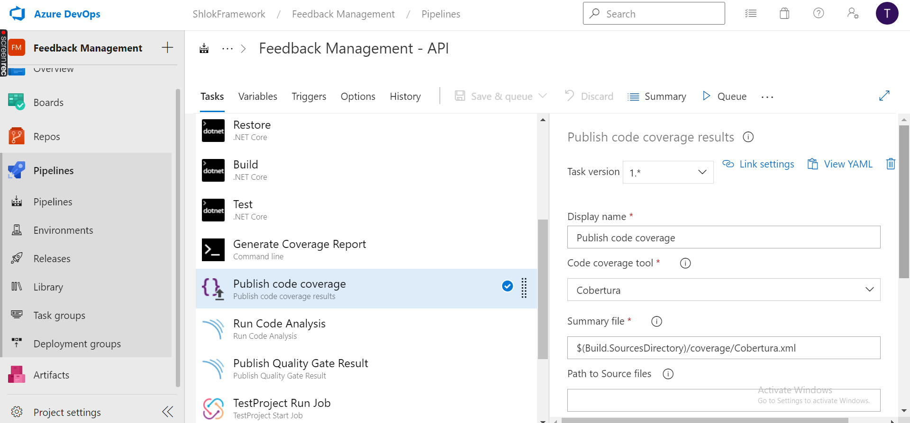

3. Add a new **Run Code Analysis** task after your build task.
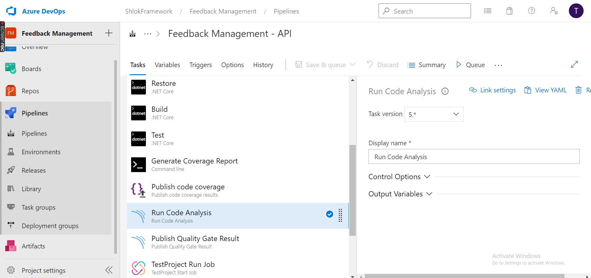

4. Add a new **Publish Quality Gate Result** on your build pipeline summary.
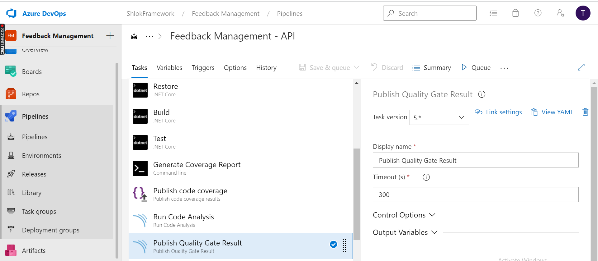

5. Under the Triggers tab of your pipeline, check Enable continuous integration, and select all of the branches for which you want SonarQube analysis to run automatically.

6. Save your pipeline.

After the successfull execution of Pipeline, you can the Code Analysis in your SonarQube Portal.
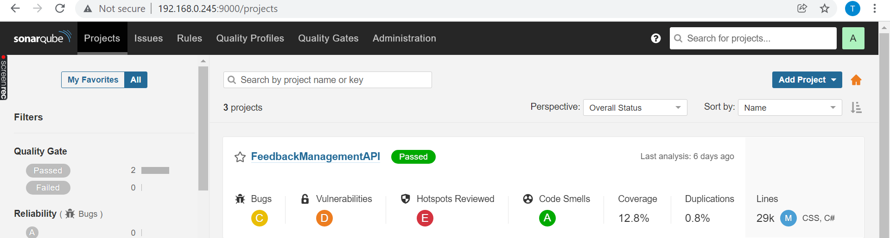

