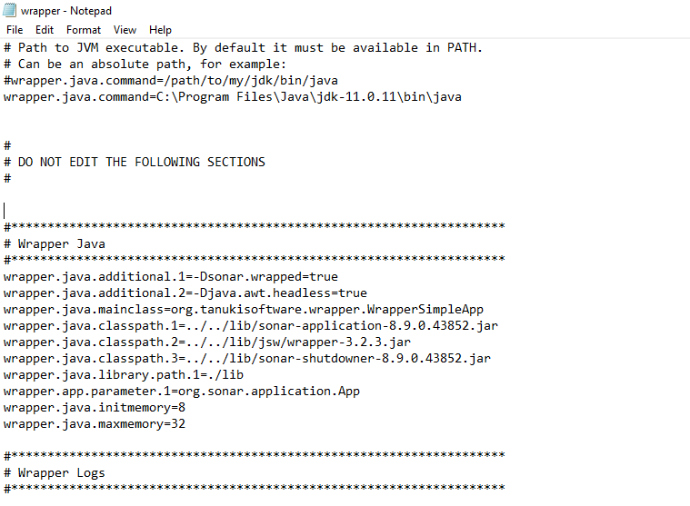
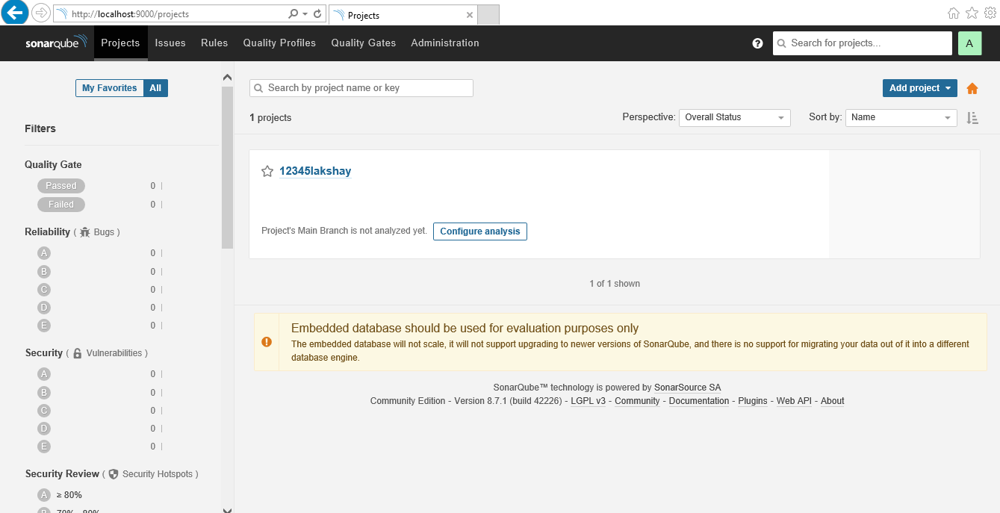
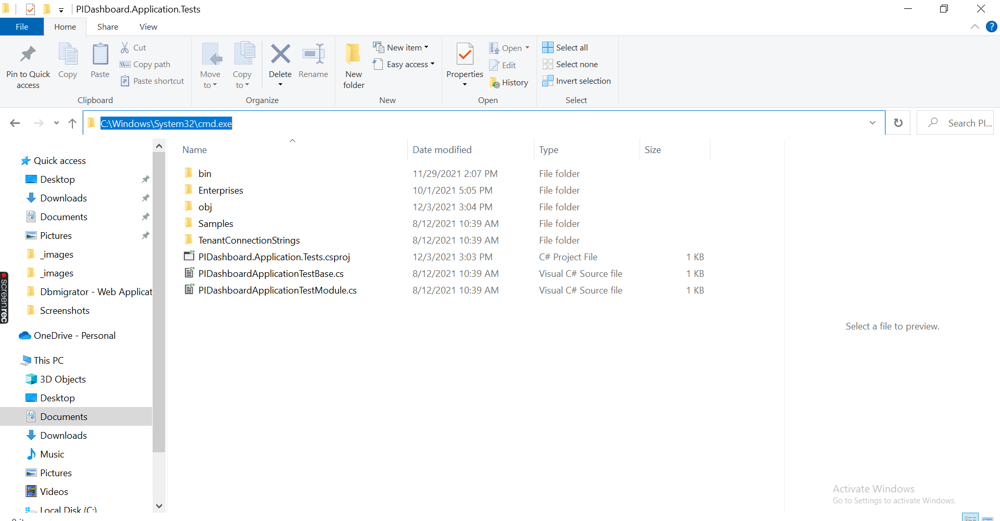
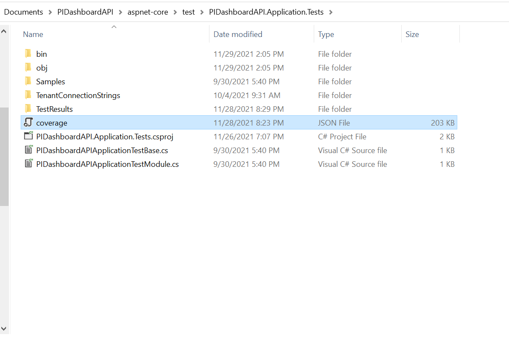
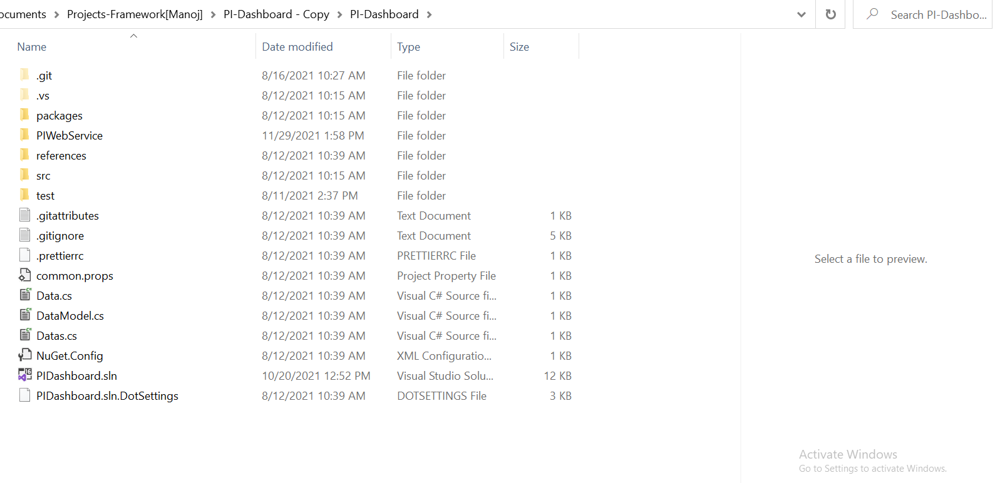

# SonarQube Setup

- step 1 : [Download Sonarqube](https://www.sonarqube.org/downloads/) community edition zip file from the following link.
- step 2 : It will download Zip folder into your downloaded folder. 

>Before doing unzip, check the properties of the downloaded folder. It might be blocked for your machine so you need to unblock it and then unzip the folder.

- step 3 : SonarQube scanners require version 8 or 11 of the JVM and the SonarQube server requires version 11. Versions beyond Java 11 are not officially supported.

To use open JDK then visit - https://openjdk.java.net/install/ and download it locally.

- step 4 : Visit the SonaQube unzipped folder and open Wrapper config file and enter the JDK path manually before proceeding further.

    

- step 5 : Navigate to the below directory and run StartSonar.bat file.

C:\sonarqube\bin\windows-x86-64\StartSonar.bat

- step 6 : Once the above step is done, hit the URL: http://localhost:9000/ and you should be able to see the dashboard.

    

you will be able to access the SonarQube dashboard using the public IP of your machine in which you installed SonarQube.

http:`<public IP of the machine>`:9000

# Coverlet Package Installation

## MSBuild Integration

### Step 1 - `Installation`

- Go to the file loaction of your Test Project:

    

- Open Command Prompt and execute the following command: 
    ```bash
    dotnet add package coverlet.msbuild
    ```

> You MUST add package only to test projects

Enabling code coverage is as simple as setting the `CollectCoverage` property to `true`

```bash
dotnet test /p:CollectCoverage=true
```

After the above command is run, a `coverage.json` file containing the results will be generated in the `root directory` of the `test project`. A summary of the results will also be displayed in the terminal.



### Step 2 - .NET Global Tool Installation

- Go to root directory of your Project:

    

- Open Command Prompt and execute the following command: 
    ```bash
    dotnet tool install --global coverlet.console
    ```