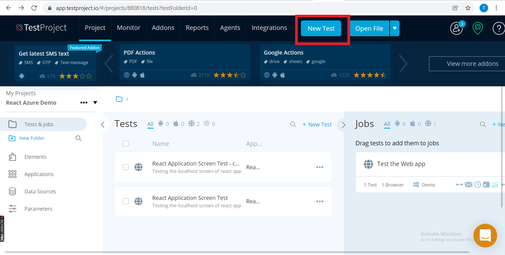
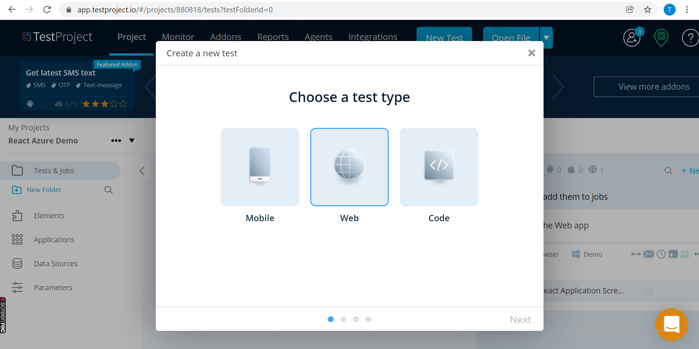
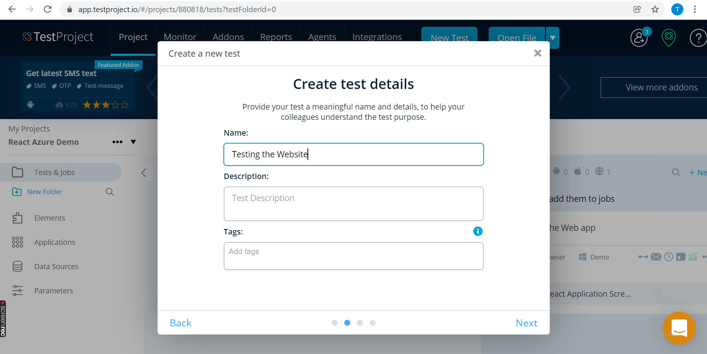
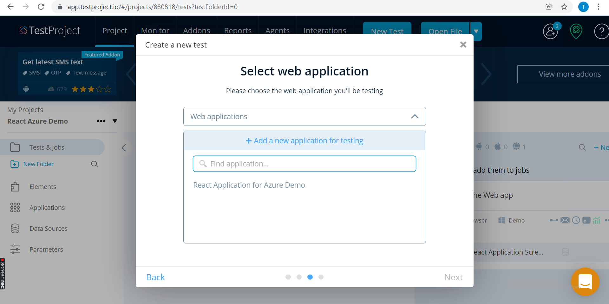
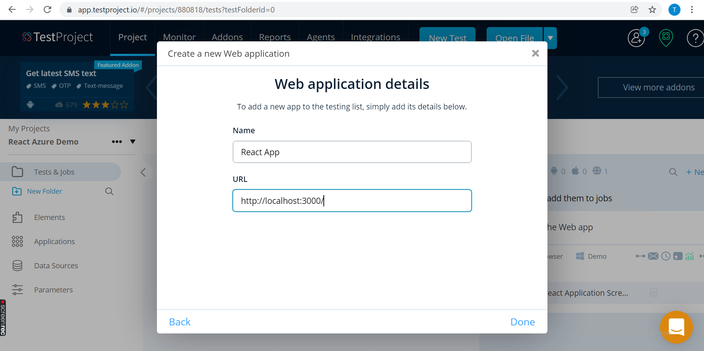
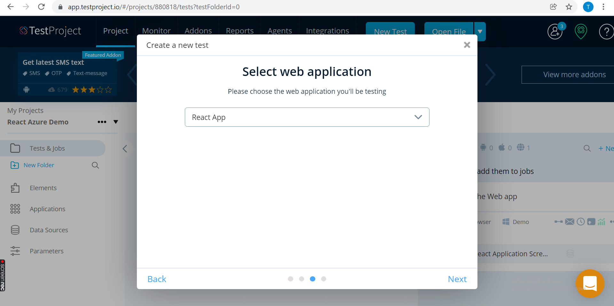
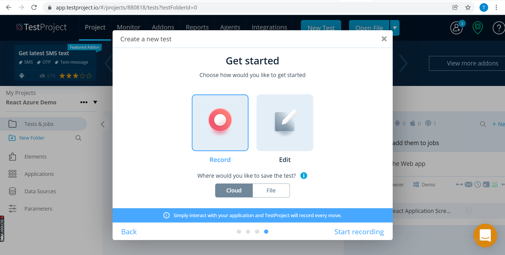
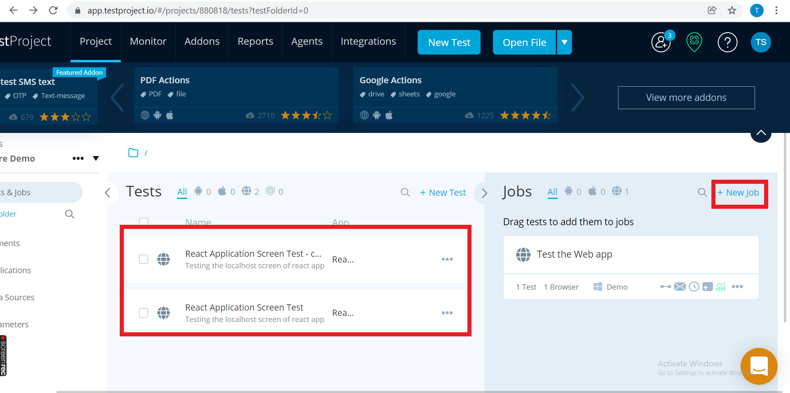

 # Add your Web Application in Test Project

 ## `Pre Requisites`

 - Test Project Account
 - Setup and start Agent [Click Here.](https://docs.testproject.io/getting-started/installation-and-setup)

 ## `Create a Project and add your Web Application`

- Step 1 : Click `New Test` Button and Add new Test for your application 

    

- step 2 : Select a Test type:

    

- step 3 : Enter the Test Details:

    

- step 4 : Click `Add new Application for Testing`:

    

- step 5 : Add Web Application Details to use it for testing

    

- step 6 : Select the Web Application we added

    

- step 7 : Select the `Start Recording` option with `Record` & `Cloud` Option Selected , this will open the browser with the Application Link to record.

    

- step 8 : After recording and saving the test, it will be displayed in Tests Section as shown below.

    - Click `New Job` to Create a New Job
    - Drag and Drop the test into the Created job.

    

