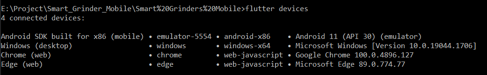
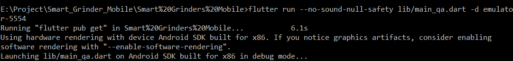
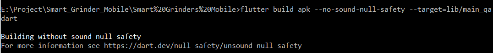
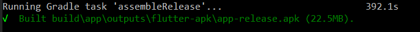

# Android Run and Build
In this, Let's see how to run a flutter application and to take build.

## How to get the running devices

- 1. Open a new terminal and execute the following command.
        
            flutter devices

- 2. Available devices in the system will be listed. 

    

## How to run Flutter android application

- 1. Create new flutter project or open the existing project.

- 2. Open a new terminal pointing the application folder. For example, `E:\Project\Smart_Grinder_Mobile\Smart%20Grinders%20Mobile`.

- 3. The following command is used to run the flutter application.

         flutter run --no-sound-null-safety lib/main_qa.dart -d emulator-5554

    - In the above command,

        - flutter run - To run the flutter application.
        - --no-sound-null-safety - To execute the application excluding the null safety warning.
        - lib/main_qa.dart - Targeting main file. This file will be execute initially.
        - -d emulator-5554 - This line is to specify in which device the application need to run. In this case, emulator-5554 is used. 

        

- 4. In the above example, the application will be run in android emulator. 

## How to take build Flutter android application

- 1. Open a  new terminal and execute the following to take build.

            flutter build apk --no-sound-null-safety --target=lib/main_qa.dart

    

    - In the above commmand,

        - flutter build apk - Used to take android build.
        - --no-sound-null-safety - To execute the application excluding the null safety warning.
        - --target=lib/main_qa.dart - Targeting main file. This file will be execute initially.

- 2. The Build output path will be showed after the build process execution along with the apk size.

    

