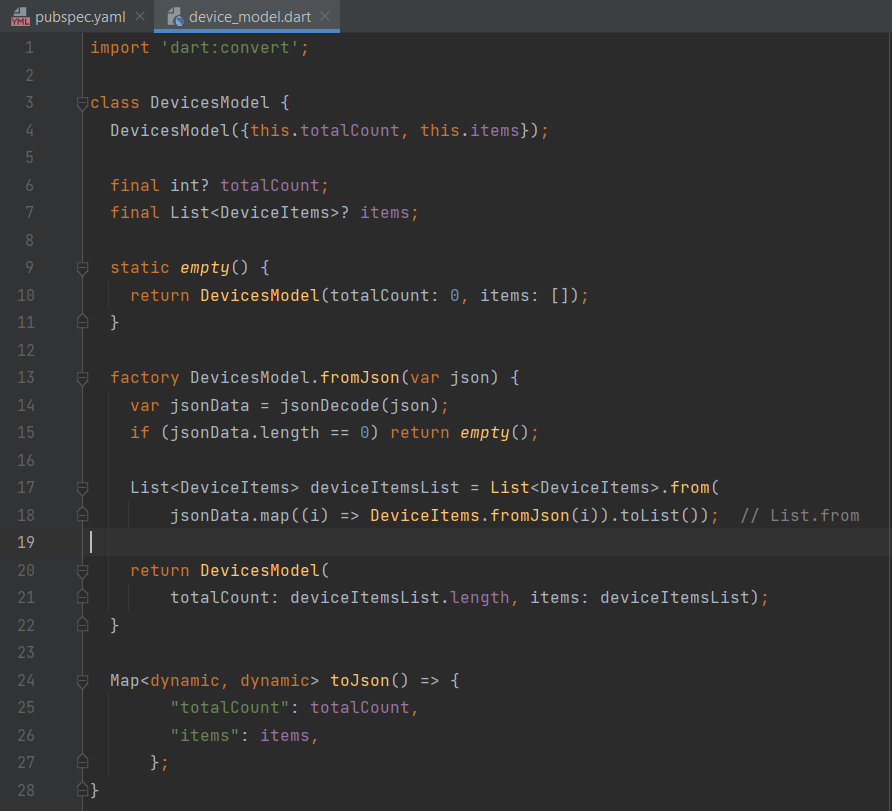
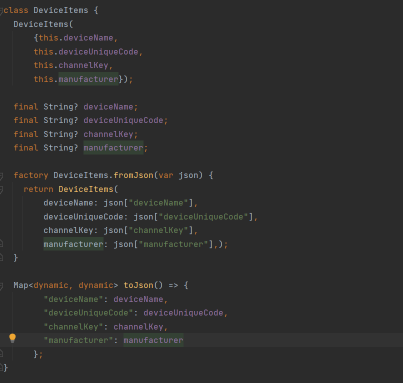

# Custom API model
API model is used to store the response that we get from the api call. The model value can be manipulated and used.

## How to create a API model.

- 1. Create a model class file and add final variable inside that. 

- 2. Create constructor for that class.

- 3. Create a factory method as fromJson, which takes json string input and returns the converted model.

- 4. Create a empty methods which returns a empty values.

### To handle the list values from json 

- 1. Create another model class to store the values from list.

- 2. Iterate the list value from the parent model class, and pass the value to child model class.

