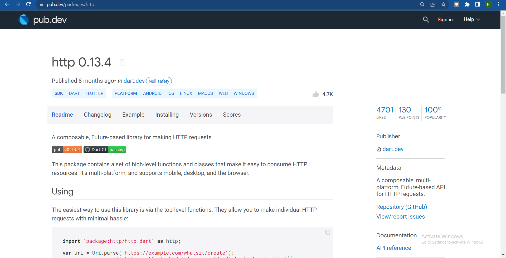
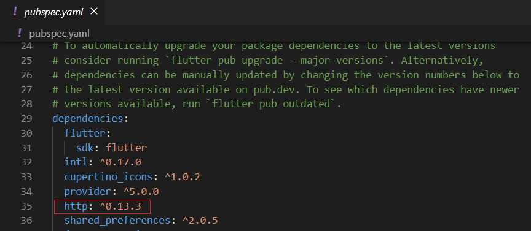
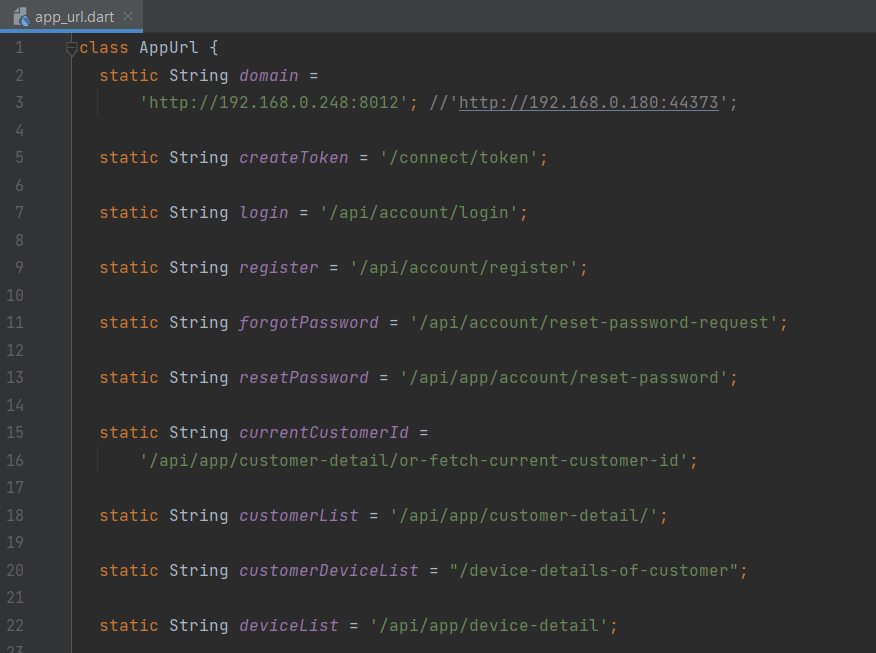
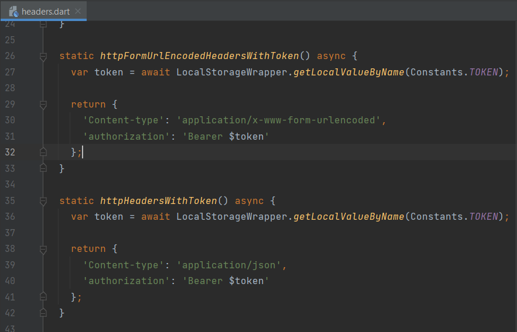
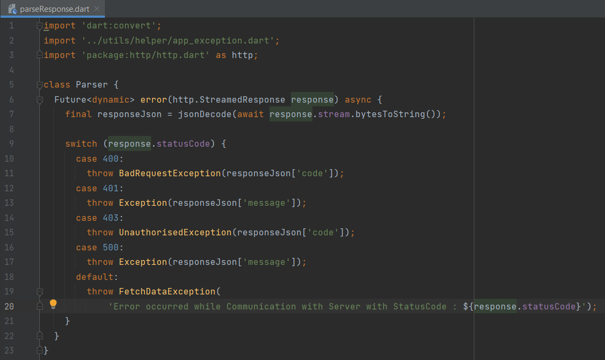
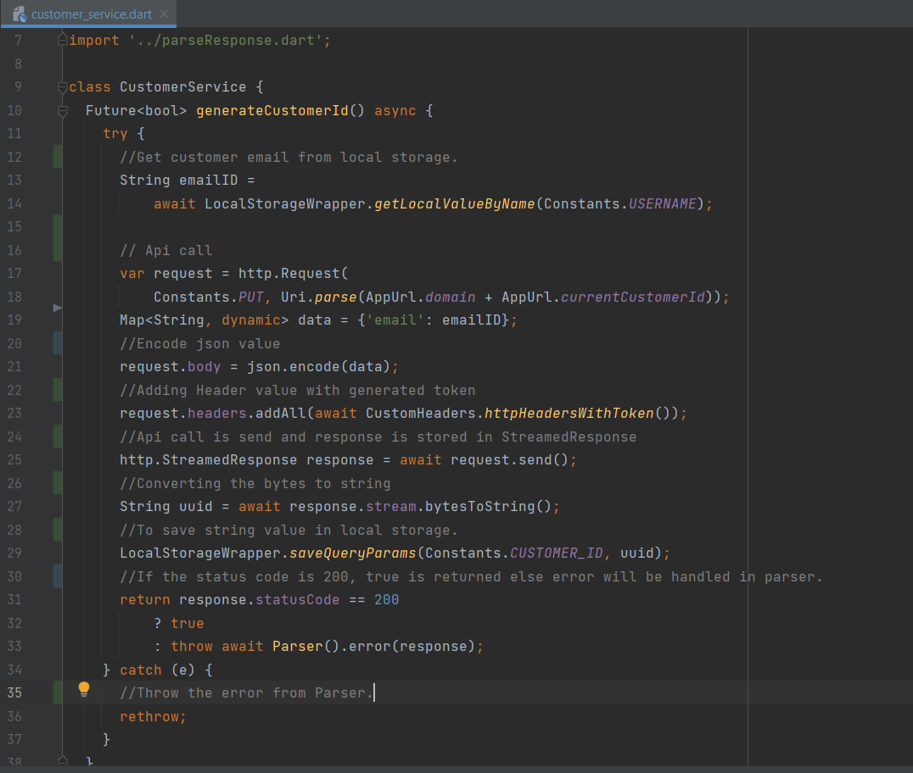
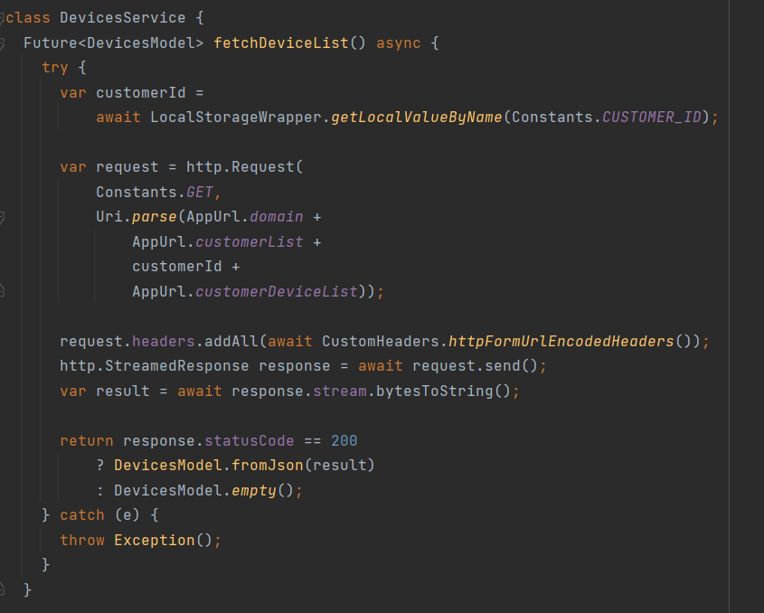
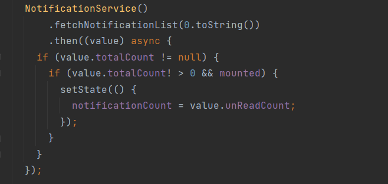

# HTTP API Services
HTTP API services are used to make api calls in Flutter applications. To make api calls api plug-ins are used.

## Why to use HTTP API services.

- It's good practice to maintain the API services seperately. So it will be easy to access. 

- If a user is working in design part and other in api part, by maintaining the API service seperately will reduce the code conflict and also reduces the dependency from each other.

- With the help of `http` package, the REST API calls can be done. 

## Prerequiste

- 1. Install the latest version `http` plugin from Pub dev.

- 2. Add the plugin in `pubspec.yaml`.

- 3. Best practice is the create a seperate folder for service calls. Add all the api service inside that.

- 4. Maintain all the url in seperate file. Here it is `AppUrl`.

- 5. Create a generic async static method which will return the headers for the api call.

- 6. Handling the unhandled exception can be done using the following way. Exception will be handled by the following method.

## How to make a simple API call

- 1. Create a class file and import the http  package inside class like import `'package:http/http.dart' as http;`.

- 2. Create Future with the required result type. Future executes asynchronously. Add the code block inside a try and catch block to handle the exceptions.

- 3. Api call is made using the `http.Request`. The Request consist of HTTP method name and the api url.

- 4. Add the header to the created request.

- 5. Send the api call using the `request.send()` and the response will be stored in the StreamedResponse instance.

- 6. As mentioned perviously, errors is handled using the generic error handling method.

- 7. StreamedResponse can be converted to string by `response.stream.bytesToString()`.

## How to make a API call with model

Note: Please refer api model session to create a API model.

- 1. All the steps are same as above except the return type.

- 2. Create a model instance to store the result of the api call.

