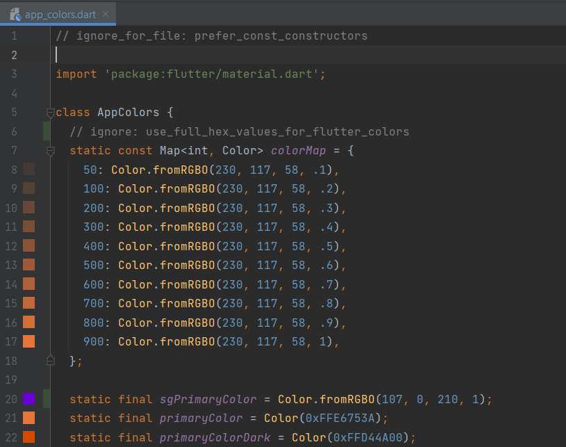
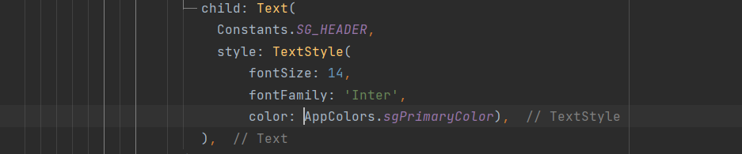

# Custom App Colors
Custom App Colors are the generic static variables which will store the custom colors. So the system need not to repaint the again and again while using the colors inside application.

## How to create a custom app colors

- 1. Create a class file as `AppColors`.

- 2. Import `'package:flutter/material.dart'`.  

- 3. Create static variables and assign the colors the format required. For example like, HEX or RGBO.

## How to use custom app colors

- 1. Import AppColors `package:smart_grinder_mobile/themes/app_colors.dart` inside the file where the color is required.

- 2. Use the color from the AppColor class.

