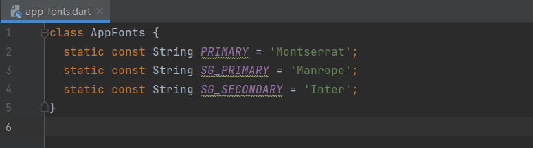
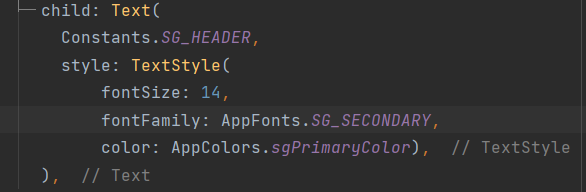

# Custom App Fonts
Custom App Fonts are the generic static variables which will store the custom fonts. So the system need not to fetch the fonts again and again while using inside application.

## Why to use App fonts

-  By determining the app fonts generically will reduce the redundancy of the code.

- We need not to use the font family name everywhere in the application. 

- By using this, the standard of the code will improved.

- In case, if there is any change in application font family, by changing at one place will change the complete application font which will reduce the man power.

- By using the static constant variable which stores the font family will improve the efficiency of application along with an optimized code.

## How to create a custom app fonts

- 1. Create a class file as `AppFonts`.

- 2. Create static variables and assign the font family to it. Refer the below image.

## How to use custom app fonts

- 1. Import AppColors `'package:smart_grinder_mobile/themes/app_fonts.dart'` inside the file where the fontFamily is required.

- 2. Use the font from the AppFont class.

