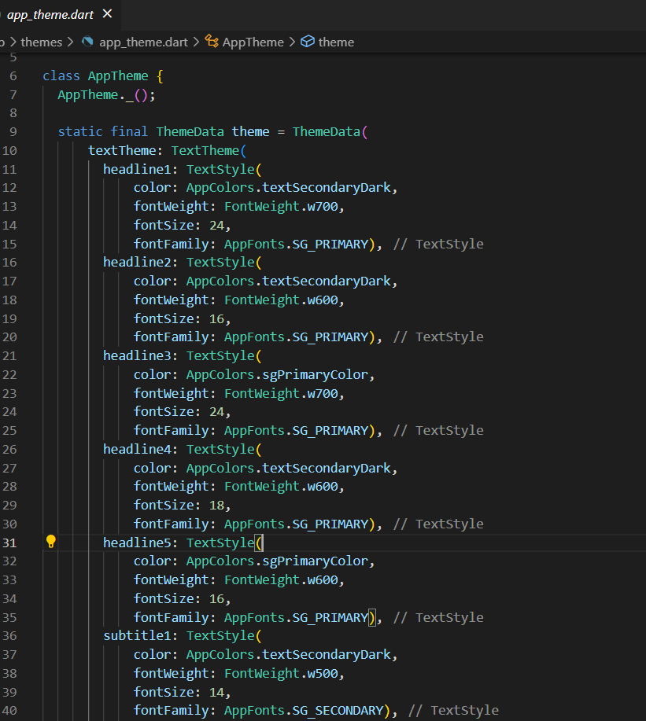

# Custom App Theme
Custom App Theme are the generic static variables which will store the custom theme. So it will reduce the redundancy of the code. 

## Why to use App Theme

-  By determining the app themes generically will reduce the redundancy of the code.

- This will increase the stability of the code and will have a standardization.

- Need not to repeat the `TextStyle` and other themes inside the widgets. We can determine the generic themes in this App theme part and it can be used. 

- This will increase the performance of the application more and reduce the number of line in code. Which will make the code much readable.

## How to create a custom app theme

- 1. Create a class file as `AppThemes`.

- 2. Create static instance of ThemeData and add textTheme within that.

- 3. Use either one version of Texttheme inside the ThemeData. For example using 2018 and 2021 version will throw error. 

 - 4. What is unclear in the documentation is which text style properties are since 2018 (and deprecated) and which are their newer 2021 replacements.

    - A quick way to avoid mixing deprecated and newer text style options is either use:

        - the ones ending with Large/Medium/Small (e.g. bodyLarge or labelSmall ...).

        - Or: the rest of the style options (e.g. bodyText1, headline2, caption, button, overline ...).

- 5. Use the already created generic color and font family inside the apptheme.

- 6. Similarly, generic methods can be created and used.

## How to use custom app theme

- 1. Call the Apptheme inside your class file. And use the required texttheme.

