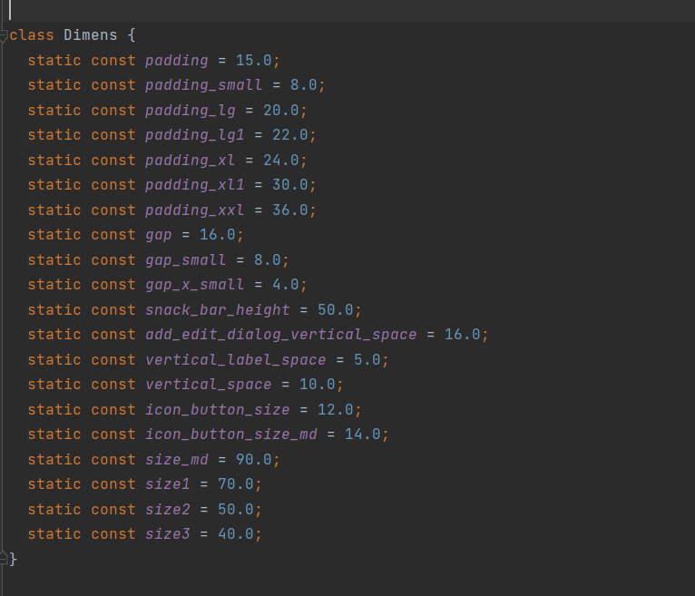

# Custom Dimensions 
Custom dimensions are the generic static variables which will store the custom dimension values. Generic padding values are used to reduce the redundancy.

## How to create a custom dimensions

- 1. Create a class file as `Dimens`.

- 2. Create const static variables and assign the integer values to it. Refer the below image.

## How to use custom dimensions

- 1. Import the Dimens class file.

- 2. Use the dimens static variable instead of using integer.

