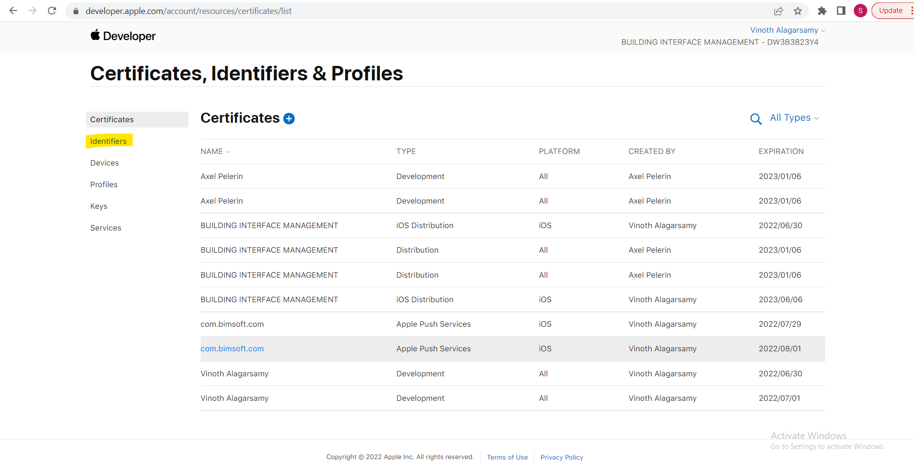

# IPA FILE 
IPA file is used to install the respective application through all iphone devices and this ipa file can be generated via xcode by linking related certificates and profile , please find the brief explanation about this in below content

## How to create a Certifiate and Profile 

- 1. Go to this https://developer.apple.com/account page and enter your apple id and password 

- 2. Once you have login, In the home page you can find the sidemenu has certificates, Ids and Profiles click on that menu 

- 3. In this page you can find the Identifiers as side menu click that to create App Id which is used to create profile

- 4. Click the add symbol which you can find in the top to add App Id 

- 5. Choose the App IDs from the following option to register new App Id

- 6. Select the App Id from the following option

- 7. Provide your description and respective bundle id to create new App Id

- 8. Click the certificate menu to create an new certificate 

- 9. Choose an ios Distribution option to export the app for submission to the App Store or for Ad Hoc distribution 

- 10. Choose your respective CSR file from you machine to create an certicate 

- 11. Once the CSR file upload your certificate will be generate and you can download the certicate by clicking download button which you can see when you click on the respective certificate from the list 

- 12. Click the profile menu to create an new provisoning profile 

- 13. Click the add icon which you can see in the top of the page 

- 14. Choose an Adhoc Distribution and click continue button 

- 15. Select your respective App id from the following dropdown and click continue button 

- 16. Choose your respective certificate from the following option and click continue button 

- 17. Select your respective devices who are all need to use the application 

- 18. Provide your profile name and click the generate button 

- 19. Download the profile by clicking the respective profile from the list 

## Import Profile & IOS Build

- 1.Open your Xcode and click the project folder which you have in sidemenu 

- 2. By clicking that you can find signing and capabilities menu at top click that manu to add provisoning profile 

- 3 Once you have imported the profile you can add the respective profile while distributing the app 

- 4 To take an IOS build go to vs code command terminal and provide the following command **flutter build ios --no-sound-null-safety -t ./lib/main_qa.dart**

- 5. Once the build is runned successfully you can get your .app file from the following path projectname/build/ios/iphones/appname.app

- 6. We can compress the file and upload it in following link https://www.diawi.com/ to release the application 

## App Icon and App Name change 

- 1. You can change the app name in the following file info.plist and change the name in CFBundleName key

- 2. Change you app icon by replacing the folder from the following path projectname/ios/Runner/Assests.xcassets

- 3. Please take this page for app icon change reference https://www.geeksforgeeks.org/flutter-changing-app-icon/

