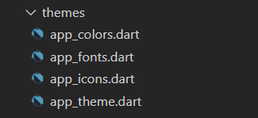
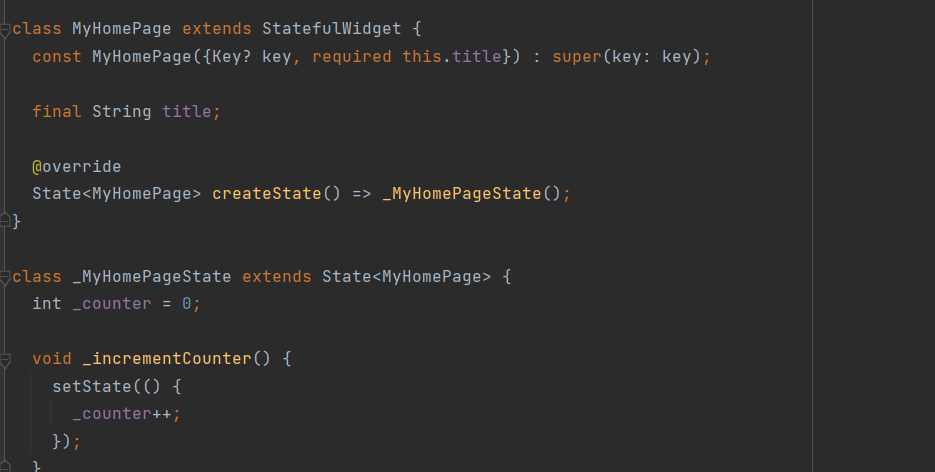
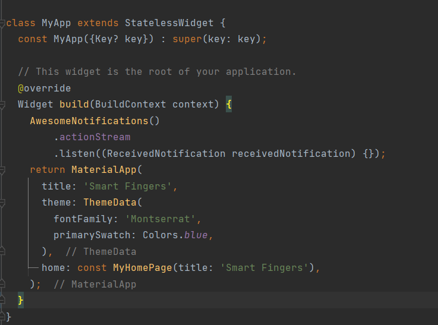

# Creating new screen

In this session we will look into how to create a new screen in existing flutter project.

## How to create new screen in Flutter project

1. Create a new dart file with a proper naming convention. The file name should be in lowercase with underscore format (lowercase_with_underscores.dart).

    

2. Import `'package:flutter/material.dart'` to use the Material UI widgets.

3. There are two types widgets State and Stateless widget,

    - `Stateful widget` - The State is the information that can be read synchronously when the widget is built and might change during the lifetime of the widget.  

    

    - `Stateless widget` - The widgets whose state can not be altered once they are built are called stateless widgets. 

    
    
    - The widget can be choose based on the screen functionality.

4. Create a `Scaffold` widget.

    **What is Scaffold widget?**

    Scaffold is a class in flutter which provides many widgets or we can say APIs like Drawer, SnackBar, BottomNavigationBar, FloatingActionButton, AppBar, etc. Scaffold will expand or occupy the whole device screen.

5. Create a `SingleChildScrollView` as child of Scaffold widget.

    **What is SingleChildScrollView widget?**
    In simple terms, a box in which a single widget can be scrolled.

    **Why is SingleChildScrollView widget?**
    This allows to scroll inside a widget, without this widget the screen can't be scrolled.

6. Create a `Column` or `Row` widget inside the SingleChildScrollView widget. 
    - Creating a Column or Row widget based on your need. 
    - Column widget allows you to add multiple widget is as children in vertical direction. 
    - Whereas, Row widget is similar to Column widget which allows to add multiple children in horizontal way.

7. You can create any widget inside the column or row widget as the as required.  For example a Container widget or a Card widget.

8. Please refer the below it's a official site given by flutter which will contain all the available widget with examples.

    https://api.flutter.dev/flutter/widgets/Align-class.html


**Example:**    
``` Flutter
class VerificationSuccessful extends StatefulWidget {
const VerificationSuccessful({Key? key}) : super(key: key);

  @override
  _VerificationSuccessfulState createState() => _VerificationSuccessfulState();
}

class _VerificationSuccessfulState extends State<VerificationSuccessful> {
  @override
  void initState() {
    super.initState();

    WidgetsBinding.instance?.addPostFrameCallback((_) {
      Future.delayed(const Duration(seconds: 5), () {
        Navigator.push(
            context, MaterialPageRoute(builder: (_) => const Login()));
      });
    });
  }

  @override
  Widget build(BuildContext context) {
    return Scaffold(
      backgroundColor: Colors.white,
      body: SafeArea(
        child: SingleChildScrollView(
          child: Column(
            children: <Widget>[
              Padding(
                padding:
                    const EdgeInsets.only(top: 135.0, left: Dimens.padding, bottom: Dimens.size2),
                child: Container(
                    alignment: Alignment.center,
                    child: Image.asset(
                        'assets/images/verification_succesfull.png')),
              ),
              Padding(
                padding: const EdgeInsets.only(left: Dimens.padding, bottom: Dimens.vertical_label_space),
                child: Container(
                  alignment: Alignment.center,
                  child: Text(
                    'Smart Fingers Verified Successfully',
                    textAlign: TextAlign.center,
                    style: AppTheme.theme.textTheme.headline3,
                  ),
                ),
              )
            ],
          ),
        ),
      ),
    );
  }
}
```

In the above example, 

- We have used a stateful widget as VerificationSuccessful and Constructor is created.

- Create class _VerificationSuccessfulState which extends the parent class VerificationSuccessful.

- Generate createState override method inside the parent class VerificationSuccessful which returns the _VerificationSuccessfulState class.

- Inside the State class override the `build` method. The method only contains the widget that need to be rendered in screen.

- We have used Scaffold widget which has SafeArea widget as child. Scaffold widget has many attributes one of them is backgroundColor. Here we have set white as background color.

- In this example we have create a SafeArea widget, which contains the SingleChildScrollView as child. 

    **What is SafeArea Widget?**    

    - A widget that insets its child by sufficient padding to avoid intrusions by the operating system.

    - For example, this will indent the child by enough to avoid the status bar at the top of the screen.

- Inside the SingleChildScrollView we have created Column widget is created in this scenario.

- Column which can contain many widgets as children as list. Here is contains two padding widgets as childrens.

- `Padding` widget can contains the padding for the child widget inside that. In this case, we have Container as child of the padding widget.

- Container contains the alignment as attribute and child widget as `Image` class which has a asset methods which take Image path url as input.

- The second padding widget is similar to the previous one, but here we have Text widget as child of the Container widget.

    **What is a Text widget?**
    - A run of text with a single style.

    - The Text widget displays a string of text with single style. The string might break across multiple lines or might all be displayed on the same line depending on the layout constraints.

    - The style argument is optional. 

- style argument in the Text widget should be given with a TextStyle class. Here we have used the App Theme Style. Refer App Theme session for further details.

- The below is the output of the example code.

    


