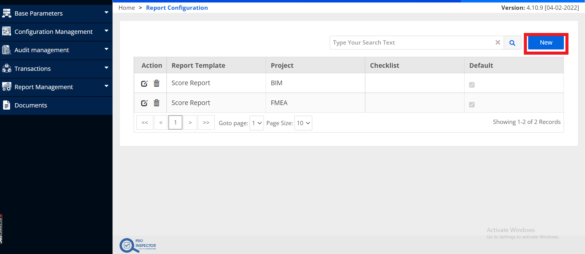
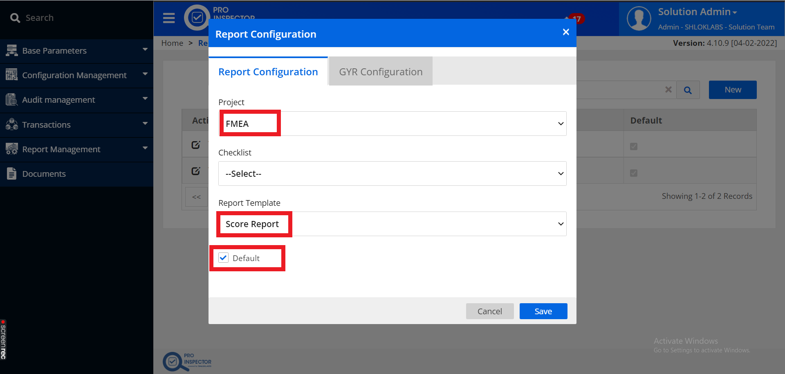
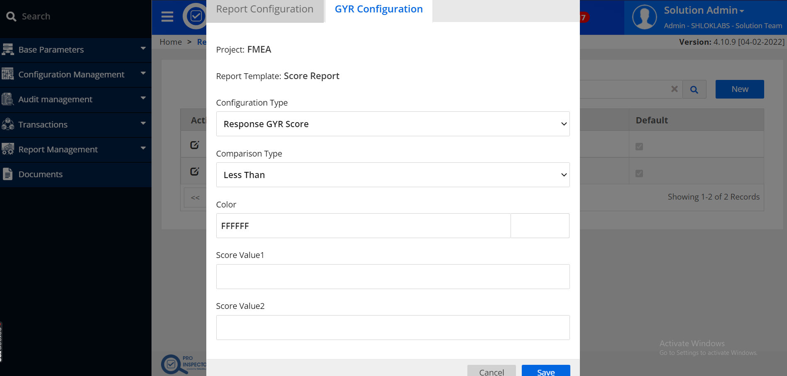

# Report Configuration for Inspection
## `step 1 : Navigate to Report configuration`:

Go to `Configuration Management` and select `Report configuration`

## `step 2 : Create New Report template`:

## `step 3 : Configure Project Details`:

Enter details as shown below:

Save the settings. Now we can download the report once the inspection is completed and approved.
