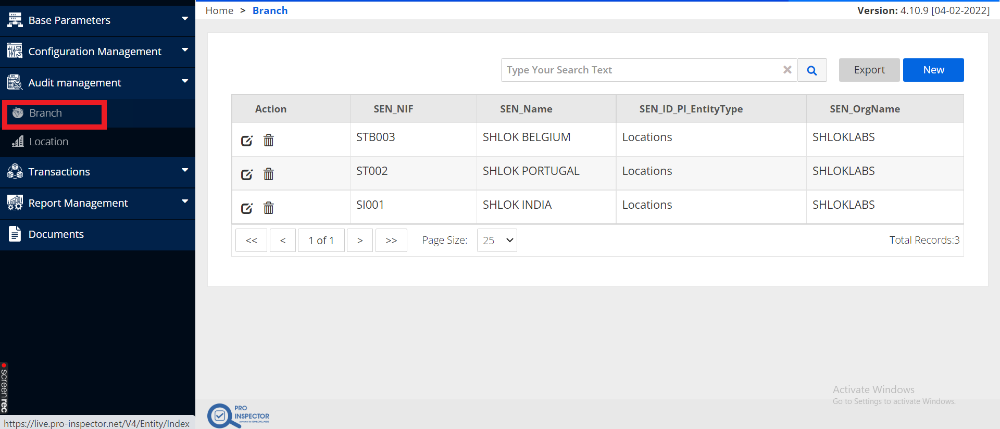
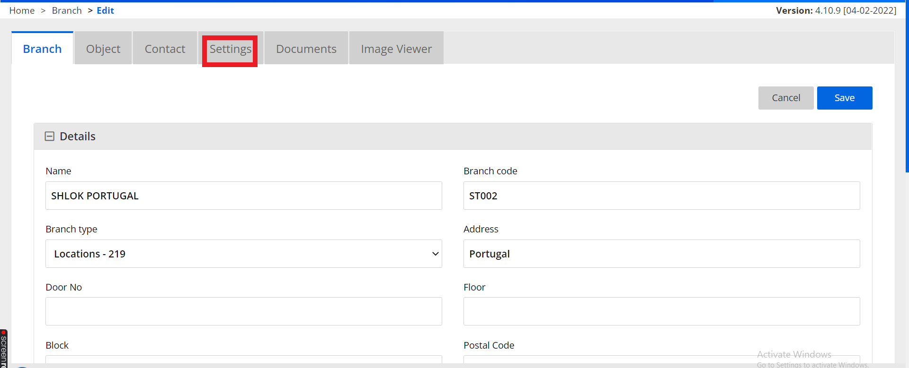
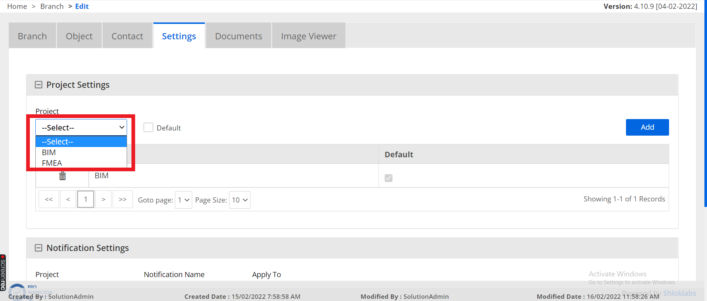
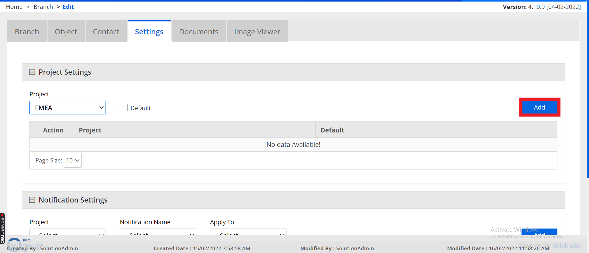
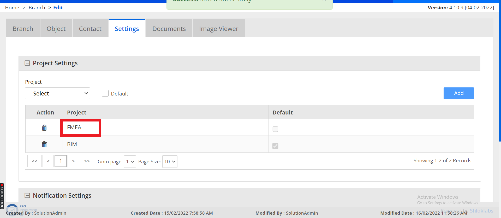
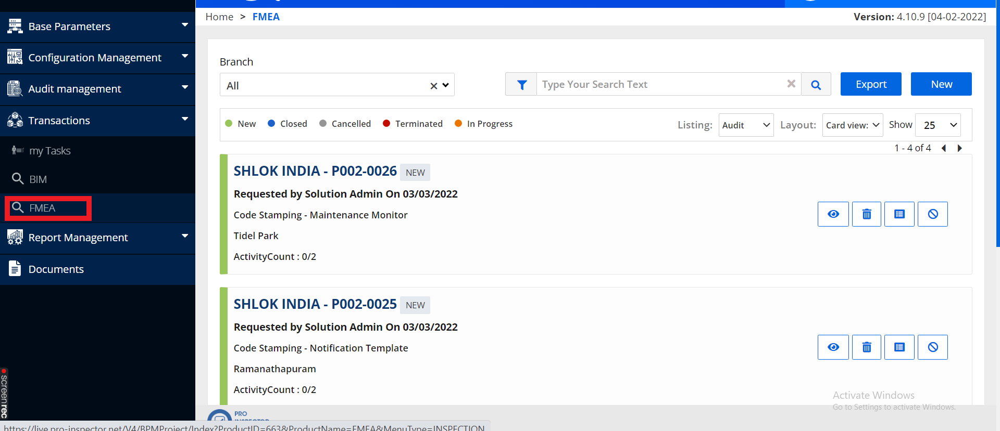
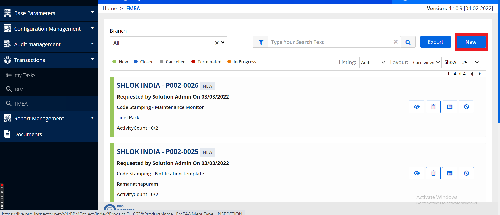
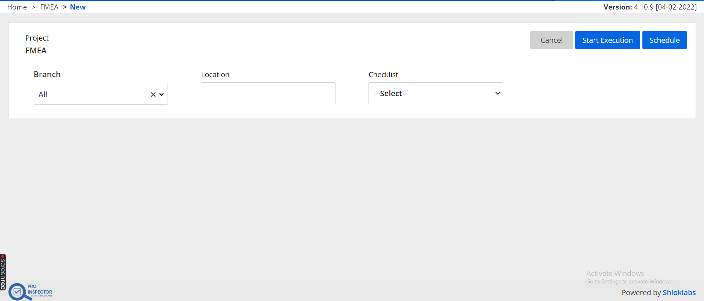
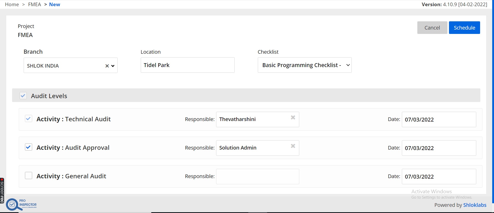
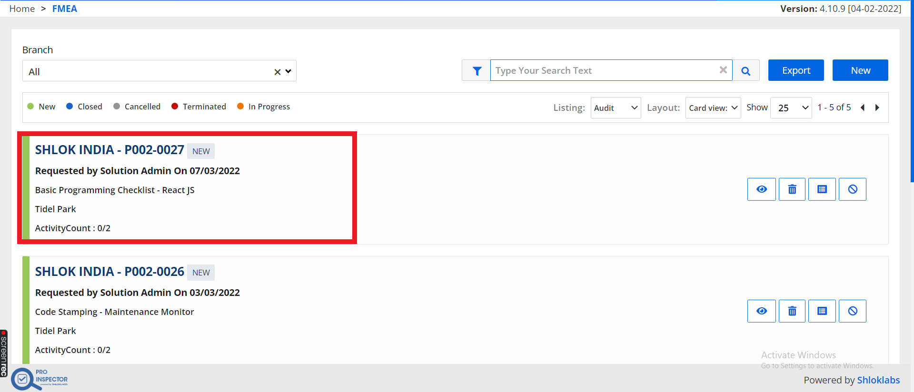

# Schedule Audits for Inspection

## Add Projects to Branch

If you are Scheduling your first audit make sure to add your `Project` to the `Branch` in `Audit Management`

### step 1 : `Go to Branch`

### step 2 : `Edit any of the Branches where your audit needed to be Scheduled`

### step 3 : `Go to Settings tab and select the project`

### step 4 : `Once Selected the Project Click Add`

### step 5 : `Now We can see the Project Added to this Branch`

## Schedule Inspections

### step 1 : `Go to Transactions and Select the project in which we want to Schedule Audit`

### step 2 : `Click New`

### step 3 : `Select Location , Branch and Checklist to be Executed`

Now Select the Audit Levels and Responsible, click Schedule finally

We can see the Scheduled Audit here

