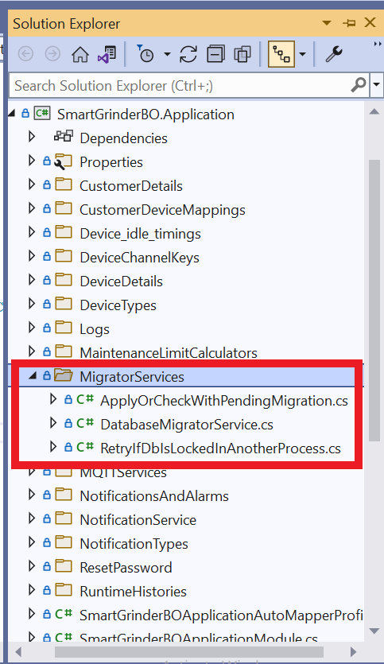
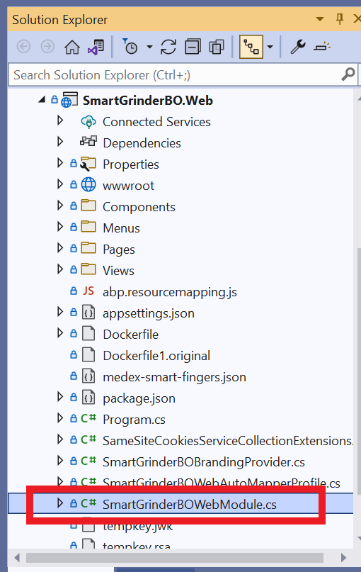
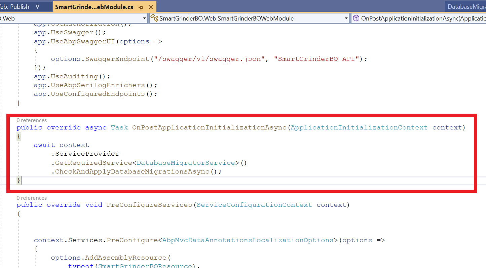

# Apply Datababase Migrations on Application Initialization in ABP :

## `Step 1 :  Add Migrator Services:`

Create a folder named `Migrator Services` and create 3 classes named as 
- *ApplyOrCheckWithPendingMigration* 
- *DatabaseMigratorService* 
- *RetryIfDbIsLockedInAnotherProcess* as shown below



## `Step 2 : Contents of `ApplyOrCheckWithPendingMigration.cs :

copy and paste the following code to the class

```
using Microsoft.EntityFrameworkCore;
using Microsoft.Extensions.DependencyInjection;
using Serilog;
using System;
using System.Linq;
using System.Threading.Tasks;
using Volo.Abp.Data;
using Volo.Abp.DistributedLocking;
using Volo.Abp.EventBus.Distributed;
using Volo.Abp.MultiTenancy;
using Volo.Abp.Uow;

namespace SmartGrinderBO.MigratorServices
{
    public abstract class ApplyOrCheckWithPendingMigration<TDbContext> : RetryIfDbIsLockedInAnotherProcess
    where TDbContext : DbContext
    {
        protected IUnitOfWorkManager UnitOfWorkManager { get; }
        protected IServiceProvider ServiceProvider { get; }
        protected ICurrentTenant CurrentTenant { get; }
        protected IDistributedEventBus DistributedEventBus { get; }
        protected IAbpDistributedLock DistributedLockProvider { get; }
        protected string DatabaseName { get; }

        protected ApplyOrCheckWithPendingMigration(
            IUnitOfWorkManager unitOfWorkManager,
            IServiceProvider serviceProvider,
            ICurrentTenant currentTenant,
            IDistributedEventBus distributedEventBus,
            IAbpDistributedLock abpDistributedLock,
            string databaseName)
        {
            UnitOfWorkManager = unitOfWorkManager;
            ServiceProvider = serviceProvider;
            CurrentTenant = currentTenant;
            DistributedEventBus = distributedEventBus;
            DistributedLockProvider = abpDistributedLock;
            DatabaseName = databaseName;
        }

        public virtual async Task CheckAndApplyDatabaseMigrationsAsync()
        {
            await TryAsync(LockAndApplyDatabaseMigrationsAsync);
        }

        protected virtual async Task LockAndApplyDatabaseMigrationsAsync()
        {
            await using (var handle = await DistributedLockProvider.TryAcquireAsync("Migration_" + DatabaseName))
            {
                Log.Information($"Lock is acquired for db migration  on database named: {DatabaseName}...");

                if (handle is null)
                {
                    Log.Information($"Handle is null because of the locking for : {DatabaseName}");
                    return;
                }

                using (CurrentTenant.Change(null))
                {
                    // Create database tables if needed
                    using (var uow = UnitOfWorkManager.Begin(requiresNew: true, isTransactional: false))
                    {
                        var dbContext = ServiceProvider.GetRequiredService<TDbContext>();

                        var pendingMigrations = await dbContext
                            .Database.EnsureCreatedAsync();


                        await uow.CompleteAsync();
                    }

                    await ServiceProvider.GetRequiredService<IDataSeeder>()
                        .SeedAsync();
                }
                Log.Information($"Lock is released for db migration on database named: {DatabaseName}...");
            }
        }
    }
}
```

## `Step 3 : Contents of `DatabaseMigratorService.cs :

copy and paste the following code to the class

```
using Microsoft.Extensions.Configuration;
using SmartGrinderBO.EntityFrameworkCore;
using System;
using System.Collections.Generic;
using System.Linq;
using System.Text;
using System.Threading.Tasks;
using Volo.Abp;
using Volo.Abp.Data;
using Volo.Abp.DistributedLocking;
using Volo.Abp.EventBus.Distributed;
using Volo.Abp.Modularity;
using Volo.Abp.MultiTenancy;
using Volo.Abp.Uow;

namespace SmartGrinderBO.MigratorServices
{
    public class DatabaseMigratorService : ApplyOrCheckWithPendingMigration<SmartGrinderBODbContext>
    {
        public DatabaseMigratorService(
        IUnitOfWorkManager unitOfWorkManager,
        IServiceProvider serviceProvider,
        ICurrentTenant currentTenant,
        IDistributedEventBus distributedEventBus,
        IAbpDistributedLock distributedLockProvider)
        : base(
            unitOfWorkManager,
            serviceProvider,
            currentTenant,
            distributedEventBus,
            distributedLockProvider,
            new ConfigurationBuilder()
              .AddJsonFile("appsettings.json", optional: true, reloadOnChange: true)
              .Build()
              .GetSection("ConnectionStrings:Default")
              .Value
            )
        {
        }        
    }

}
```

## `Step 4 : Contents of `RetryIfDbIsLockedInAnotherProcess.cs :

copy and paste the following code to the class

```
using Serilog;
using System;
using System.Threading.Tasks;
using Volo.Abp;
using Volo.Abp.DependencyInjection;

namespace SmartGrinderBO.MigratorServices
{
    public abstract class RetryIfDbIsLockedInAnotherProcess : ITransientDependency
    {
        public async Task TryAsync(Func<Task> task, int retryCount = 3)
        {
            try
            {
                await task();
            }
            catch (Exception ex)
            {
                retryCount--;

                if (retryCount <= 0)
                {
                    throw;
                }

                Log.Warning($"{ex.GetType().Name} has been thrown. The operation will be tried {retryCount} times more. Exception:\n{ex.Message}");

                await Task.Delay(RandomHelper.GetRandom(5000, 15000));

                await TryAsync(task, retryCount);
            }
        }
    }
}
```

## `Step 5 :  Go to Web Module of your Web Project :`




## `Step 6 :  Add following code in` *OnPostApplicationInitializationAsync* :

```
await context.ServiceProvider.GetRequiredService<DatabaseMigratorService>().CheckAndApplyDatabaseMigrationsAsync();
```

The above code looks like this in web module:



