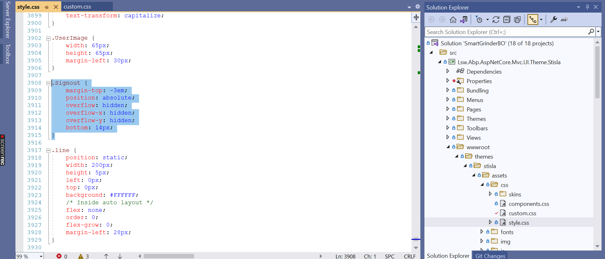
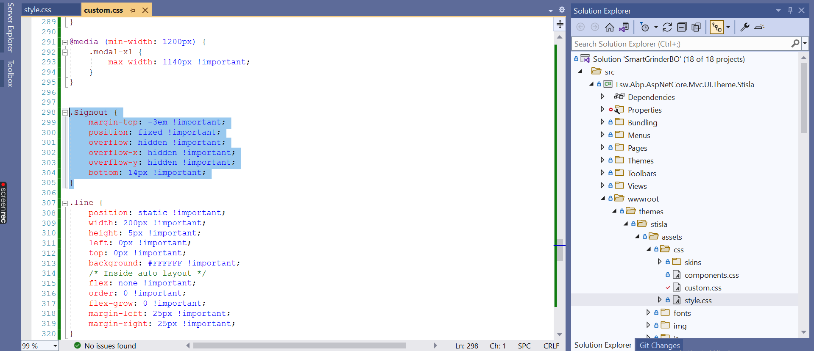
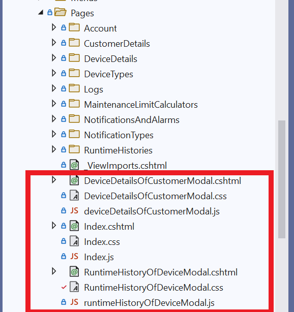

## Roadblocks Faced & Solutions to fix it
### 1 . Solution for `Copying & Customization of Theme` 

> Refer [Copy & Customize Theme](https://docs.abp.io/en/abp/latest/UI/AspNetCore/Basic-Theme#copy-customize) for customizing the source code

Any overridding on style components should be made in `custom.css` file with `!important` added to the porperties

- Default style in `style.css`:

    

- Overriding Default style in `custom.css`: 
    
    

### 2. Solution for `Custom RazorPage / Modal Page Creation`

If CLI is used for Entity Creation , Always Create Razor Pages separately from auto generated Files.

### 3. Solution for `Login/Register function not working on Hosting or Same Site Cookie policy` 

> Refer [Patch for Chrome Login Issue](https://community.abp.io/posts/patch-for-chrome-login-issue-identityserver4-samesite-cookie-problem-weypwp3n?_ga=2.123013000.2040206733.1653884428-1331923432.1623049455)

### 4. Solution for `Overriding Built-in ABP Async methods` 

> Refer [Override Async Functions](https://docs.abp.io/en/abp/4.4/Customizing-Application-Modules-Overriding-Services)