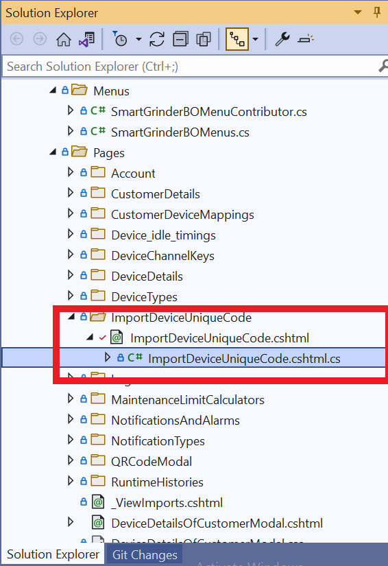
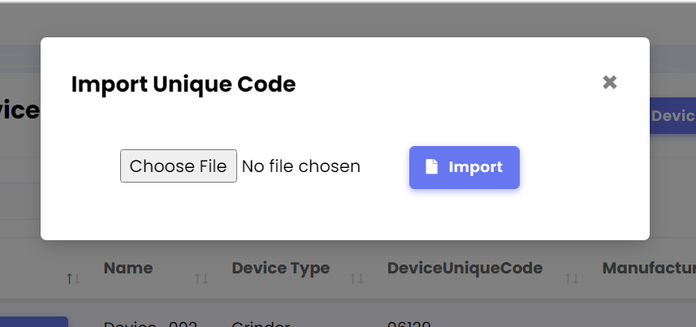

# Import / Export Excel Data in ABP Application

> Refered from [ABP-Samples](https://github.com/abpframework/abp-samples/tree/master/ExcelIO)

## `Import and Export Excel Data in Single button click`

### Step 1 : Go to `cshtml` file of your Razor Page and add following:

```
<form method="POST" enctype="multipart/form-data" >
    <input type="file" name="excel"/> 
    <abp-button button-type="Primary" icon="file" text="Import" type="Submit"></abp-button>
</form>
```

### Step 2 : Go to `cshtml.cs` file of your Razor Page and add following:

 

- **Install package `ClosedXML` and reference it in `cshtml.cs` file**

    ```
    using ClosedXML.Excel;
    ```

- **Add the following code in your Post method (`OnPostAsync`)**

    ```
    if (excel == null)
    {
        throw new UserFriendlyException(message: "Excel is null or Invalid");
    }

    var memoryStream = new MemoryStream();

    using (var workbook = new XLWorkbook(excel.OpenReadStream()))
    {
        //Reads Data from the sheet named "Devices"
        var worksheet = workbook.Worksheet("Devices");

        worksheet.Column(2).Width = 30;

        var count = 0;
        foreach (var row in worksheet.Rows())
        {
            count += 1;
            if (count > 1) //skip the first row.
            {
                //stores value from cell to a assigned variable
                var valueToStore = row.Cell(1).Value.ToString()

                                //Stores value from variable to cell in excel
                int assignValuetoCell = 87;
                row.Cell(2).Value = assignValuetoCell;

            }
            workbook.SaveAs(memoryStream);
        }
    }

    memoryStream.Position = 0;
    return File(memoryStream, "application/vnd.openxmlformats-officedocument.spreadsheetml.sheet");
    ```

The final modal screen looks like this:

 

 on clicking `Import` button ,  the chosen excel file wil be read and a new excel file with *`updated`* data will be exported automatically.