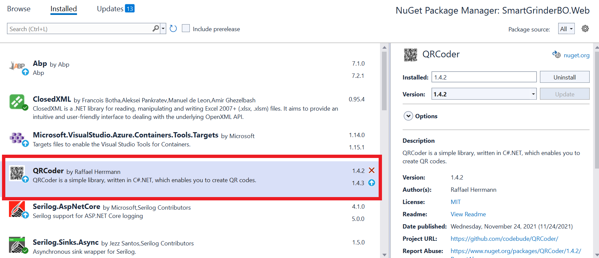
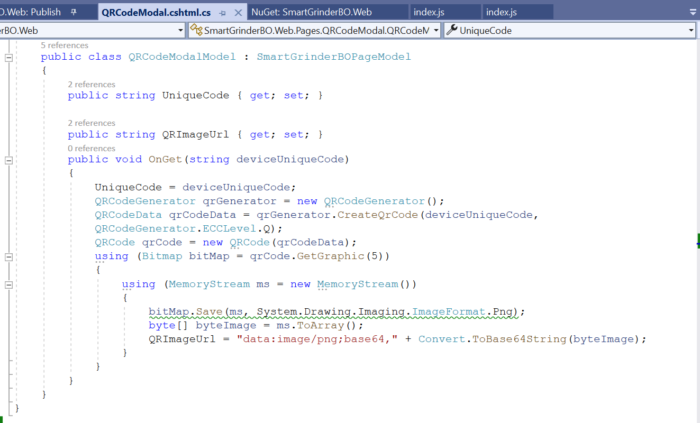
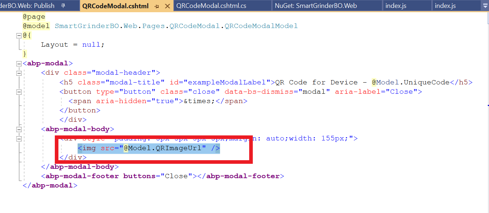
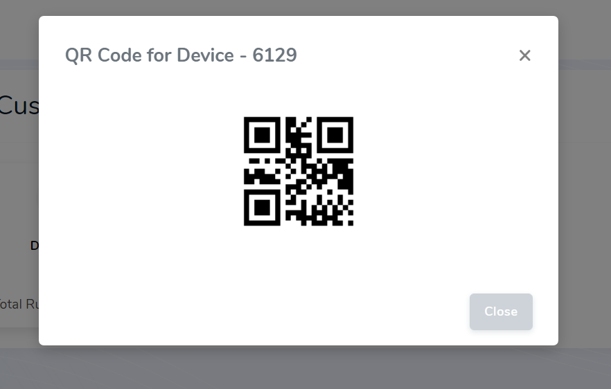

# QR Code Modal Screen

- **`step 1 : Install QRCoder Nuget Package:`** 

    

> Make sure the version is **1.4.2**

- **`step 2 : Add the following code to `cshtml.cs` file of your Razor Page:`**

    Add this code to any method

    ```
    QRCodeGenerator qrGenerator = new QRCodeGenerator();
    QRCodeData qrCodeData = qrGenerator.CreateQrCode("Text for QR code Conversion",
    QRCodeGenerator.ECCLevel.Q);
    QRCode qrCode = new QRCode(qrCodeData);
    using (Bitmap bitMap = qrCode.GetGraphic(5))
    {
        using (MemoryStream ms = new MemoryStream())
        {
            bitMap.Save(ms, System.Drawing.Imaging.ImageFormat.Png);
            byte[] byteImage = ms.ToArray();
            QRImageUrl = "data:image/png;base64," + Convert.ToBase64String(byteImage);
        }
    }
    ```

    The `cshtml.cs` file looks like this : 

    

- **`step 3 : Add the following code to `cshtml` file of your Razor Page:`**

    

Finally add the `img tag` to use the url generated from the QRCode generator method we have seen above.

The Finished Screen in application looks like this:



> References
- [Nuget Package](https://www.nuget.org/packages/QRCoder/)
- [Article used for Reference](https://www.aspsnippets.com/Articles/Dynamically-generate-and-display-QR-code-Image-in-ASPNet.aspx)