# Upload candidate Details and Schedule a Test

### `step 1 : Sort Candidate details according to Candidate Details Template :`

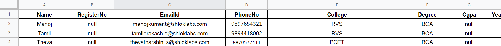

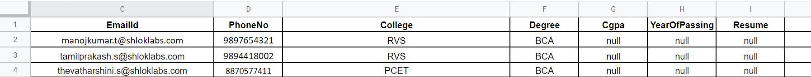

> Make sure to fill in all columns and check if emails are valid.

### `step 2 : Upload Candidate Details :`

- Candidate Listing Screen

    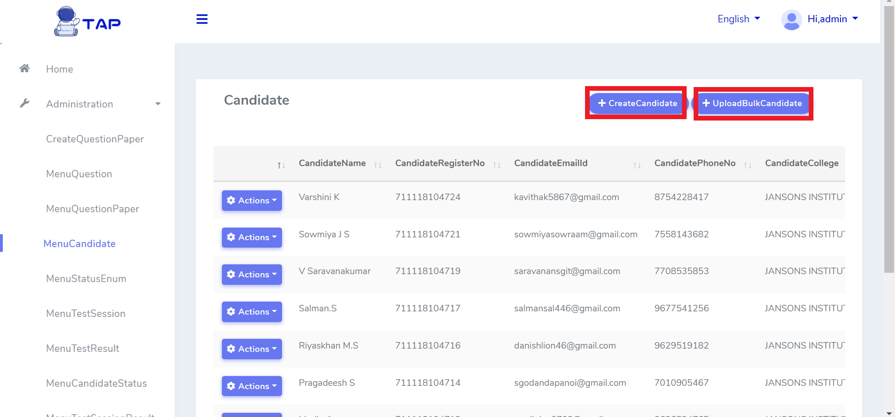

- Create a Candidate by clicking *`Create Candidate`* button

    

    Fill out the details

    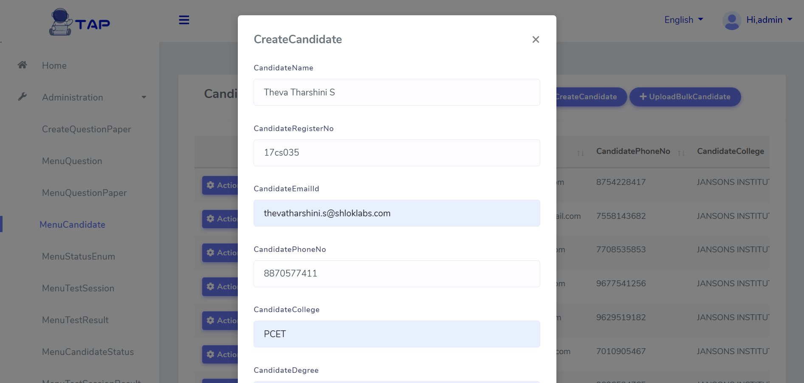

- Upload Bulk Candidates with *`Upload Bulk Candidate`* button.

    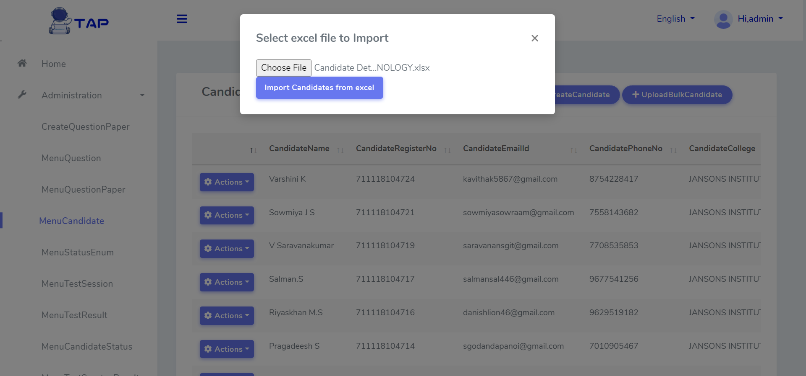

    Import the `.xlsx` format file we have created in the step 1.

### `step 3 : Create Test Session :`

- Go to `MenuTestSession` and create a Test Session by clicking `New Test session For Candidates`.

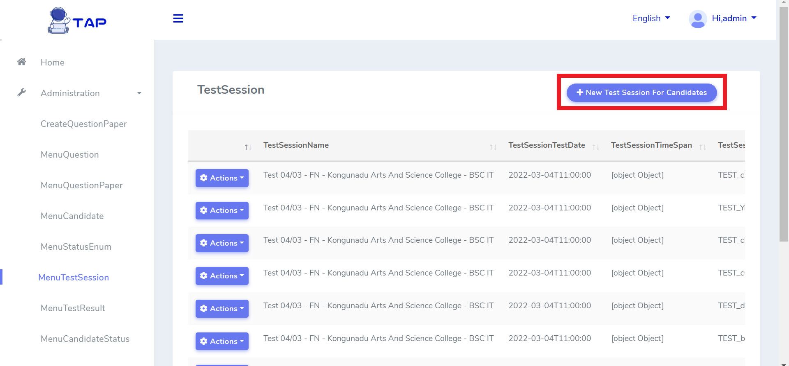

- Here Enter Session Name, Date & Time , Question Paper Id (Question Set) , Reviewer Name and College Name.

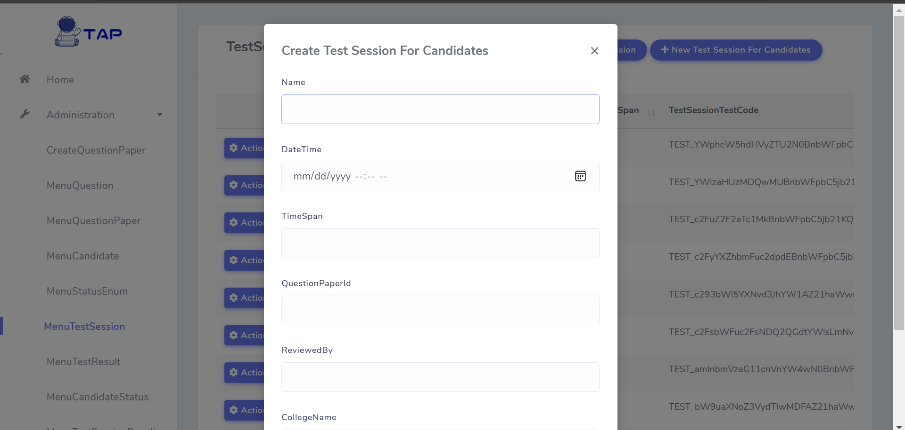

> Make sure to Enter the college name same as the one uploaded in the Candidate Details.

> Test Session should be Created for Each College, so that the Candidates under the College have Specific Test Session Created for them.
 
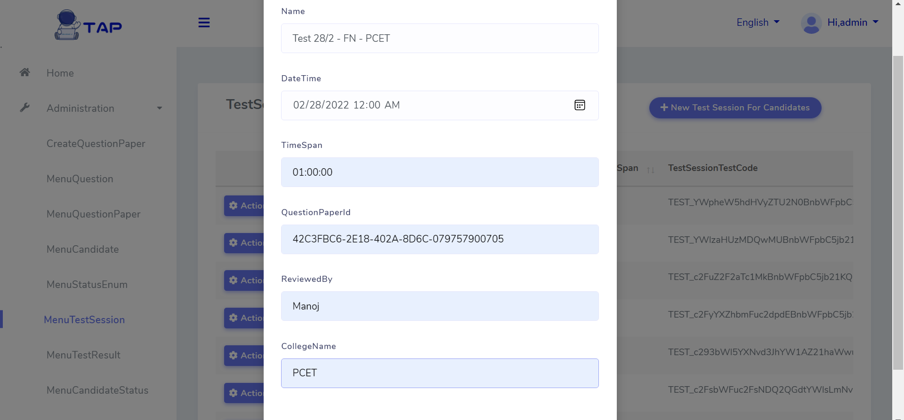

### `step 3 : Create and Send Test Link to Candidates :`

- Go to `MenuTestLink` and Generate Test Link by clicking `GenerateTestLink`.

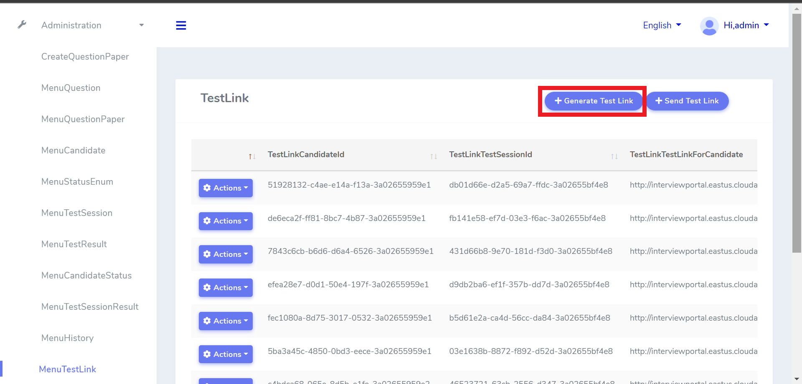

- Here Enter the Test Session for which the Link should be generated and Date Time of it and save it

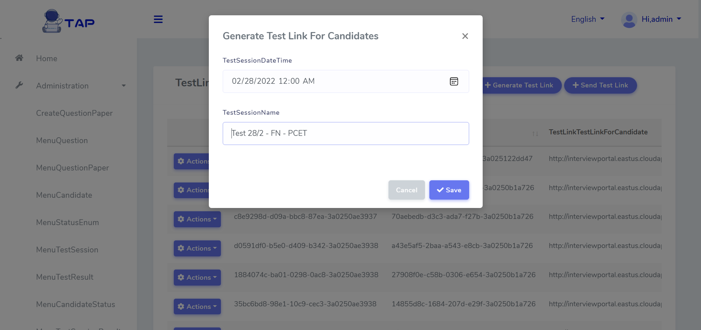

> Please Ensure to enter the exact name of the test Session without mistakes.

- Now Send the Created Test Links to the Respective Candidates of Respective College by clicking `SendTestLink`

- Here Enter the college name and the Test Session Date Time Scheduled for that particular College and Click Save, this is will send Test Links as mail to all the candidate of given college.

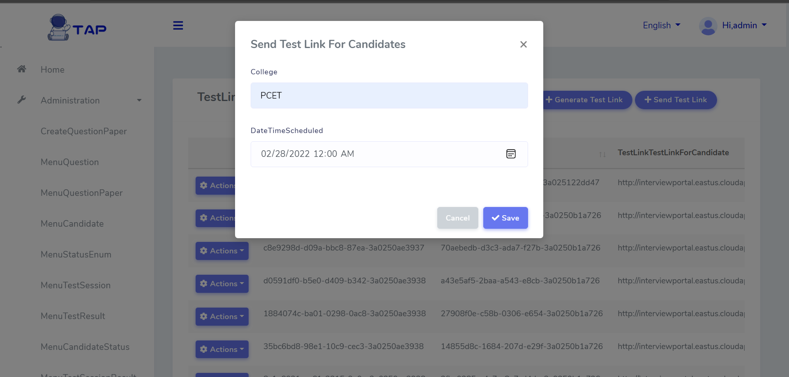